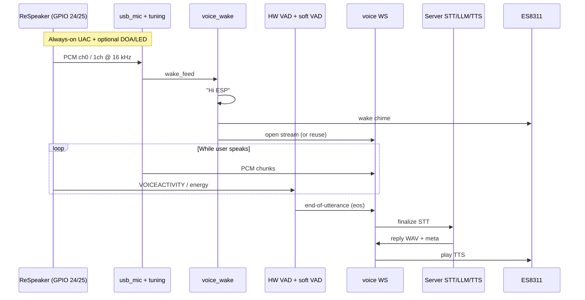

# 4-Mic Clear Try 1 — Better Use of ReSpeaker on GPIO Header

Planning doc only. Goal: get full value from the **ReSpeaker USB Mic Array** when it is wired to the ESP32-P4 **40-pin header** (5V, GND, GPIO 24, GPIO 25), not the onboard USB-A port.

Related docs: [Integrate-4mic.md](Integrate-4mic.md), [USB-4MIC-INTEGRATION.md](USB-4MIC-INTEGRATION.md), Seeed ReSpeaker USB Mic Array wiki (Python `tuning.py` / `dfu.py` / DOA / VAD / LEDs).

---

## 1. Short answer: can everything run on GPIO 24 / 25?

**Yes.** Those pins are not “GPIO audio.” They are the board’s **USB Full-Speed host** remapped to the header:

| Wire | Header pin | Role |
|------|------------|------|
| Red | **5V** | VBUS power |
| Black | **GND** | Ground |
| White | **GPIO 24** | USB D− |
| Green | **GPIO 25** | USB D+ |

Electrically this is still **USB** (UAC + vendor control). The mic does not know or care whether D+/D− land on the USB-A connector or on GPIO 24/25.

So on **the same four wires** you can run:

| Feature | On GPIO 24/25? | Notes |
|---------|----------------|-------|
| UAC audio capture (16 kHz PCM) | **Yes** | Already in `usb_mic.c` |
| Beamformed / processed ASR channel | **Yes** | Prefer 1-ch XMOS FW, or ch0 of 6-ch |
| Vendor control: AGC / AEC / NS / thresholds | **Yes** | Same USB control transfers as PC `tuning.py` |
| Hardware VAD (`VOICEACTIVITY` / `SPEECHDETECTED`) | **Yes** | Read via vendor IN |
| DOA angle (`DOAANGLE`) | **Yes** | Read via vendor IN → can drive pan servo |
| Pixel-ring LEDs | **Yes** | Vendor OUT commands |
| DFU flash of XMOS firmware | **Usually on a PC first** | Same USB device; safest to flash on laptop, then plug into header. Porting DFU to P4 is optional and risky |

**What does *not* move to these pins**

- Speaker / TTS stays on **ES8311** (onboard codec).
- Camera / Dynamixel stay on **J18** USB hub (separate PHY).
- Flash / serial debug stays on a **different** USB connection — do not share the mic header with the PC debugger.

```text
PC debug USB ──► P4 console / flash          (separate)
J18 hub      ──► camera + U2D2               (HS PHY)
GPIO header  ──► ReSpeaker only              (FS PHY: 5V,GND,24,25)
                 ├─ UAC PCM (audio)
                 └─ vendor ctrl (tune / VAD / DOA / LEDs)
```

---

## 2. What we have today vs what we want

### Today (already working)

```text
ReSpeaker (header USB)
  → usb_mic.c (UAC, ch0 mono @ 16 kHz)
  → mic_input.c
  → voice_wake (esp-sr “Hi ESP”)
  → energy VAD in voice_assist.c (software on P4)
  → full WAV over WebSocket
  → PC STT → LLM → TTS
  → ES8311 play
```

Mic DSP (beamforming, AEC, NS) may already run **inside** the ReSpeaker, but firmware does **not** yet:

- set DSP knobs (AGC, VAD threshold, …)
- read hardware VAD / DOA
- drive the LED ring
- stream audio to STT while the user speaks (still batch-after-VAD)

### Target (better use of the board)

```text
Wake
  → open / keep WS
  → stream cleaned mono PCM to STT while talking
  → ReSpeaker HW VAD (+ software VAD backup) closes utterance
  → finalize STT → LLM → TTS reply
  → optional: DOA steers head; LED shows listen / think / speak
```

---

## 3. End-to-end target flow



**Roles**

| Layer | Job |
|-------|-----|
| ReSpeaker XMOS | Far-field, beamform, AEC, NS, HW VAD, DOA |
| ESP-P4 | USB host on header, wake word, endpoint merge, WS client, servo/eyes |
| PC server | Streaming (or batch) STT, LLM, TTS |

Hardware VAD on the mic and energy VAD on the P4 can **work together**: HW VAD for “speech present,” software trailing silence for “safe close,” so continue-listen / medical-ack paths stay reliable.

---

## 4. Four-part implementation plan

Do these in order. Each part is shippable on its own.

---

### Part 1 — Mic board baseline (audio quality on GPIO header)

**Goal:** Best possible mono for wake + STT using only the wires you already have.

**Hardware**

- Confirm: **5V, GND, GPIO 24 (D−), GPIO 25 (D+)**.
- Short D+/D− leads; swap 24/25 if enum fails.
- Keep J18 and debug USB separate.

**PC one-time (before or beside P4 work)**

1. Plug ReSpeaker into a **laptop** USB port.
2. Flash XMOS FW with Seeed `dfu.py`:
   - Prefer **`1_channel_firmware.bin`** for ASR (single processed stream).
   - Keep **`6_channels_firmware.bin`** only if you need raw mics + DOA experiments (ch0 still = processed).
3. Run `tuning.py` presets for your room (start conservative):
   - AGC on/off and max gain (avoid clipping WakeNet).
   - Stationary / non-stationary noise suppression.
   - Echo / AEC if TTS plays while mic is live later.
   - `GAMMAVAD_SR` if you will use HW VAD in Part 3.
4. Unplug from PC → plug into **P4 header**. Settings usually persist on the device.

**Firmware (already mostly done — verify)**

| Check | Where |
|-------|--------|
| `CONFIG_USB4MIC_USB_PHY_ON_HEADER=y` | sdkconfig |
| D−=24, D+=25 | Kconfig |
| ReSpeaker `2886:0018` only | `usb_mic.c` |
| 16 kHz mono out | `usb_mic_read()` |
| Soft gain not insanely high | `USB_MIC_SW_GAIN_*` |
| Wake + energy VAD still work on USB path | `mic_input` → wake / `voice_assist` |

**Done when**

- Serial shows UAC streaming on header.
- “Hi ESP” reliable at conversation distance.
- STT quality clearly better than onboard mic (or at least stable).

**Out of scope for Part 1:** live tuning API, DOA, LED, streaming STT.

---

### Part 2 — Bring ReSpeaker *control* onto the same GPIO USB (C port of Python)

**Goal:** Do on P4 what Seeed’s Python does on PC: vendor USB control transfers over the **same** header link.

**Why Python cannot run on the bot**

- Scripts need a USB **host** with pyusb.
- P4 **is** that host — implement the same requests in C next to `usb_mic.c`.

**New module (concept): `respeaker_ctrl.c` / `.h`**

| API (concept) | Maps from Seeed |
|---------------|-----------------|
| `respeaker_ctrl_set(name, value)` | `tuning.py AGCONOFF 0` etc. |
| `respeaker_ctrl_get(name, *value)` | `DOAANGLE`, `VOICEACTIVITY`, … |
| `respeaker_led_mode(...)` | `pixel_ring` listen / think / speak |
| Boot apply profile | Fixed table after UAC open |

**Implementation notes**

- Use ESP-IDF USB host **control transfers** (same idea as Dynamixel vendor path).
- Device must already be enumerated (after `usb_mic` open).
- Do **not** fight UAC isochronous traffic: short control xfers at boot / between utterances.
- Expose serial / HTTP debug: `mic tune list`, `mic tune AGCONOFF 0`, `mic doa`.

**Suggested first knobs**

| Param | Why |
|-------|-----|
| `AGCONOFF` / `AGCMAXGAIN` | Stop over-amplifying room noise |
| `STATNOISEONOFF` / `NONSTATNOISEONOFF` | Cleaner STT |
| `ECHOONOFF` / AEC-related | Better when speaker is loud |
| `GAMMAVAD_SR` | Prep for Part 3 HW VAD |

**Done when**

- From P4 serial you can read `DOAANGLE` and toggle AGC without unplugging to a PC.
- Wake/STT still stable after applying a known-good profile at boot.

**Still batch STT** after software VAD — that changes in Part 4.

---

### Part 3 — VAD + DOA + UX on the mic board

**Goal:** Use the board’s **on-chip VAD and DOA**, not only P4 energy VAD.

#### 3A — Hardware VAD

| Source | Signal | Use |
|--------|--------|-----|
| ReSpeaker | `VOICEACTIVITY` / `SPEECHDETECTED` | Speech present / start listen |
| P4 `voice_assist.c` | Energy + trailing silence | Safe end-of-utterance (eos) |

**Recommended merge logic**

```text
After wake chime:
  wait until HW VAD says speech  OR  energy start threshold
  record / stream while speech active
  close when:
      HW VAD quiet for N ms
      AND/OR energy trailing silence (existing ~450 ms)
      with min speech length guard
```

Benefits:

- Faster speech-start in noisy rooms (DSP VAD).
- Fewer cutoffs mid-word if you require **both** soft and hard quiet (tunable).
- Medical-ack / continue-listen reuse the same closer.

#### 3B — DOA → head turn (optional but high value)

```text
While listening (or on speech start):
  read DOAANGLE (0–359)
  map to Dynamixel pan (and later tilt)
  rate-limit updates so head does not jitter
```

Same GPIO USB — no extra wires.

#### 3C — LED ring (optional UX)

| State | LED mode (Seeed-style) |
|-------|-------------------------|
| Idle / off | off |
| Wake / listening | listen / trace |
| Thinking (STT+LLM) | think |
| Speaking TTS | speak |
| Volume / DOA demo | set_volume / wakeup(angle) |

**Done when**

- Utterance open/close uses mic HW VAD + existing soft VAD.
- Logs show DOA during listen; optional pan tracks talker.
- LEDs optional but wired if you want demo polish.

---

### Part 4 — Stream-to-STT (full pipeline upgrade)

**Goal:** Stop waiting for VAD close before any audio reaches STT. Audio flows from **wake (or speech-start)**; VAD close only **finalizes** and triggers the reply.

```text
TODAY:
  Wake → VAD record full WAV → upload → STT → LLM → TTS

TARGET:
  Wake → stream PCM chunks to STT
       → VAD close = eos
       → finalize STT → LLM → TTS
```

**Firmware changes (concept)**

1. After wake (and chime): open WS early (or keep persistent session).
2. While listening: send **PCM frames** (20–40 ms) on the existing `/voice-query` connection (new framing).
3. On VAD close (Part 3 logic): send **eos** text/binary marker; stop mic stream; wait for reply WAV.
4. Continue-listen / medical-ack: same stream → eos → reply loop.

**Server changes (concept)**

1. Accept chunked PCM + eos (keep old full-WAV path for a while).
2. Streaming-capable STT (or running buffer that finalizes on eos).
3. Only after final transcript → existing LLM → TTS → send WAV + JSON meta.

**Hybrid start (safer than pure stream-from-wake)**

```text
Wake → chime → wait speech-start (HW/soft VAD)
     → stream with pre-roll
     → eos on close → reply
```

Less silence burned into STT; still overlaps STT with most of the utterance.

**Done when**

- Latency log shows STT overlapping speech (lower post-silence wait).
- No regression on wake, medical ack, face-reg voice paths.
- GPIO header mic still sole capture path.

---

## 5. Change flow summary (what touches what)

| Part | Mic board | `usb_mic` / new ctrl | `voice_assist` / wake | Server | PC one-time |
|------|-----------|----------------------|------------------------|--------|-------------|
| **1** Baseline | XMOS FW + room tune | Verify UAC on 24/25 | No protocol change | No | `dfu.py` + `tuning.py` |
| **2** Control | — | Vendor ctrl C API | Optional apply profile | No | Protocol reference only |
| **3** VAD/DOA/LED | HW VAD/DOA used live | Poll get/set + LEDs | Merge HW+soft VAD; DOA→servo | No | Threshold cheat-sheet |
| **4** Stream STT | — | Steady PCM out | Stream + eos instead of full WAV | Chunk STT + eos | — |

---

## 6. GPIO header checklist (print this)

```text
[ ] Mic cable: 5V, GND, GPIO24=D−, GPIO25=D+
[ ] Not sharing header with PC flash/serial
[ ] J18 still camera + servos only
[ ] sdkconfig: USB4MIC on header, console secondary none
[ ] Part 1: 1-ch (or ch0) sounding clean; wake OK
[ ] Part 2: serial can tune AGC / read DOA on header USB
[ ] Part 3: HW VAD closes turns; DOA optional; LEDs optional
[ ] Part 4: stream after wake/speech-start; eos → reply
```

---

## 7. Risks and rules

1. **Header = USB.** All ReSpeaker USB features can use it; there is no second “GPIO mic protocol.”
2. **DFU on P4 is optional.** Prefer laptop flash once; recover bricked XMOS from PC.
3. **Control vs isochronous.** Do not spam vendor transfers during heavy UAC; tune at boot / between turns.
4. **Dual USB hosts.** Header mic and J18 camera must stay on separate PHYs (already designed that way).
5. **Do not remove software VAD in Part 3** until HW VAD is proven in your noise floor — merge first.
6. **Streaming STT (Part 4)** needs a streaming (or buffered) STT backend; batch Whisper-on-full-file alone will not give the latency win.

---

## 8. Suggested order of work (Try 1)

1. **Part 1** this week — FW verify + PC DFU/tune → best audio on GPIO.  
2. **Part 2** — small `respeaker_ctrl` + serial.  
3. **Part 3** — HW VAD merge + optional DOA.  
4. **Part 4** — stream protocol + server STT finalize on eos.

That is the full path to “better use of this mic board” on **5V / GND / 24 / 25**, with VAD and the rest included, without needing the onboard USB-A port.
