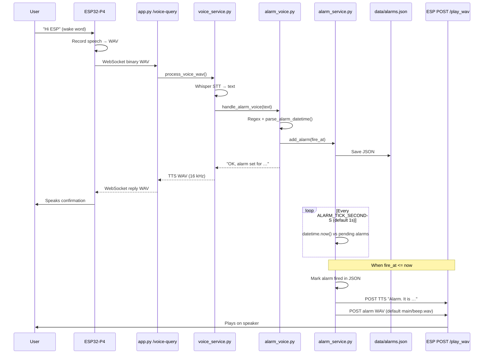

# Alarm system — time source, workflow, and troubleshooting

## Where the server gets time

The alarm system uses **only your PC’s system clock** — the same local time shown in the Windows taskbar. There is no ESP clock, NTP client, or cloud time in the alarm code.

All reads go through `server/alarm_time.py`:

| Function | Purpose |
|----------|---------|
| `system_now()` | Current local date/time (`datetime.now()`) |
| `system_clock_info()` | Exposed in logs and `GET /api/alarms` → `clock` block |

| Step | Module | Time source |
|------|--------|-------------|
| Parse “is this in the past?” | `alarm_voice.parse_alarm_datetime()` | `system_now()` |
| Save alarm | `alarm_service.add_alarm()` | `system_now()` for `created_at` |
| Scheduler tick | `alarm_service._check_due_alarms()` | `system_now()` |
| Fire alarm | `fire_datetime() <= system_now()` | Same |

Stored values look like `2026-06-03T03:50:00` (naive local datetime). **Keep Windows date/time and timezone correct.**

On startup the server logs: `Alarm scheduler started (… system_now=… timezone_name=…)`.

When you set an alarm via voice, the log includes:

```text
Alarm time parse | phrase=… normalized=… system_now=… fire_at=… rolled_to_tomorrow=…
```

---

## End-to-end workflow



### 1. Wake word → server

1. User says **"Hi ESP"** on the board.
2. Firmware captures speech and opens `ws://<PC_IP>:8000/voice-query`.
3. Server accepts the WebSocket in `app.py` → `_voice_ws_pipeline()`.

### 2. Speech → text

1. Incoming WAV goes to `voice_service.process_voice_wav()`.
2. **faster-whisper** transcribes audio to text (e.g. `"set an alarm at 3:50 AM today"`).
3. Alarm handling runs **before** servo 360, identity, and general LLM paths.

### 3. Text → alarm time

1. `alarm_voice.handle_alarm_voice()` matches set/list/cancel patterns.
2. For set: `_extract_time_phrase()` pulls the tail after `"set an alarm at/for"`.
3. `parse_alarm_datetime()`:
   - Strips `"today"` / `"tomorrow"`.
   - Regex extracts hour, minute, AM/PM.
   - Builds `fire_at` using **`datetime.now()`** on today’s date.
   - Applies past/future rules (see below).

### 4. Save

1. `alarm_service.add_alarm(fire_at)` appends to `server/data/alarms.json`.
2. Background thread (started in `app.py` startup) polls every **1 second** (`ALARM_TICK_SECONDS`).

### 5. Fire

When `fire_at <= datetime.now()`:

1. Alarm marked `"fired": true` in JSON.
2. SAPI TTS: *"Alarm. It is 3:50 AM."* → resampled to **22050 Hz** → `POST /play_wav`.
3. Alarm tone: default **`main/beep.wav`** (override with `--alarm-wav` or `ALARM_WAV_PATH`) → `POST /play_wav` again.

---

## Past vs future rules (`parse_alarm_datetime`)

After parsing hour/minute:

| Situation | Result |
|-----------|--------|
| You said **"today"** and that clock time is **≤ now** | Sets alarm for **tomorrow** at that time; reply explains the roll-forward |
| You did **not** say today/tomorrow and time is **≤ now** | Alarm moved to **tomorrow** (no extra explanation) |
| You said **"tomorrow"** | Alarm set for **tomorrow** at that time |

**Examples (local PC clock):**

- Now **3:40 AM**, say *"3:50 AM today"* → **OK** today at 3:50 AM.
- Now **3:55 AM**, say *"3:50 AM today"* → **Tomorrow 3:50 AM** with *"That time already passed today…"*
- Now **3:30 PM**, say *"3:50 AM today"* → **Tomorrow 3:50 AM** (same roll-forward).
- Now **3:30 PM**, say *"3:50 AM"* (no “today”) → **Tomorrow 3:50 AM** (silent bump).

---

## Why you see “time passed” or “invalid”

### “That time already passed today.”

This message is **no longer a hard error**. If you said **“today”** but that time already passed, the alarm is set for **tomorrow** instead, with a spoken explanation.

### “That time does not look valid.” / “Please use a 12-hour time…”

Still possible if Whisper output cannot be normalized (e.g. garbled digits).

### “I could not understand that time…”

Common causes:

1. Whisper outputs **words** instead of digits: *"three fifty AM today"* — parser only understands **numeric** times.
2. No recognizable time token in the phrase.

### Supported Whisper variants (normalized before parse)

| Input | Normalized | Parsed as |
|-------|------------|-----------|
| `3:50 AM` | (unchanged) | 3:50 AM |
| `3.50 AM` | `3:50 AM` | 3:50 AM |
| `350 AM` | `3:50 AM` | 3:50 AM |
| `3 50 AM` | (unchanged) | 3:50 AM |

---

## Files involved

## Parsing pipeline (regex first, Ollama fallback)

```text
Whisper text
  → cancel / list?     → regex only
  → remind / set alarm? → regex parse + validate
       ↓ fail
  → alarm-related phrase? + ALARM_NLP_FALLBACK=1
       → Ollama JSON → parse_alarm_datetime() again → save
       ↓ fail
  → error reply OR fall through to general voice (Ollama chat)
```

| File | Role |
|------|------|
| `server/alarm_voice.py` | Regex patterns, time parser, save, list, cancel |
| `server/alarm_nlp.py` | Ollama JSON extraction when regex misses or fails |
| `server/alarm_time.py` | PC system clock |
| `server/voice_service.py` | Whisper STT; routes alarm commands first |
| `server/alarm_voice.py` | Regex, time parsing, spoken replies |
| `server/alarm_service.py` | JSON persistence, scheduler, fire → ESP |
| `server/esp_playback.py` | `POST` WAV to `ESP_PLAY_WAV_URL` |
| `server/data/alarms.json` | Stored alarms (`fire_at` in local ISO format) |
| `main/beep.wav` | Default alarm sound (resampled to 22050 Hz) |

---

## Voice commands

| Say | Action |
|-----|--------|
| Set an alarm at 4:30 AM today | Plain alarm (no label) |
| Remind me to take medicines at 6 AM | Labeled reminder |
| Remind me to go to school at 8 AM | Labeled reminder (multiple allowed) |
| Set an alarm at 4:30 AM tomorrow | Set for next calendar day |
| List my alarms / list my reminders | Read pending items with labels |
| Cancel my alarm | Clear all pending |

**Tips for reliable set:**

- Use **“remind me to … at …”** for school, medicine, etc.
- Whisper typo **“remaind”** is accepted.
- Use clear digits: **“3:50 AM”** works best.
- Check server log: `Voice reminder | label=…` or `Voice alarm command | heard: …`

**When a labeled reminder fires**, the ESP speaks e.g. *“Krishna, it's 8 AM, time for go to school.”* (name from face recognition when the alarm was set). Plain alarms: *“Krishna, alarm. It's 3:20 AM.”* or generic if no face was recognized.

---

## REST API (debugging)

```http
GET    /api/alarms           # pending alarms + config
DELETE /api/alarms           # cancel all
DELETE /api/alarms/{id}      # cancel one
GET    /api/status           # includes "alarms" block
```

---

## Configuration

| Variable / CLI | Default | Purpose |
|----------------|---------|---------|
| `ESP_PLAY_WAV_URL` / `--esp-play-wav-url` | from config | Required for alarm audio on ESP |
| `ALARM_WAV_PATH` / `--alarm-wav` | `../main/beep.wav` | Ringtone WAV at fire time |
| `ALARM_TICK_SECONDS` | `1.0` | Scheduler poll interval |

---

## Known limitations (current implementation)

1. **Clock = Windows PC system time only** — verify via `GET /api/alarms` → `clock.now`.
2. **Naive local datetimes** — no separate `TZ` env override (uses OS timezone).
3. **Numeric time only** — word numbers (*"three fifty"*) not supported.
4. **AM/PM default** — if Whisper drops AM/PM, small hours default to AM.
5. **Whisper errors** can still produce wrong times when digits are badly garbled.

NOTE **IMPLEMENT ACK BASED ALARMS**