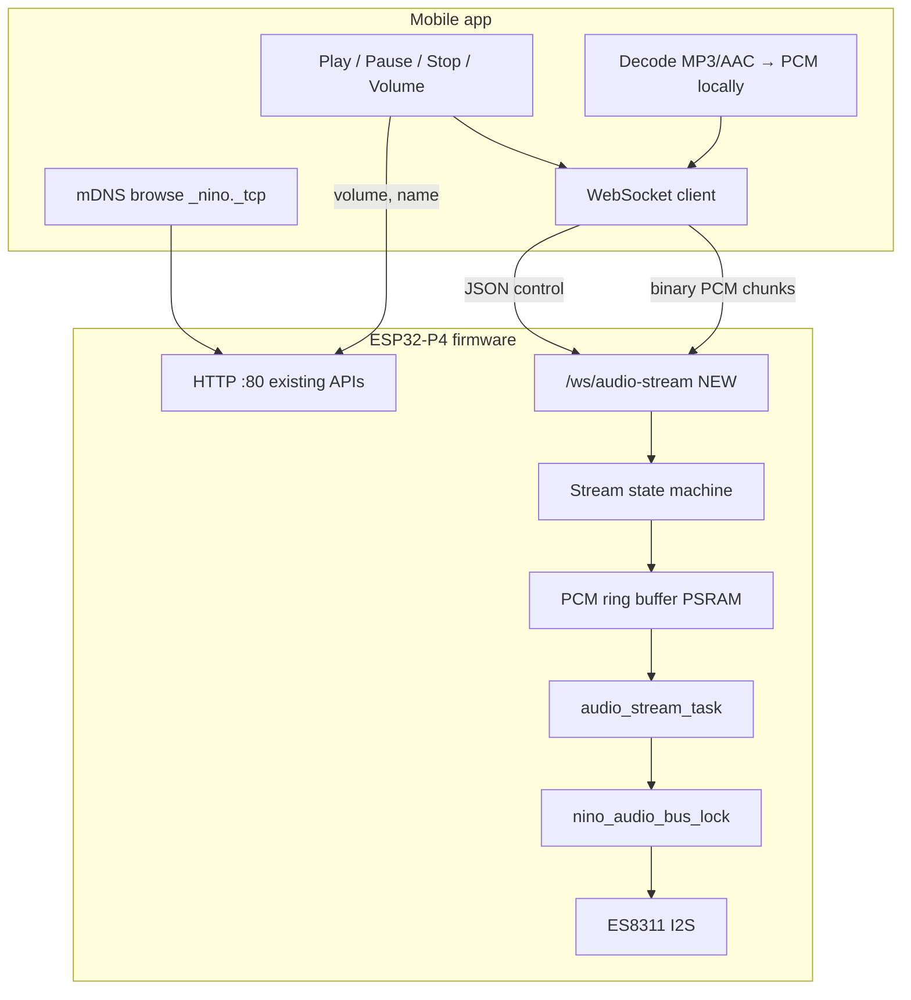
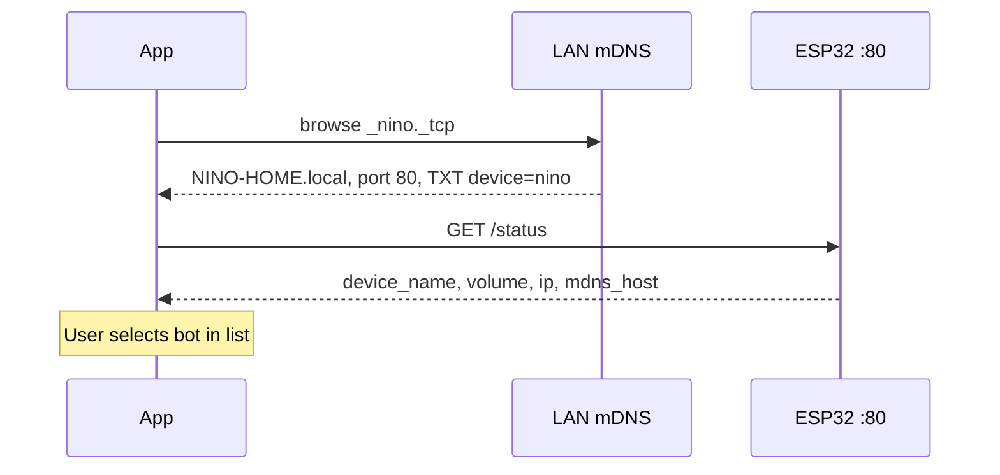
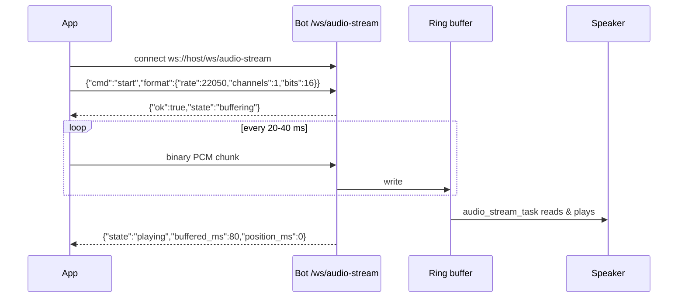
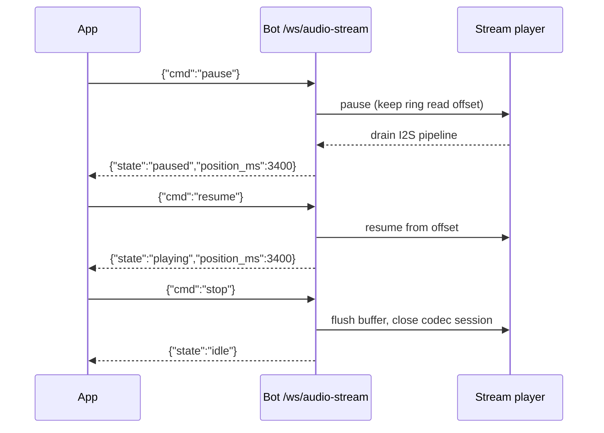
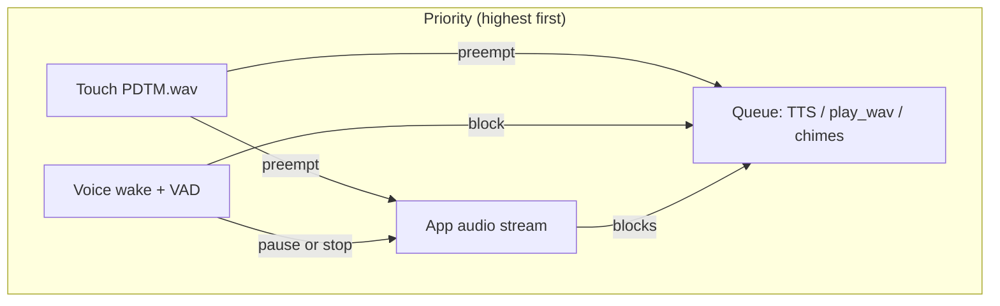

# Real-Time WiFi Audio Streaming — App → Bot

How to play audio from your mobile app on the NINO bot over WiFi, with play / pause / stop / resume in real time. This doc covers end-to-end flow, protocol design, app integration (using your existing mDNS discovery), and **what must change on the firmware side**.

Pair with [FIRMWARE_ARCHITECTURE.md](FIRMWARE_ARCHITECTURE.md) and [MDns.md](MDns.md).

---

## Table of contents

- [1. What you have today](#1-what-you-have-today)
- [2. Goal](#2-goal)
- [3. Recommended architecture](#3-recommended-architecture)
- [4. End-to-end flow](#4-end-to-end-flow)
- [5. Wire protocol (WebSocket)](#5-wire-protocol-websocket)
- [6. App implementation guide](#6-app-implementation-guide)
- [7. Firmware changes required](#7-firmware-changes-required)
- [8. Interaction with existing audio](#8-interaction-with-existing-audio)
- [9. Phased rollout plan](#9-phased-rollout-plan)
- [10. Testing checklist](#10-testing-checklist)

---

## 1. What you have today

| Layer | Current behavior | Good for streaming? |
|-------|------------------|---------------------|
| **Discovery** | mDNS `_nino._tcp` on port **80**, UDP `discover` on `239.255.255.250:1900` | Yes — app already finds the bot |
| **Control** | `GET/POST /speaker/volume`, `GET/POST /device/name`, `GET /status` | Yes — reuse as-is |
| **Audio playback** | `POST /play_wav` — upload **entire WAV** (max **384 KiB**), queued worker | **No** — whole-file, not real-time |
| **WebSocket on bot** | `GET /ws/status` — ping / status JSON only | Partial — WS infra exists, not audio |
| **TCP :8888** | Accepts connections, **logs** messages only | Could be extended, but WS is better |
| **Voice assistant** | Bot is **WebSocket client** → PC server `/voice-query` | Separate path; must not break |
| **Audio worker** | `audio_queue.c` — touch preempts server WAV with pause/resume | Pattern to copy, not the queue itself |

**Bottom line:** Discovery and basic control are ready. You need a **new streaming path** on the firmware — do not try to stretch `POST /play_wav` into streaming (384 KiB cap, full-buffer-before-play, no app pause API).

---

## 2. Goal

```text
[Mobile app]  ──WiFi LAN──►  [ESP32-P4 bot speaker]
     │                              │
     │  mDNS discover               │  ES8311 I2S
     │  connect                     │  play PCM in real time
     │  tap "Play song"             │
     │  pause / resume / stop       │  reacts within ~50–150 ms
     └──────────────────────────────┘
```

Requirements:

1. User picks audio in the app → sound starts on the bot **without** waiting for the full file to upload.
2. **Pause** freezes playback; **Resume** continues from the same position.
3. **Stop** clears buffer and returns to idle.
4. **Volume** and **device name** keep using existing HTTP APIs.
5. PC server (`server/`) stays out of this path — app talks **directly** to the bot on LAN.

---

## 3. Recommended architecture

Use a **WebSocket on the firmware** for both control and PCM data. ESP-IDF HTTP server already supports WebSocket (`/ws/status` proves it).



**Why WebSocket (not HTTP upload or TCP :8888)?**

| Option | Latency | Pause/resume | Mobile libraries | Fits existing code |
|--------|---------|--------------|------------------|-------------------|
| **WebSocket PCM** | Low | Easy | Excellent | `/ws/status` already there |
| HTTP chunked POST | Medium | Awkward | OK | New handler, one-way |
| TCP :8888 custom | Low | Custom framing | Manual | Port exists but no protocol |
| Extend `/play_wav` | High | No | N/A | Wrong model |

**Audio format (recommended contract):**

| Field | Value | Notes |
|-------|-------|-------|
| Sample rate | **22050 Hz** | Matches embedded WAV assets; ES8311 handles it |
| Channels | **1** (mono) | Same as voice/TTS path |
| Sample format | **16-bit signed LE PCM** | Raw bytes on WS binary frames |
| Chunk duration | **20–40 ms** | ~882–1764 bytes/chunk at 22050 Hz |
| App-side encoding | Decode to PCM **before** send | Bot should not run MP3 decoder in v1 |

---

## 4. End-to-end flow

### 4.1 Discovery & pairing (already works)



Existing endpoints:

- `GET http://<host>/status` — `{ device_name, volume, ip, mdns_host, ... }`
- `GET/POST http://<host>/device/name` — rename bot
- `GET/POST http://<host>/speaker/volume` — volume 0–100

Resolve host as: mDNS name → `http://NINO-HOME.local` (or IP from discovery response).

### 4.2 Start streaming



App should **prefill** ~100–200 ms of PCM after `start` before the bot flips to `playing` (small jitter buffer).

### 4.3 Pause / resume / stop



**Real-time feel:** Pause should set a flag checked in the write loop (same pattern as `s_stop_requested` in `audio_queue.c`). Target **&lt; 100 ms** from command to silent speaker.

---

## 5. Wire protocol (WebSocket)

**Endpoint (proposed):** `ws://<bot-host>/ws/audio-stream`  
**Port:** same as HTTP (**80**) — advertise in mDNS TXT when implemented.

### 5.1 App → bot (text / JSON)

| Command | Payload | Effect |
|---------|---------|--------|
| Start | `{"cmd":"start","format":{"rate":22050,"channels":1,"bits":16}}` | Reset buffer, open codec session, expect binary frames |
| Pause | `{"cmd":"pause"}` | Stop consuming buffer; keep `position_ms` |
| Resume | `{"cmd":"resume"}` | Continue from saved offset |
| Stop | `{"cmd":"stop"}` | Flush, idle, close WS session optional |
| Ping | `{"cmd":"ping"}` | Keepalive |

Optional later: `{"cmd":"seek","position_ms":5000}`.

### 5.2 App → bot (binary)

- **One WebSocket binary frame = one PCM chunk** (no WAV header per chunk).
- Length should be multiple of 2 (16-bit samples).
- Send only after successful `start` ack.

### 5.3 Bot → app (text / JSON)

| Message | Meaning |
|---------|---------|
| `{"ok":true,"state":"buffering"}` | Ready for PCM |
| `{"state":"playing","buffered_ms":120,"position_ms":800}` | Periodic status (every 500 ms) |
| `{"state":"paused","position_ms":3400}` | Paused |
| `{"state":"idle"}` | Stopped or finished |
| `{"state":"underrun"}` | App too slow; need more data |
| `{"ok":false,"error":"busy"}` | Voice/touch owns audio bus |
| `{"ok":false,"error":"invalid_format"}` | Bad start params |

### 5.4 Errors & backpressure

- Ring buffer **full** → bot sends `{"state":"backpressure"}`; app slows sends.
- Ring buffer **empty** while playing → `underrun`; app should burst ~200 ms of PCM.
- Invalid JSON → `{"ok":false,"error":"bad_cmd"}`.

---

## 6. App implementation guide

### 6.1 Discovery

1. Browse **`_nino._tcp.local`** (Bonjour / NSD / Android NsdManager).
2. Read TXT: `device=nino`, `ble_name`, `transport=http`.
3. Connect to **`host:80`** (from SRV record).
4. Fallback: UDP send `"discover"` to `239.255.255.250:1900` — parse `name`, `ip`, port `8888` (legacy).

### 6.2 Connection state in app

```text
DISCOVERED → CONNECTED (HTTP /status ok) → STREAM_IDLE
STREAM_IDLE → STREAM_BUFFERING → STREAM_PLAYING
STREAM_PLAYING ↔ STREAM_PAUSED
any → STREAM_IDLE (stop or error)
```

### 6.3 Playing a local file

1. User taps a track in the app.
2. App decodes file to **22050 Hz mono PCM** (platform decoder → resample if needed).
3. Open WebSocket to `/ws/audio-stream`.
4. Send `start`, then PCM chunks in a loop (respect backpressure).
5. On **Pause**: stop sending chunks; send `pause` JSON (bot stops DAC; position frozen).
6. On **Resume**: send `resume`, continue chunks from same sample index.
7. On **Stop** or track end: send `stop`, close WS.

### 6.4 Volume & rename (unchanged)

```http
POST /speaker/volume
Content-Type: application/json

{"volume": 65}
```

```http
POST /device/name
Content-Type: application/json

{"device_name": "Kitchen Nino"}
```

### 6.5 What the PC server does **not** do

The Python server in `server/` is for **wake word → STT → LLM → TTS → POST /play_wav**. App music streaming is **direct app ↔ bot**. No server changes required for v1.

---

## 7. Firmware changes required

This is the main work. Grouped by new code vs changes to existing modules.

### 7.1 New module: `audio_stream.c` / `audio_stream.h`

| Responsibility | Detail |
|----------------|--------|
| Ring buffer | 200–500 ms PCM in **PSRAM** (~9–22 KiB @ 22050 mono) |
| `audio_stream_task` | FreeRTOS task: read ring → `esp_codec_dev_write` in 4 KiB blocks (mirror `nino_audio_play_decoded`) |
| State machine | `IDLE`, `BUFFERING`, `PLAYING`, `PAUSED`, `STOPPING` |
| Position tracking | `position_ms` from bytes consumed |
| API | `audio_stream_feed()`, `audio_stream_pause()`, `audio_stream_resume()`, `audio_stream_stop()`, `audio_stream_get_status()` |

Implementation notes:

- Reuse **`nino_audio_bus_lock()`** / **`nino_audio_bus_unlock()`** from `audio_playback.c`.
- Open codec once per session (`esp_codec_dev_open` with 22050 / 16 / mono) — same as queue worker.
- On pause: stop reading ring; do **not** free read index.
- On stop: reset ring, `esp_codec_dev_close`, state → `IDLE`.

### 7.2 New WebSocket handler: `/ws/audio-stream`

Add in `main.c` (alongside existing `/ws/status`):

| Piece | Detail |
|-------|--------|
| URI registration | `.is_websocket = true`, increase `max_uri_handlers` |
| Text frames | Parse minimal JSON (`cmd`, `format`) — same style as `json_value_start()` in `main.c` |
| Binary frames | Forward payload to `audio_stream_feed()` |
| Async send | Status JSON every 500 ms while `PLAYING` (optional timer or tick in stream task) |
| Single client | Only one app stream at a time; second connect → `{"ok":false,"error":"busy"}` |

Enable in `sdkconfig` if not already: **`CONFIG_HTTPD_WS_SUPPORT=y`**.

### 7.3 Audio arbitration layer (new or extend `audio_queue.c`)

Introduce a global **audio owner** enum:

```text
AUDIO_OWNER_NONE
AUDIO_OWNER_STREAM      ← app WebSocket
AUDIO_OWNER_QUEUE       ← /play_wav, voice TTS, embedded WAV
AUDIO_OWNER_VOICE_CAP   ← wake / VAD mic capture
```

Rules:

| Event | Action |
|-------|--------|
| Stream `start` while queue playing | Stop queue clip OR reject stream (`busy`) — **pick one for v1** |
| Touch sensor during stream | **Pause stream**, play `PDTM.wav`, **resume stream** (same as server WAV today) |
| Wake word during stream | **Pause or stop stream**, run voice pipeline, then idle |
| Stream active | Reject new `POST /play_wav` with 409 or queue after stream stops |

Expose: `nino_audio_try_acquire(owner)`, `nino_audio_release(owner)`.

### 7.4 Changes to existing files

| File | Change |
|------|--------|
| **`main/main.c`** | Register `/ws/audio-stream`; bump `max_uri_handlers`; optional mDNS TXT `audio=ws` |
| **`main/CMakeLists.txt`** | Add `audio_stream.c` |
| **`main/audio_queue.c`** | Check audio owner before play; integrate touch preempt with stream pause/resume |
| **`main/touch_sensor.c`** | Call `audio_stream_pause()` when stream active (not only queue suspend) |
| **`main/voice_wake.c` / `voice_assist.c`** | If stream playing, pause/stop before mic capture |
| **`main/audio_playback.h`** | Optional: `nino_audio_play_pcm_stream()` helper shared by queue and stream |
| **`sdkconfig`** | Confirm `HTTPD_WS_SUPPORT`, PSRAM allocation for stream buffer |

### 7.5 mDNS TXT (optional but helpful)

Add to existing TXT in `mdns_start_service()`:

```c
{"audio", "ws"},
{"audio_path", "/ws/audio-stream"},
{"pcm_rate", "22050"},
```

App can read these instead of hardcoding paths.

### 7.6 What you do **not** need for v1

- MP3/AAC decoder on ESP32
- Changes to PC `server/` or `esp_playback.py`
- TLS / HTTPS on port 443 (LAN-only; match current HTTP :80)
- TCP :8888 protocol (unless you want a second transport later)

---

## 8. Interaction with existing audio



Aligns with current design principle: **touch &gt; server audio** ([FIRMWARE_ARCHITECTURE.md](FIRMWARE_ARCHITECTURE.md)). Extend that to **touch &gt; app stream &gt; queued WAV**.

Existing pause/resume in `audio_queue.c` (lines around `s_suspended`, `play_suspended`) is the **template** for stream pause — save `pcm_offset`, stop DAC, resume later.

---

## 9. Phased rollout plan

### Phase 1 — MVP (prove latency)

- [ ] `audio_stream.c` with ring buffer + play task
- [ ] `/ws/audio-stream`: `start`, binary PCM, `stop` only
- [ ] App: discover → play one test tone / short WAV as PCM
- [ ] No pause yet; single client

### Phase 2 — Transport controls

- [ ] `pause` / `resume` with position tracking
- [ ] Status messages (`playing`, `paused`, `underrun`)
- [ ] App UI: play / pause / stop

### Phase 3 — Coexistence

- [ ] Audio owner + touch preempt stream
- [ ] Voice wake pauses stream
- [ ] Reject or queue `POST /play_wav` during stream

### Phase 4 — Polish

- [ ] mDNS TXT for audio capability
- [ ] Seek (optional)
- [ ] Stream finished event when app sends all PCM and buffer drains

---

## 10. Testing checklist

### Firmware (serial + curl)

1. Flash build with `/ws/audio-stream`.
2. Use a WS test client (e.g. `websocat`) on the same LAN:
   - Connect `ws://<IP>/ws/audio-stream`
   - Send `{"cmd":"start","format":{"rate":22050,"channels":1,"bits":16}}`
   - Send binary PCM (generate 1 kHz sine in Python)
   - Verify speaker output
3. Send `pause` / `resume` / `stop` — measure silence delay.
4. Trigger touch during stream — warning plays, stream resumes.
5. Say wake word during stream — voice pipeline still works.

### App

1. mDNS lists bot after Wi-Fi provisioning.
2. `/status` shows correct name and volume.
3. Play local file — audio starts within **&lt; 300 ms**.
4. Pause — bot silent within **&lt; 100 ms**; resume continues same position.
5. Volume slider → `POST /speaker/volume` — immediate level change (applies to stream too).
6. Rename → `POST /device/name` → mDNS name updates.

### Stress

- Walk app to WiFi edge — expect `underrun` / recovery, no crash.
- Second phone connects — gets `busy`.
- Reconnect after bot reboot — clean idle state.

---

## Quick reference — today vs target

| Feature | Today | After streaming work |
|---------|-------|----------------------|
| Play app audio | Not supported | WebSocket PCM stream |
| Real-time pause | No | Yes (`pause` / `resume`) |
| Discovery | mDNS + UDP | Same + optional TXT |
| Volume / name | HTTP | Same |
| Voice assistant | WS client → PC | Unchanged; pauses stream |
| `POST /play_wav` | Full file, 384 KiB max | Still for server/TTS; not for app music |

---

## Related docs

| Document | Contents |
|----------|----------|
| [FIRMWARE_ARCHITECTURE.md](FIRMWARE_ARCHITECTURE.md) | Audio queue, HTTP API, tasks |
| [MDns.md](MDns.md) | mDNS hostname and service records |
| [SERVER_ARCHITECTURE.md](SERVER_ARCHITECTURE.md) | PC voice pipeline (separate from app streaming) |
| [WIFI_PROVISION.md](WIFI_PROVISION.md) | Getting the bot on your LAN |
