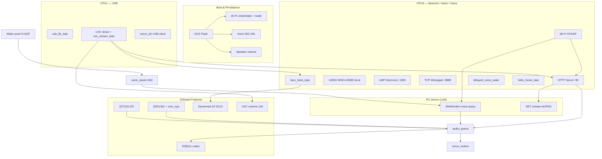
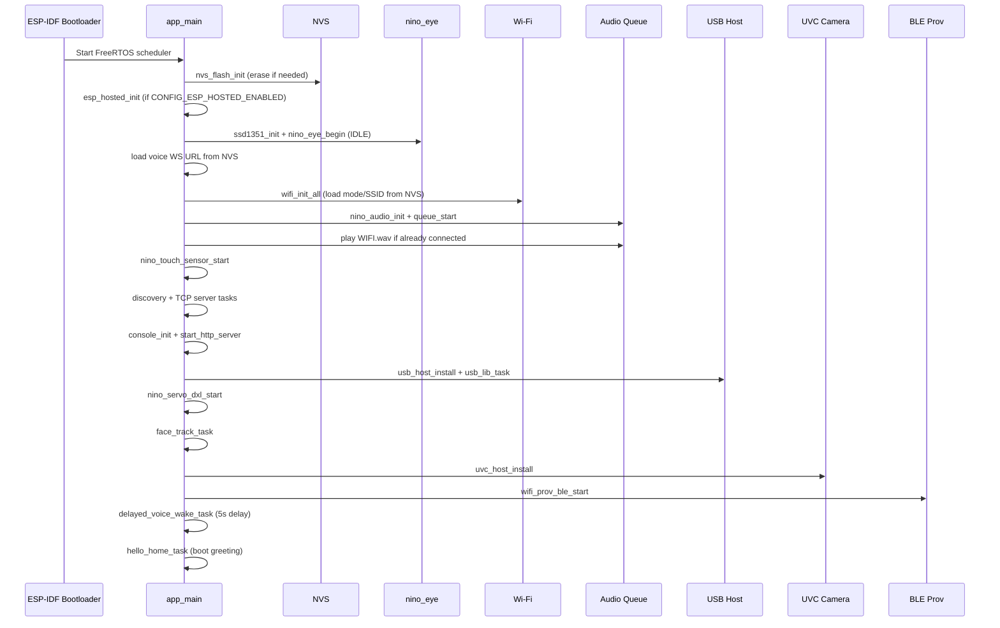
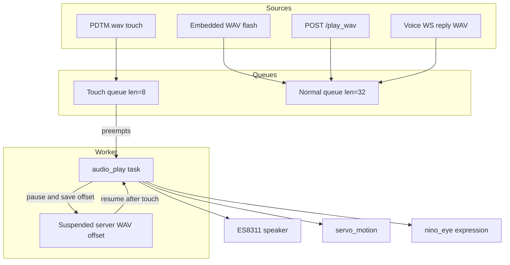
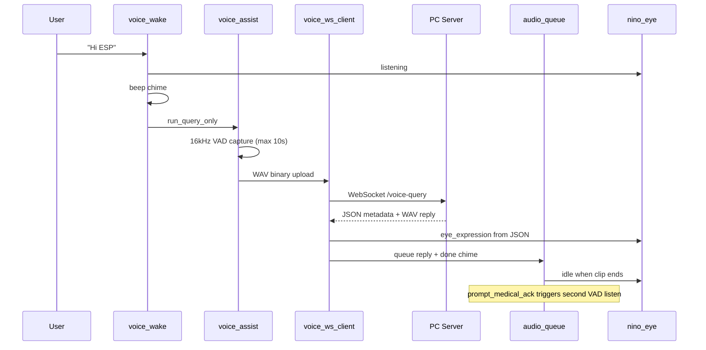

# NINO Home Bot — Firmware Architecture

Architecture of the ESP32-P4 firmware in `main/`, from reset through every onboard feature. The PC FastAPI server handles STT, LLM, face *recognition*, and TTS; this document focuses on what runs on the board.

---

## Table of contents

- [1. Platform & Stack](#1-platform--stack)
- [2. High-Level System Diagram](#2-high-level-system-diagram)
- [3. Boot Sequence](#3-boot-sequence-app_main)
- [4. Module Map](#4-module-map)
- [5. FreeRTOS Tasks & CPU Affinity](#5-freertos-tasks--cpu-affinity)
- [6. Feature Deep-Dives](#6-feature-deep-dives)
  - [6.1 Wi-Fi & Provisioning](#61-wi-fi--provisioning)
  - [6.2 USB Camera (UVC)](#62-usb-camera-uvc)
  - [6.3 Face Detection & Pan Tracking](#63-face-detection--pan-tracking)
  - [6.4 Dynamixel Servos (U2D2)](#64-dynamixel-servos-u2d2)
  - [6.5 Audio System](#65-audio-system)
  - [6.6 Voice Assistant Pipeline](#66-voice-assistant-pipeline)
  - [6.7 OLED Eyes](#67-oled-eyes)
  - [6.8 Touch Sensor](#68-touch-sensor)
  - [6.9 BLE Wi-Fi Provisioning](#69-ble-wi-fi-provisioning)
- [7. HTTP API (Firmware Port 80)](#7-http-api-firmware-port-80)
- [8. Serial Console Commands](#8-serial-console-commands)
- [9. NVS & Persistence Summary](#9-nvs--persistence-summary)
- [10. External Integration (PC Server)](#10-external-integration-pc-server)
- [11. Hardware Wiring Reference](#11-hardware-wiring-reference)
- [12. Design Principles](#12-design-principles)

---

## 1. Platform & Stack

| Item | Value |
|------|--------|
| **Target** | ESP32-P4 Function EV Board |
| **Framework** | ESP-IDF 5.5+, FreeRTOS |
| **Wi-Fi** | On-chip (P4) + optional **ESP-Hosted** C6 co-processor for BLE |
| **PSRAM** | Used for UVC frames, face inference, large WAV buffers |
| **Entry point** | `app_main()` in `main/main.c` |

**Build dependencies** (`main/CMakeLists.txt`): Wi-Fi, HTTP server, mDNS, USB/UVC, esp-sr (wake word), esp32_p4_function_ev_board BSP, WebSocket client, Dynamixel over USB, ESP-DL face detect.

**Embedded audio assets:** `WIFI.wav`, `Hello-home.wav`, `WIFI-UNABLE.wav`, `GO-APP.wav`, `PDTM.wav`, `beep.wav`

---

## 2. High-Level System Diagram



---

## 3. Boot Sequence (`app_main`)

Order matters: eyes first for user feedback, then network/audio, then USB peripherals.



### Boot greeting logic (`hello_home_task`)

| Condition | Audio played |
|-----------|--------------|
| No saved STA SSID in NVS | `GO-APP.wav` — prompt to use the app to provision |
| Provisioned, Wi-Fi connects within 60 s | `Hello-home.wav` (after `WIFI.wav` on connect) |
| Connect fails (auth / SSID not found) | `WIFI-UNABLE.wav` (once per attempt) |

### `app_main` init order (reference)

```text
1.  NVS flash init
2.  esp_hosted_init (if enabled)
3.  SSD1351 + nino_eye_begin (IDLE)
4.  Voice assist mutex + load WS URL from NVS
5.  Frame mutex + UVC frame queue + face_tracker_init
6.  wifi_init_all
7.  nino_audio_init + load volume + audio_queue_start
8.  Optional WIFI.wav if already connected
9.  nino_touch_sensor_start
10. multicast_discovery_task + tcp_message_server_task
11. console_init + start_http_server
12. usb_host_install + usb_lib_task (300 ms settle)
13. nino_servo_dxl_start
14. face_track_task
15. uvc_host_install
16. wifi_prov_ble_start
17. delayed_voice_wake_task (5 s)
18. hello_home_task
```

---


## 5. FreeRTOS Tasks & CPU Affinity

On dual-core builds: **Core 0 = network / voice / vision**, **Core 1 = USB**.

| Task | Stack | Priority | Core | Module |
|------|-------|----------|------|--------|
| `usb_lib` | 4K | 20 | USB | USB host event loop |
| `uvc_driver` (background) | 4K | 21 | USB | UVC driver |
| `uvc_stream` | 8K | 19 | USB | Camera stream open/read |
| `face_track` | 12K | 5 | NET | Face detect + pan |
| `audio_play` | 6K | 6 | — | WAV queue worker |
| `touch_poll` | 4K | 5 | — | Capacitive sensor |
| `dxl_*` / spin / hon | 4K | 4–18 | USB | Dynamixel |
| `wake_feed` / `wake_fetch` | — | 3 | 1 / 0 | Wake word AFE |
| `after_wake` | 20K | 3 | — | Post-wake voice pipeline |
| `discovery` | 4K | 5 | NET | UDP multicast discover |
| `tcp_server` | 4K | 5 | NET | Port 8888 messages |
| `hello_home` | 4K | 4 | NET | Boot greeting |
| `wake_delay` | 4K | 3 | NET | Deferred wake init (5 s) |
| `sta_reconn` | 2K | 5 | NET | Wi-Fi retry (5 s delay) |
| `nino_eye` (internal) | — | — | — | OLED animator |

Wake word is deliberately delayed 5 s after boot so UVC USB DMA allocation does not race AFE init.

---

## 5. Feature Deep-Dives

### 5.1 Wi-Fi & Provisioning

**NVS namespace:** `wifi_cfg`

| Key | Content |
|-----|---------|
| `mode` | AP / STA / APSTA |
| `sta_ssid`, `sta_pass` | Home network |
| `voice_ws` | e.g. `ws://192.168.x.x:8000/voice-query` |

**Modes:** Default AP `ESP32_P4_CAM` / `12345678`. STA credentials from serial, HTTP `POST /api/wifi/config`, or BLE GATT.

**Events:**

- `IP_EVENT_STA_GOT_IP` → mDNS start, `WIFI.wav`, BLE status update
- `WIFI_EVENT_STA_DISCONNECTED` → mDNS stop, optional `WIFI-UNABLE.wav`, auto-reconnect after 5 s

**Discovery:** UDP multicast `239.255.255.250:1900` — responds to `"discover"` with MAC, name, IP, message port `8888`.

**mDNS:** Host `NINO - HOME.local`, service `_nino._tcp` on port 80.

---

### 5.2 USB Camera (UVC)

**Hardware:** Powered USB hub on **J18** → UVC webcam.

**Pipeline:**

1. `uvc_driver_event_callback` — device connect, enumerate MJPEG modes
2. Prefer **640×480 @ ~15 fps** MJPEG
3. `uvc_stream_task` — frames into queue → `latest_frame_store()` (mutex + sequence counter)
4. `face_track_task` notified on new frame
5. HTTP `/snapshot.jpg` and `/stream` read from `latest_frame`

**Frame budget:** ~92 KB buffers in PSRAM, 3 frame buffers, 4 URBs × 24 KB.

Face inference runs at **250 ms** intervals (not every frame) to reduce CPU contention with UVC.

---

### 5.3 Face Detection & Pan Tracking


- **Detector:** `face_detect.cpp` — MSRMNP or ESPDet Pico (sdkconfig)
- **Tracker:** Disabled by default; enable via serial `track on`
- **Algorithm:** Smoothed face X → proportional pan with deadzone; reuses last face up to **8 s** on UVC stalls
- **Pauses when:** servo motion active, 360 spin, track hon, or U2D2 not ready

**CLI extras:** `track hon` (looping pan demo), `hstop`, `360` (full rotation)

---

### 5.4 Dynamixel Servos (U2D2)

**Hardware:** ROBOTIS U2D2 (FTDI) on same J18 hub as camera.

| Servo ID | Role | Range |
|----------|------|-------|
| **1** | Tilt | 0–1023 (center 512) |
| **2** | Pan | 0–1023 (center 512) |

**`servo_dxl.c`:** USB bulk to FTDI, Dynamixel v1 protocol, torque/position control, attach retry while hub enumerates.

**Motion modes (`servo_motion.c`):**

- `NINO_SERVO_MOTION_FULL` — L/R pan + U/D tilt during TTS
- `NINO_SERVO_MOTION_NOD_LR` — pan only (touch warnings)

**Special moves:**

- **360 spin (ID2):** 512 → 0 → 1023 → 512 via HTTP `/servo/360`, CLI `360`, or PC voice route
- **Track hon:** Demo loop 512→212→512→800→512 until `hstop`

See also [SERVO.md](SERVO.md).

---

### 5.5 Audio System



- **Volume:** NVS-backed; `GET/POST /speaker/volume` or `/volume`
- **Max HTTP WAV:** 384 KB
- **Header `X-Nino-Prompt-Ack: 1`:** After playback, triggers medical yes/no re-listen
- **Bus lock:** Shared I2C/I2S between wake, VAD, playback, touch

---

### 5.6 Voice Assistant Pipeline



**Wake word:** esp-sr WakeNet on `srmodels` partition; feed task on CPU1, fetch on CPU0.

**VAD parameters:** 20 ms frames, 200 ms pre-roll, 700 ms trailing silence, 3 s listen timeout.

**PC URL:** Stored in NVS; set via `voice connect <PC_IP> 8000`.

**Medical ack flow:** Server sets `prompt_medical_ack: true` → after TTS, firmware auto-listens (8 s) and sends second query.

---

### 5.7 OLED Eyes

**Displays:** 2× Waveshare SSD1351 128×96 (SPI: CLK 23, DIN 22, DC 21, RST 20, CS 26/27).

| State | Typical trigger |
|-------|-----------------|
| `idle` | Boot, after reply |
| `listening` | Wake word → end of user speech |
| `thinking` | Available; server can drive via expression |
| `happy`, `sad`, `surprised`, … | Server `eye_expression` in WS metadata |
| `recalling` | Memory/recap replies |

Animator runs in its own task; state changes are non-blocking. Serial: `eye <state>`.

See also [Eye states.md](Eye%20states.md).

---

### 5.8 Touch Sensor

**Hardware:** QT2120 @ I2C `0x1C`, SDA GPIO 7, SCL GPIO 8.

**Behavior:**

1. Calibrate at startup (hands away)
2. Poll every 30 ms; 300 ms stable touch required
3. On touch → queue `PDTM.wav` with **touch priority**
4. **Preempts** in-progress server WAV, plays warning with nod motion, **resumes** from saved PCM offset
5. 500 ms cooldown between triggers

---

### 5.9 BLE Wi-Fi Provisioning

**Requires:** ESP-Hosted + C6 with NimBLE firmware.

**GATT service** `4facb001-…`:

- SSID, password, apply command, status characteristic

Falls back gracefully: HTTP `/api/wifi/config` always works if BLE unavailable.

See also [WIFI_PROVISION.md](WIFI_PROVISION.md).

---

## 6. HTTP API (Firmware Port 80)

| Method | Path | Purpose |
|--------|------|---------|
| GET | `/` | Info page + snapshot preview |
| GET | `/stream` | MJPEG multipart stream |
| GET | `/snapshot.jpg` | Single JPEG frame |
| POST | `/play_wav` | Queue WAV (+ optional `X-Nino-Prompt-Ack`) |
| POST | `/servo/360` | ID2 full rotation |
| GET/POST | `/speaker/volume`, `/volume` | Volume 0–100 |
| GET | `/status` | Device JSON (Wi-Fi, volume, firmware) |
| GET | `/ws/status` | WebSocket status ping |
| GET | `/api/wifi/status` | Provisioning state |
| POST | `/api/wifi/config` | JSON `{ssid, password}` |

No authentication — trusted LAN only.

---

## 7. Serial Console Commands

| Command | Action |
|---------|--------|
| `wifi mode ap\|sta\|both` | Switch Wi-Fi mode |
| `wifi connect <ssid> [pass]` | STA connect + NVS save |
| `wifi status` | Mode, IPs, connection |
| `voice connect <ip> [port]` | Save WS URL to NVS |
| `voice wake on\|off` | Enable/disable wake word |
| `voice status` | Wake HW, URL, tips |
| `speaker volume [0-100]` | Get/set volume |
| `eye <state>` | Set eye animation |
| `track on\|off\|status\|hon` | Face pan tracking |
| `360` | Servo ID2 spin |
| `hstop` | Stop track hon |
| `cpu_dump` | FreeRTOS CPU stats |

Prompt: `usb_cam>`

---

## 8. NVS & Persistence Summary

| Data | Namespace / key |
|------|-----------------|
| Wi-Fi mode, SSID, password | `wifi_cfg` |
| Voice WebSocket URL | `wifi_cfg` / `voice_ws` |
| Speaker volume | (via `audio_playback`) |

---

## 9. External Integration (PC Server)

The firmware is designed to pair with the Python server in `server/`:

| Firmware exposes | Server consumes |
|------------------|-----------------|
| `GET /stream` | Face recognition (YuNet/SFace), web UI |
| `POST /play_wav` | Greetings, alarms, TTS replies |
| `POST /servo/360` | Voice-triggered spin |
| WebSocket (client) | `/voice-query` — STT → LLM → TTS |

**Typical setup:**

```text
voice connect <PC_LAN_IP> 8000
```

```bash
python app.py --camera-source http://<ESP_IP>/stream \
              --esp-play-wav-url http://<ESP_IP>/play_wav
```

---

## 10. Hardware Wiring Reference

| Subsystem | Interface | Notes |
|-----------|-----------|-------|
| Camera + U2D2 | USB hub J18 | Shared bus; enumeration order affects servo readiness |
| Servos | Dynamixel AX via U2D2 | ID1 tilt, ID2 pan, 1 Mbps |
| Touch | I2C GPIO 7/8 | QT2120 @ 0x1C |
| Eyes | SPI | Dual SSD1351 |
| Audio | I2S ES8311 | Mic 16 kHz (voice), speaker 22.05 kHz typical for WAV |
| Wi-Fi/BLE | On-chip + C6 hosted | BLE optional for provisioning |

---

## 11. Design Principles

1. **Eyes-first boot** — User sees idle face immediately during long USB/Wi-Fi init.
2. **Touch > server audio** — Safety warning always preempts TTS with resume.
3. **USB isolation** — Camera and Dynamixel on Core 1; network on Core 0 to reduce watchdog issues.
4. **Deferred wake word** — 5 s delay avoids PSRAM/DMA contention with UVC.
5. **Face track throttling** — Inference at 250 ms, not full frame rate.
6. **Graceful degradation** — Missing camera, servos, touch, eyes, or BLE each log a warning and continue.

---

## Related docs

| Document | Contents |
|----------|----------|
| [SERVER_ARCHITECTURE.md](SERVER_ARCHITECTURE.md) | PC FastAPI server — STT, LLM, face ID, memory, alarms |
| [../README.md](../README.md) | Full project overview (firmware + server) |
| [WIFI_PROVISION.md](WIFI_PROVISION.md) | BLE / HTTP Wi-Fi setup |
| [SERVO.md](SERVO.md) | Dynamixel wiring and 360 API |
| [ALARM.md](ALARM.md) | Medical ack and alarm flow (server + firmware) |
| [Eye states.md](Eye%20states.md) | Eye expression reference |
| [MDns.md](MDns.md) | mDNS discovery on LAN |
