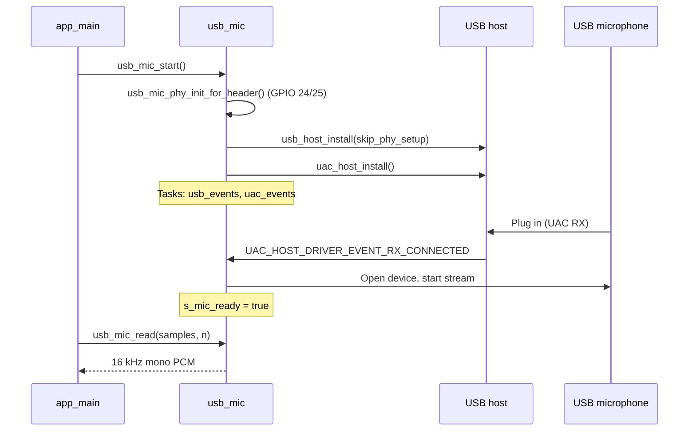

# Integrate USB-4-Mic into Main Build

Guide for bringing **USB microphone capture over the GPIO header** (ESP32-P4, Waveshare ESP32-P4-WIFI6) into another ESP-IDF project. Covers GPIO wiring, menuconfig, sdkconfig, and the core `usb_mic` module only — no wake word, ESP-SR, or speaker/beep logic.

> **NiNO full integration** (wake word, VAD, dual USB host with J18 camera, ReSpeaker tuning): see **[USB-4MIC-INTEGRATION.md](USB-4MIC-INTEGRATION.md)** in this repo.

---

## Overview

The USB mic path routes the **USB Full-Speed host PHY** to **GPIO 24 (D−)** and **GPIO 25 (D+)** on the 40-pin header instead of the onboard USB-A port (GPIO 26/27). Firmware uses the Espressif **USB Audio Class (UAC) host** driver to capture audio and expose **16 kHz mono PCM** via a small API.

```
USB mic (UAC)  →  usb_host + UAC driver  →  resample/mono  →  usb_mic_read()
                     ↑
              GPIO 24/25 PHY init
```

---

## Hardware wiring

Wire the USB mic cable to the **40-pin header**:


| USB wire   | Typical color | Board connection |
| ---------- | ------------- | ---------------- |
| VCC / VBUS | Red           | **5V**           |
| GND        | Black         | **GND**          |
| D−         | White         | **GPIO 24**      |
| D+         | Green         | **GPIO 25**      |


```
USB mic cable          ESP32-P4 header
─────────────          ─────────────────
Red   (VCC)     →      5V
Black (GND)     →      GND
White (D-)      →      GPIO 24
Green (D+)      →      GPIO 25
```

- Confirm wire colors with a multimeter — cables vary.
- Keep D+/D− leads **short**.
- If the mic is not detected, try swapping D+ and D−.
- Use a **separate USB port** for flash/serial debug; do not share it with the mic header.

**PHY mapping (ESP32-P4):**


| PHY        | D− / D+ GPIO | Use                        |
| ---------- | ------------ | -------------------------- |
| FSLS PHY 0 | GPIO 24 / 25 | GPIO header (this project) |
| FSLS PHY 1 | GPIO 26 / 27 | Onboard USB-A              |


---

## Files to add to your main build

Copy these from this repo into your `main/` component:


| File        | Purpose                                                   |
| ----------- | --------------------------------------------------------- |
| `usb_mic.c` | USB host, UAC capture, GPIO PHY setup, 16 kHz mono output |
| `usb_mic.h` | Public API                                                |


Add the Kconfig menu (below) to `main/Kconfig.projbuild` or merge into your existing projbuild file.

---

## Dependencies

### `main/idf_component.yml`

```yaml
dependencies:
  espressif/usb_host_uac: "^1.3.3"
```

### `main/CMakeLists.txt`

Register the mic sources and required IDF components:

```cmake
idf_component_register(
    SRCS "main.c" "usb_mic.c"
    INCLUDE_DIRS "."
    REQUIRES esp_driver_gpio usb
)
```

`usb_host_uac` is pulled in transitively via the component manager dependency above.

---

## GPIO menuconfig (`main/Kconfig.projbuild`)

Add a menu for USB mic GPIO pins. Defaults match Waveshare ESP32-P4-WIFI6:

```kconfig
menu "USB-4-Mic"

    config USB4MIC_USB_PHY_ON_HEADER
        bool "USB mic on GPIO header (D-/D+ on GPIO 24/25)"
        default y
        help
            Route the USB Full-Speed host port to FSLS PHY 0 (GPIO 24 = D-, GPIO 25 = D+)
            on the 40-pin header instead of the onboard USB-A port (GPIO 26/27 or HS PHY).
            Wire the mic cable: Red -> 5V, Black -> GND, White -> GPIO 24, Green -> GPIO 25.

    config USB4MIC_USB_DM_GPIO
        int "USB D- (DM) GPIO"
        default 24
        depends on USB4MIC_USB_PHY_ON_HEADER
        range 0 54

    config USB4MIC_USB_DP_GPIO
        int "USB D+ (DP) GPIO"
        default 25
        depends on USB4MIC_USB_PHY_ON_HEADER
        range 0 54

endmenu
```

If you use the **onboard USB-A port** instead, set `USB4MIC_USB_PHY_ON_HEADER=n` — the PHY init and `skip_phy_setup` path in `usb_mic.c` are skipped automatically.

---

## sdkconfig defaults (mic + GPIO only)

Add to `sdkconfig.defaults` (or set via `idf.py menuconfig`):

```ini
# USB mic on 40-pin header: D-=GPIO24, D+=GPIO25, VCC=5V, GND=GND
CONFIG_USB4MIC_USB_PHY_ON_HEADER=y
CONFIG_USB4MIC_USB_DM_GPIO=24
CONFIG_USB4MIC_USB_DP_GPIO=25

# Avoid USB Serial/JTAG driver competing for the same FSLS PHY pads
CONFIG_ESP_CONSOLE_SECONDARY_NONE=y
```

`CONFIG_ESP_CONSOLE_SECONDARY_NONE` is important when GPIO 24/25 are used for USB host — otherwise the secondary console can conflict with the FSLS PHY.

---

## Public API (`usb_mic.h`)

```c
#pragma once

#include <stdbool.h>
#include <stddef.h>
#include <stdint.h>

#include "esp_err.h"

/** Init FS PHY on GPIO header (call before usb_host_install when using header pins). */
esp_err_t usb_mic_phy_init_for_header(void);

/** Start UAC driver + ring buffer (after single usb_host_install). */
esp_err_t usb_mic_start(void);

/** Block UAC open on a USB address (e.g. UVC camera on J18 hub). */
void usb_mic_block_dev_addr(uint8_t dev_addr);

/** True after the USB microphone is streaming. */
bool usb_mic_ready(void);

/**
 * Read 16 kHz mono int16 PCM from the USB mic ring buffer.
 * Only one task may read at a time (internal mutex).
 */
esp_err_t usb_mic_read(int16_t *samples, int sample_count);

/** Discard buffered PCM (call before VAD after wake). */
void usb_mic_flush(void);
```

In the NiNO build, also use `nino_voice_wake_set_mic_capture_hold()` from `voice_wake.h` to pause wake feed while VAD holds the mic.

---

## Core logic: enable USB mic on GPIO header

### 1. Select FSLS PHY 0 and set D+/D− drive strength

When `CONFIG_USB4MIC_USB_PHY_ON_HEADER` is enabled, route PHY 0 to GPIO 24/25 and boost drive capability on those pins:

```c
#if CONFIG_USB4MIC_USB_PHY_ON_HEADER
#include "driver/gpio.h"
#include "esp_private/usb_phy.h"
#include "hal/usb_wrap_ll.h"
#include "soc/usb_wrap_struct.h"

static usb_phy_handle_t s_phy_handle;

static esp_err_t usb_mic_phy_init_for_header(void)
{
    /* FSLS PHY 0 = GPIO 24/25; default PHY 1 = GPIO 26/27 (onboard USB-A). */
    usb_wrap_ll_phy_select(&USB_WRAP, 0);
    gpio_set_drive_capability(CONFIG_USB4MIC_USB_DM_GPIO, GPIO_DRIVE_CAP_3);
    gpio_set_drive_capability(CONFIG_USB4MIC_USB_DP_GPIO, GPIO_DRIVE_CAP_3);

    const usb_phy_config_t phy_config = {
        .controller  = USB_PHY_CTRL_OTG,
        .target      = USB_PHY_TARGET_INT,
        .otg_mode    = USB_OTG_MODE_HOST,
        .otg_speed   = USB_PHY_SPEED_UNDEFINED,
        .ext_io_conf = NULL,
        .otg_io_conf = NULL,
    };
    esp_err_t err = usb_new_phy(&phy_config, &s_phy_handle);
    if (err != ESP_OK) {
        return err;
    }
    ESP_LOGI(TAG, "USB FS host PHY on header: D-=GPIO%d D+=GPIO%d (5V+GND)",
             CONFIG_USB4MIC_USB_DM_GPIO, CONFIG_USB4MIC_USB_DP_GPIO);
    return ESP_OK;
}
#endif
```

### 2. Install USB host with custom PHY

When using the header pins, skip the default PHY setup and select the OTG11 full-speed peripheral:

```c
const usb_host_config_t host_config = {
#if CONFIG_USB4MIC_USB_PHY_ON_HEADER
    .skip_phy_setup = true,
    .peripheral_map = BIT1, /* USB OTG11 full-speed (not HS UTMI on USB-A) */
#else
    .skip_phy_setup = false,
    .peripheral_map = 0,
#endif
    .intr_flags = ESP_INTR_FLAG_LOWMED,
};

#if CONFIG_USB4MIC_USB_PHY_ON_HEADER
ESP_ERROR_CHECK(usb_mic_phy_init_for_header());
#endif
ESP_ERROR_CHECK(usb_host_install(&host_config));
```

### 3. Start UAC driver and open mic on connect

On `UAC_HOST_DRIVER_EVENT_RX_CONNECTED`, open the device, pick the best alt setting (prefer **16 kHz**, fallback **48 kHz** with software resample), and start streaming:

```c
uac_host_driver_config_t uac_config = {
    .create_background_task = true,
    .task_priority          = 5,
    .stack_size             = 6144,
    .core_id                = 0,
    .callback               = uac_host_lib_callback,
    .callback_arg           = NULL,
};
ESP_ERROR_CHECK(uac_host_install(&uac_config));

/* On UAC_HOST_DRIVER_EVENT_RX_CONNECTED: */
const uac_host_device_config_t dev_cfg = {
    .addr             = addr,
    .iface_num        = iface_num,
    .buffer_size      = 9600,
    .buffer_threshold = 2400,
    .callback         = uac_device_callback,
    .callback_arg     = NULL,
};
uac_host_device_open(&dev_cfg, &mic);

/* Prefer 16 kHz mono; average multi-channel to mono; resample to 16 kHz if needed */
const uac_host_stream_config_t stream_cfg = {
    .channels       = alt.channels,
    .bit_resolution = alt.bit_resolution,
    .sample_freq    = mic_freq,
};
uac_host_device_start(mic, &stream_cfg);
s_mic_ready = true;
```

### 4. Read PCM in your application task

```c
esp_err_t usb_mic_start(void);  /* once at boot */

/* Wait for mic plug-in */
while (!usb_mic_ready()) {
    vTaskDelay(pdMS_TO_TICKS(100));
}

/* Read 16 kHz mono int16 samples */
int16_t buf[512];
esp_err_t err = usb_mic_read(buf, 512);
if (err == ESP_OK) {
    /* process buf[0..511] */
}
```

---

## Minimal `app_main` integration

Replace wake-word startup with direct mic usage:

```c
#include "esp_log.h"
#include "usb_mic.h"
#include "freertos/FreeRTOS.h"
#include "freertos/task.h"

static const char *TAG = "main";

static void mic_consumer_task(void *arg)
{
    (void)arg;

    while (!usb_mic_ready()) {
        ESP_LOGW(TAG, "Waiting for USB mic on GPIO %d/%d (5V+GND)...",
                 CONFIG_USB4MIC_USB_DM_GPIO, CONFIG_USB4MIC_USB_DP_GPIO);
        vTaskDelay(pdMS_TO_TICKS(500));
    }
    ESP_LOGI(TAG, "USB mic streaming");

    int16_t samples[320]; /* 20 ms @ 16 kHz */
    for (;;) {
        if (usb_mic_read(samples, 320) == ESP_OK) {
            /* Your audio processing here */
        }
    }
}

void app_main(void)
{
    ESP_LOGI(TAG, "Starting USB mic on GPIO header");

    ESP_ERROR_CHECK(usb_mic_start());
    xTaskCreate(mic_consumer_task, "mic_consumer", 4096, NULL, 5, NULL);
}
```

---

## Boot flow (mic only)




---

## Expected serial log

```
I (…) main: Starting USB mic on GPIO header
I (…) usb_mic: USB FS host PHY on header: D-=GPIO24 D+=GPIO25 (5V+GND)
I (…) usb_mic: USB host installed
I (…) usb_mic: UAC driver installed — connect USB microphone
W (…) main: Waiting for USB mic on GPIO 24/25 (5V+GND)...
I (…) usb_mic: USB mic ready: 16000 Hz, 1 ch, 16-bit
I (…) main: USB mic streaming
```

---

## Capture details (for integrators)


| Topic         | Behavior                                                                             |
| ------------- | ------------------------------------------------------------------------------------ |
| Output format | 16 kHz, mono, 16-bit signed PCM                                                      |
| Sample rate   | Prefers 16 kHz from device; 48 kHz with software resample; other rates supported     |
| Channels      | Multi-channel mics are averaged to mono                                              |
| Buffer        | ~1 s ring buffer (`StreamBuffer`)                                                    |
| Tasks         | `usb_events` (USB host lib), `uac_events` (UAC connect/read) — both pinned to core 0 |
| Disconnect    | `s_mic_ready` cleared; `usb_mic_read()` blocks until reconnect                       |


---

## Troubleshooting


| Symptom                             | Check                                                 |
| ----------------------------------- | ----------------------------------------------------- |
| No `USB host installed` log         | ESP32-P4 target; `usb_host_uac` dependency present    |
| Mic never detected                  | 5V + GND + GPIO 24/25 wiring; swap D+/D−; short wires |
| Build error on `usb_wrap_ll`        | ESP-IDF v5.x with ESP32-P4 USB host support           |
| Console/PHY conflict                | `CONFIG_ESP_CONSOLE_SECONDARY_NONE=y`                 |
| `usb_mic_read` timeout              | Mic not plugged or not UAC 1.0 compatible             |
| Stack overflow on multi-channel mic | Keep RX buffers static (already done in `usb_mic.c`)  |


---

## Checklist for main build merge

1. Copy `usb_mic.c` and `usb_mic.h` into `main/`.
2. Add `espressif/usb_host_uac` to `main/idf_component.yml`.
3. Add USB GPIO Kconfig menu (or equivalent `CONFIG_USB4MIC_*` symbols).
4. Set sdkconfig: `USB4MIC_USB_PHY_ON_HEADER`, DM/DP GPIOs, `ESP_CONSOLE_SECONDARY_NONE`.
5. Call `usb_mic_start()` from `app_main` (or your audio init).
6. Poll `usb_mic_ready()` then read with `usb_mic_read()` in your consumer task.
7. Do **not** add ESP-SR, wake model partition, or `voice_wake.c` unless you need wake word separately.

