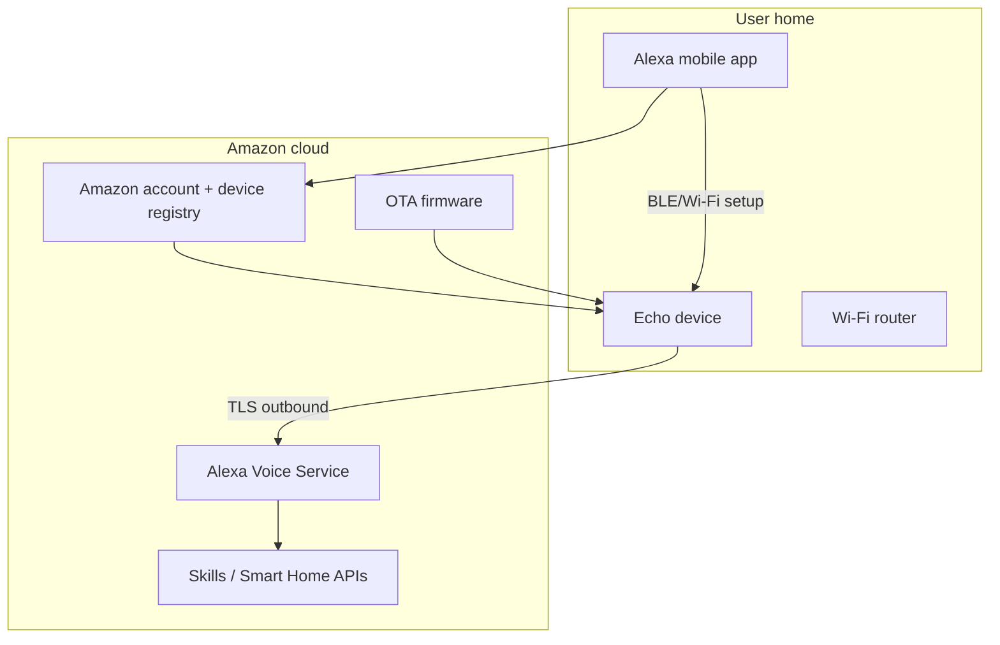
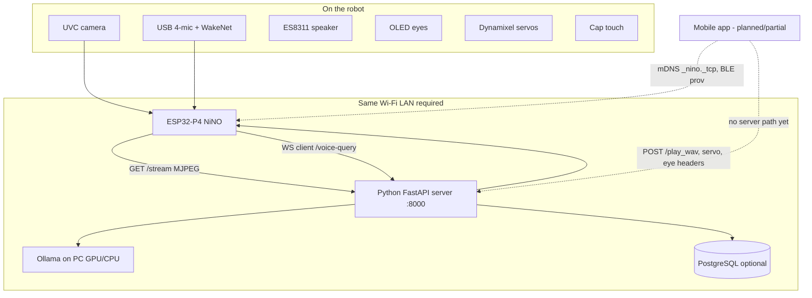
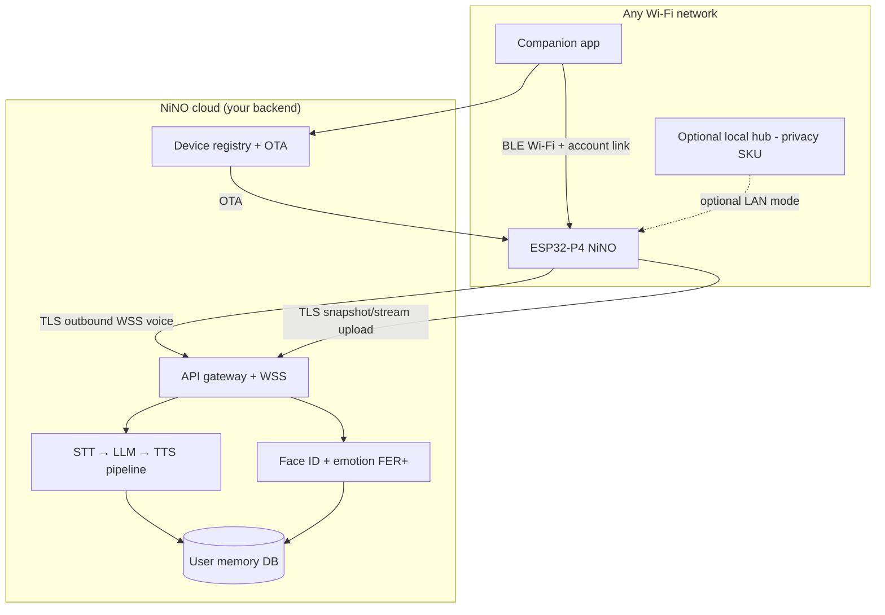
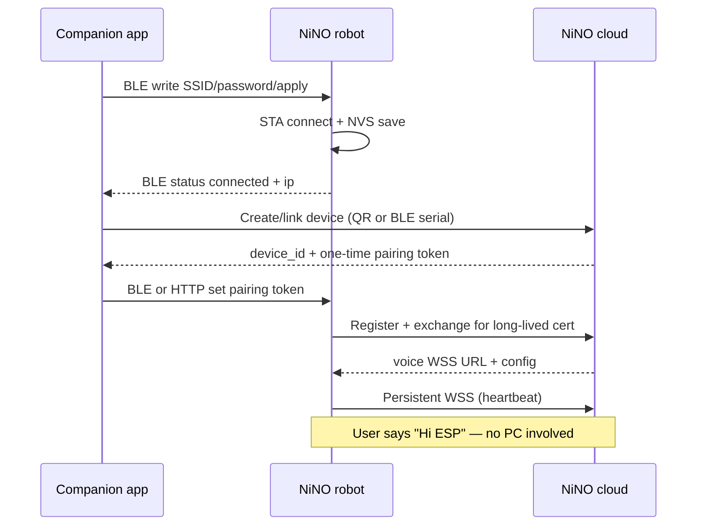

# NiNO Open Plan — Portable Product vs Alexa

A comparison of the current NiNO stack (ESP32-P4 firmware + PC Python server) with a consumer voice product like **Amazon Alexa**, plus a phased roadmap to ship a **portable, Wi‑Fi‑anywhere robot** that keeps vision, emotion, memory, and motion — without requiring a developer PC on the same LAN.

Pair with [FIRMWARE_ARCHITECTURE.md](FIRMWARE_ARCHITECTURE.md), [SERVER_ARCHITECTURE.md](SERVER_ARCHITECTURE.md), [WIFI_PROVISION.md](WIFI_PROVISION.md), and [AUDIO_STREAMING_FLOW.md](AUDIO_STREAMING_FLOW.md).

---

## Table of contents

- [1. Executive summary](#1-executive-summary)
- [2. Side-by-side architecture](#2-side-by-side-architecture)
- [3. What NiNO already has (Alexa-like)](#3-what-nino-already-has-alexa-like)
- [4. Critical gaps for a portable product](#4-critical-gaps-for-a-portable-product)
- [5. Recommended target architecture](#5-recommended-target-architecture)
- [6. Deployment models compared](#6-deployment-models-compared)
- [7. Phased roadmap](#7-phased-roadmap)
- [8. Decision matrix — best approach](#8-decision-matrix--best-approach)
- [9. Risks and mitigations](#9-risks-and-mitigations)
- [10. Success criteria](#10-success-criteria)

---

## 1. Executive summary

| Dimension | Alexa (Echo) | NiNO today | NiNO target (portable product) |
|-----------|--------------|------------|--------------------------------|
| **User setup** | Alexa app → Wi‑Fi → Amazon account | BLE/HTTP Wi‑Fi + manual `voice connect <PC_IP>` | Companion app → BLE Wi‑Fi → cloud account → done |
| **Where intelligence runs** | Amazon cloud (AVS) | Developer PC on same LAN | Cloud backend (or optional home hub) |
| **Device role** | Mic, speaker, wake word, minimal local logic | Mic, camera, speaker, servos, eyes, face track, wake word | Same rich edge — **thin client + smart edge** |
| **Vision** | Echo Show only; cloud-side | Camera on bot → PC does face/emotion | Camera stays on bot → frames to cloud (or hub) |
| **Works after moving homes** | Yes — re-provision Wi‑Fi in app | Wi‑Fi yes; **server URL breaks** | Yes — device re-registers to your cloud tenant |
| **Offline / privacy mode** | Limited | Full LAN if PC is up | Optional local hub SKU |

**Bottom line:** NiNO is already **halfway to an Alexa setup experience** on Wi‑Fi (BLE GATT provisioning, mDNS, HTTP control). The main blocker for “take it anywhere and talk to it” is not firmware — it is that **the brain lives on a PC you must configure by IP**. The best product path is a **hybrid cloud architecture**: keep the heavy pipeline you already built, host it in the cloud, and make the bot an **outbound WebSocket + HTTPS client** (same pattern as today, but pointed at `wss://api.yourproduct.com` instead of `ws://192.168.x.x:8000`).

---

## 2. Side-by-side architecture

### 2.1 Alexa (simplified)



**Key properties**

- Device **never** needs a discoverable LAN IP for voice — it maintains an **outbound** connection to Amazon.
- Identity is **account-bound** (serial + certificate), not “find my PC on the network.”
- Wake word and light DSP on device; STT/NLU/TTS in cloud.
- Standard Echo has **no robot vision or servos**; NiNO’s differentiation is exactly that extra edge + vision stack.

### 2.2 NiNO today



**Key properties**

- **Split brain:** firmware is production-quality for a demo; server is production-quality for a lab — but **coupled by LAN IP**.
- Voice WebSocket URL stored in NVS (`voice_ws`) — must be set via serial `voice connect <ip> 8000` or `X-Nino-Voice-Ws-Url` header from server on playback.
- Vision pipeline **pulls** camera from bot (`--camera-source http://<ESP_IP>/stream`) — server initiates ingest; bot does not push video to cloud today.
- BLE Wi‑Fi provisioning is **~95% done** ([WIFI_PROVISION.md](WIFI_PROVISION.md)); mobile app layer is not in-repo.
- No TLS, no auth on firmware HTTP — **trusted LAN only**.

### 2.3 NiNO target (portable product)



---

## 3. What NiNO already has (Alexa-like)

| Capability | Alexa | NiNO today | Notes |
|------------|-------|------------|-------|
| **Wi‑Fi provisioning via phone** | App (often BLE) | BLE GATT + HTTP fallback | Validated on hardware; needs companion app UX |
| **Wake word on device** | Yes | Yes — “Hi ESP” via esp-sr | Rename/custom wake word later |
| **Local chimes / feedback** | Yes | beep.wav, eye states, touch preempt | Stronger embodiment than Echo |
| **Speaker output** | Yes | ES8311 + queue + `/play_wav` | App streaming path planned ([AUDIO_STREAMING_FLOW.md](AUDIO_STREAMING_FLOW.md)) |
| **LAN discovery** | No (cloud) | mDNS `NINO-HOME.local`, UDP discover | Good for **local** app features, not enough for voice brain |
| **Device rename / volume** | App | HTTP `/device/name`, `/speaker/volume` | Reuse in companion app |
| **Multi-modal** | Echo Show (display) | Camera + servos + OLED eyes + touch | **Product differentiator** |
| **Conversation memory** | Amazon-side | PostgreSQL + Phase B/C memory | Needs cloud DB per user |
| **Account / identity** | Amazon account | Face recognition (local server) | Needs cloud user model |
| **Works without PC** | Yes | **No** | Primary gap |
| **Security (TLS/auth)** | Yes | LAN trust model | Must add for cloud |
| **OTA updates** | Yes | Manual flash | Required for shipped units |

NiNO is **more capable on the robot** than a standard Echo. It is **less capable as a shipped product** because setup and intelligence are still tied to a developer workstation.

---

## 4. Critical gaps for a portable product

### Gap A — Server coupling (blocker)

| Today | Problem | Target |
|-------|---------|--------|
| `voice connect 192.168.0.50 8000` | Every new network / PC IP change breaks voice | Device boots → cloud registration → fixed `wss://…/voice-query` |
| Server pulls `http://<ESP_IP>/stream` | Cloud cannot reach private LAN IP | Bot **pushes** snapshots or short MJPEG bursts over TLS, or maintains outbound video channel |
| `ESP_PLAY_WAV_URL=http://<ESP_IP>/play_wav` | Server must know bot IP | Bot registers IP/session with cloud; cloud uses **session routing** or bot pulls TTS via same WSS |

### Gap B — Product setup flow (blocker)

Current happy path:

1. Flash firmware  
2. BLE provision Wi‑Fi (works)  
3. Start Python server on a PC  
4. Serial/console: point bot at PC  
5. Start server with `--camera-source` and `--esp-play-wav-url`  

Alexa happy path:

1. Plug in device  
2. App: Wi‑Fi + login  
3. Talk  

**Missing:** companion app, device-to-account binding, automatic backend URL, no serial commands.

### Gap C — Security (required for cloud)

- Firmware HTTP :80 has **no authentication**.
- WebSocket voice carries raw audio — needs **TLS + device token**.
- Camera stream is world-readable on LAN — unacceptable on guest Wi‑Fi.

### Gap D — Compute placement (design choice)

Heavy workloads today on PC:

| Workload | Module | Fits on ESP32-P4? |
|----------|--------|-------------------|
| Wake word | esp-sr | Yes (already) |
| VAD + capture | voice_assist.c | Yes |
| STT (Whisper) | faster-whisper | No (quality + RAM) |
| LLM (Qwen 1.5B) | Ollama | No |
| Face YuNet/SFace | OpenCV | Borderline poor |
| Emotion FER+ | ONNX | No |
| TTS | ElevenLabs / espeak | No (quality) |

**Conclusion:** A pure “all on device” Alexa competitor is not realistic for NiNO’s vision stack. **Cloud or home hub** is required for quality.

### Gap E — Operational product layers

| Layer | Status |
|-------|--------|
| OTA firmware | Not implemented |
| Factory provisioning (device cert) | Not implemented |
| Crash telemetry | Logs only |
| Multi-user household | Face ID only; no household model |
| Privacy / GDPR | Not addressed |
| Offline degradation | Partial (Wi‑Fi chimes, touch) |

---

## 5. Recommended target architecture

### 5.1 Principle: **Outbound-first, like Alexa**

The bot should **initiate** connections to your backend. That way it works on:

- Home Wi‑Fi  
- Office Wi‑Fi  
- Mobile hotspot  
- Networks with client isolation (no LAN server discovery)

You already have the right firmware pattern: `voice_ws_client.c` is a **WebSocket client**, not a server.

### 5.2 Split responsibilities

| Layer | Stays on ESP32-P4 | Moves to cloud (port of `server/`) | Optional local hub |
|-------|-------------------|-------------------------------------|--------------------|
| Wake word + VAD | Yes | — | — |
| Mic capture → WS upload | Yes | — | — |
| Speaker playback | Yes | TTS bytes returned on WS or pull URL | Same |
| Camera capture | Yes | Face/emotion inference | Same |
| Face pan tracking | Yes | — | — |
| Servos + eyes + touch | Yes | Command messages from pipeline | Same |
| STT / LLM / TTS | — | Yes | Yes (privacy SKU) |
| Memory / alarms | — | Yes | Yes |
| Device registry / OTA | TLS client | Yes | Partial |

### 5.3 Vision transport change (important)

Today the **server pulls** the camera:

```text
PC: GET http://192.168.x.x/stream  ← requires PC on same LAN
```

For cloud/portable mode, invert to **push or rendezvous**:

| Option | Description | Pros | Cons |
|--------|-------------|------|------|
| **A. Snapshot push** | Bot POSTs JPEG every N ms during face track / after wake | Simple, low bandwidth | Latency for emotion path |
| **B. Outbound video WS** | Bot streams MJPEG over WSS to cloud | Reuses `/stream` encoder | Bandwidth cost |
| **C. Wake-triggered burst** | On “Hi ESP”, send 2–3 s of frames | Efficient | Emotion-only path needs timer |
| **D. Local hub relay** | Hub on LAN pulls `/stream`, uploads to cloud | Privacy + quality | Extra hardware |

**Recommendation:** Start with **A + C** for MVP cloud vision; add **B** if empathy latency is too high.

### 5.4 Audio path (voice)

Keep the existing `/voice-query` contract ([SERVER_ARCHITECTURE.md](SERVER_ARCHITECTURE.md)):

```text
Bot --WSS--> Cloud /voice-query
  → send WAV / PCM
  ← JSON { eye_expression, text } + binary WAV
```

Changes:

1. Replace LAN URL with `wss://api.example.com/v1/devices/{id}/voice`  
2. Add `Authorization: Bearer <device_token>` (or mTLS)  
3. Cloud routes TTS back on same socket (already how firmware works)  
4. Remove dependency on `POST /play_wav` from cloud to bot for **voice replies** (use WS return path only); keep HTTP playback for **async** alarms/notifications if needed via **bot polling** or **push on open WSS**.

### 5.5 Setup flow (target UX)



---

## 6. Deployment models compared

| Model | Portable? | Vision quality | Privacy | Dev effort | Best for |
|-------|-----------|----------------|---------|------------|----------|
| **1. Status quo (PC on LAN)** | No | Excellent | High (local) | Zero | Development only |
| **2. Cloud SaaS (recommended)** | Yes | Excellent | Medium | High | Consumer product |
| **3. Dedicated home hub (Pi/NUC)** | Within home | Excellent | High | Medium | Privacy-first SKU |
| **4. All-in-edge (LLM on ESP)** | Yes | Poor / dropped | Highest | Very high | Not recommended |
| **5. Hybrid: cloud voice + local hub vision** | Yes | Excellent | High | Highest | Enterprise / medical |

### Recommended default: **Model 2 (Cloud SaaS)** with optional **Model 3** later

Reasons:

1. Reuses ~90% of existing `server/` Python pipeline — lift to Docker/K8s, not rewrite.  
2. Matches Alexa’s “works anywhere” property.  
3. ESP32-P4 already acts as WS **client** — minimal firmware churn for voice.  
4. Vision push is incremental (new task or extend `voice_assist` snapshot path).  
5. BLE provisioning already matches consumer setup.

---

## 7. Phased roadmap

### Phase 0 — Foundation (4–6 weeks) — *“Stop needing serial commands”*

**Goal:** One network, one app, no `voice connect`.

| Task | Owner | Details |
|------|-------|---------|
| Companion app MVP | Mobile | BLE provisioning per [WIFI_PROVISION.md](WIFI_PROVISION.md); show `/status` |
| mDNS + manual server pairing | Mobile + firmware | App discovers bot; user enters cloud region OR app writes `voice_ws` over BLE new GATT char |
| Server discovery helper | Server | `network_util.voice_ws_url_for_esp()` already exists — expose stable LAN hostname via mDNS for **dev** |
| Document factory test | Ops | BLE + voice smoke test checklist |

**Exit:** New user on LAN talks without opening serial monitor.

---

### Phase 1 — Cloud MVP (8–12 weeks) — *“Alexa-like portability”*

**Goal:** Bot works on any Wi‑Fi; backend in cloud; no PC.

| Task | Details |
|------|---------|
| Containerize `server/` | Docker: FastAPI + Ollama sidecar or hosted LLM API |
| Device registry | device_id, pairing token, refresh token |
| TLS WSS voice | Port `/voice-query`; firmware NVS default URL → cloud |
| Auth | JWT or device cert on WSS + HTTPS |
| Snapshot upload API | `POST /v1/devices/{id}/frame` for face/emotion |
| Async playback | Alarms via WSS push or bot long-poll |
| Strip LAN-only assumptions | Remove hard dependency on `ESP_PLAY_WAV_URL` for voice path |

**Firmware changes (minimal):**

- `voice_ws` → cloud URL in factory NVS or set at pairing  
- Optional: `camera_upload.c` — periodic JPEG to cloud during emotion window  
- TLS trust store (Let's Encrypt CA bundle)  
- Reconnect/backoff on WSS (likely partial today — harden)

**Exit:** Unplug robot, take to friend’s house, BLE Wi‑Fi, talk within 5 minutes.

---

### Phase 2 — Product hardening (8–10 weeks)

| Task | Details |
|------|---------|
| OTA | ESP-IDF OTA partition + cloud job queue |
| Factory flash | Per-device cert injection |
| Companion app v1 | Account, device list, rename, volume, Wi‑Fi re-provision |
| Security audit | TLS only, rotate tokens, no open `/stream` on WAN |
| Observability | Device heartbeat, last seen, crash reports |
| Rate limits + cost controls | STT/TTS/LLM quotas per account |

---

### Phase 3 — Differentiation (ongoing)

Features Alexa does **not** do out of the box:

| Feature | Leverage |
|---------|----------|
| Emotion empathy | [EMOTION_RECOGNITION.md](EMOTION_RECOGNITION.md) |
| Face memory + recap | Phase B/C memory |
| Physical embodiment | Servos, OLED eyes, touch preempt |
| Medical alarms | [ALARM.md](ALARM.md) P0 ack flow |
| App → bot music stream | [AUDIO_STREAMING_FLOW.md](AUDIO_STREAMING_FLOW.md) (LAN direct is fine) |

Also ship:

- **Privacy hub SKU** — Model 3: Raspberry Pi 5 / NUC runs same Docker stack locally; cloud optional for OTA only  
- **Wake word branding** — replace “Hi ESP” with product name  
- **Kid / guest modes** — cloud policy flags  

---

### Phase 4 — Scale & ecosystem (later)

- Third-party “skills” API (analogous to Alexa Skills Kit)  
- Multi-language  
- Smart home integrations (MQTT/HomeKit)  
- Fleet management for B2B  

---

## 8. Decision matrix — best approach

| Question | Recommendation |
|----------|----------------|
| Cloud vs all-on-device? | **Cloud** (or hub) for STT/LLM/vision; keep wake/VAD/playback on bot |
| Rewrite firmware or server? | **Mostly server + infra**; firmware adds TLS, pairing, frame upload |
| Keep PC server for dev? | **Yes** — dual-mode: `NINO_MODE=local` vs `cloud` |
| Pull vs push camera? | **Push** for cloud; keep pull for local dev |
| Discovery for voice? | **No mDNS for brain** — use outbound WSS only |
| mDNS still useful? | **Yes** for LAN app streaming, diagnostics, hub mode |
| PostgreSQL? | Move to **managed cloud DB**; same schema |
| ElevenLabs vs local STT? | Cloud product: **ElevenLabs or Deepgram**; hub SKU: Whisper |
| LLM? | Cloud: **hosted API** (OpenAI/Anthropic/Groq) or managed Ollama; avoid user-run Ollama in consumer path |

### Architecture decision record (ADR)

**We will adopt a hybrid cloud-edge architecture:**

1. **Edge (ESP32-P4):** sensing, actuation, wake word, audio I/O, optional local face **tracking** (not full ID).  
2. **Cloud:** STT, LLM, TTS, face **recognition**, emotion, memory, alarms, device management.  
3. **Transport:** Outbound TLS WebSocket for voice; HTTPS for frames and control.  
4. **Setup:** BLE Wi‑Fi + app account linking (Alexa-parity).  
5. **Optional hub:** Same server Docker image for privacy customers — not blocking v1.

---

## 9. Risks and mitigations

| Risk | Impact | Mitigation |
|------|--------|------------|
| Cloud latency > LAN | Sluggish replies | Edge VAD; streaming STT; TTS first-byte streaming; regional PoPs |
| Video bandwidth cost | COGS | Snapshot-on-demand; emotion window only; JPEG quality cap |
| ESP32 TLS RAM | Connection failures | IDF mbedTLS session reuse; single WSS connection |
| User distrust of camera cloud | Sales blocker | Hub SKU; explicit camera LED; physical shutter; “vision off” setting |
| Vendor lock-in (ElevenLabs) | Cost | Abstract STT/TTS in `voice_service.py` (already partially done) |
| Wake word false fires | Annoyance | Keep deferred wake + mutex; cloud-side discard short clips |
| Guest Wi‑Fi captive portals | No connect | App detects; show “sign in to network” UX (Alexa has same issue) |

---

## 10. Success criteria

### MVP (Phase 1 done)

- [ ] User completes setup only with phone app (BLE Wi‑Fi + account).  
- [ ] No PC on network; voice query works end-to-end.  
- [ ] Registered face triggers emotion empathy within ~5 s.  
- [ ] Device reconnects after power cycle without manual URL config.  
- [ ] Touch preempt and eye expressions still work.  

### Product (Phase 2 done)

- [ ] OTA firmware update in field.  
- [ ] TLS on all cloud paths; no unauthenticated camera on internet.  
- [ ] 99% device heartbeat visibility in admin console.  
- [ ] Documented COGS per active device per month.  

### Differentiation (Phase 3+)

- [ ] Side-by-side demo: NiNO responds with **emotion + motion + memory** while Alexa gives text-only reply.  
- [ ] Optional hub mode with feature parity to cloud.  

---

## Quick reference — three generations

| | Gen 0 (today) | Gen 1 (cloud MVP) | Gen 2 (product) |
|---|---------------|-------------------|-----------------|
| **Setup** | Flash + serial + PC | App + cloud account | App + OTA |
| **Voice backend** | PC LAN IP | Cloud WSS | Cloud WSS + failover hub |
| **Vision** | PC pulls `/stream` | Bot pushes frames | Adaptive push/stream |
| **Portable** | No | Yes | Yes |
| **Alexa parity** | Wi‑Fi only | Wi‑Fi + talk anywhere | Full consumer ops |

---

## Related docs

| Document | Relevance |
|----------|-----------|
| [FIRMWARE_ARCHITECTURE.md](FIRMWARE_ARCHITECTURE.md) | What stays on the bot |
| [SERVER_ARCHITECTURE.md](SERVER_ARCHITECTURE.md) | What moves to cloud |
| [WIFI_PROVISION.md](WIFI_PROVISION.md) | Already Alexa-like setup |
| [BLE_CONFIGURATION_STATUS.md](BLE_CONFIGURATION_STATUS.md) | ~95% provisioning done |
| [AUDIO_STREAMING_FLOW.md](AUDIO_STREAMING_FLOW.md) | LAN app streaming (parallel track) |
| [EMOTION_RECOGNITION.md](EMOTION_RECOGNITION.md) | Differentiator vs Alexa |
| [phase_c_priority_flow.md](phase_c_priority_flow.md) | Memory product value |

---

*Document: OPEN_PLAN.md — portable NiNO product strategy vs Alexa, July 2026.*
