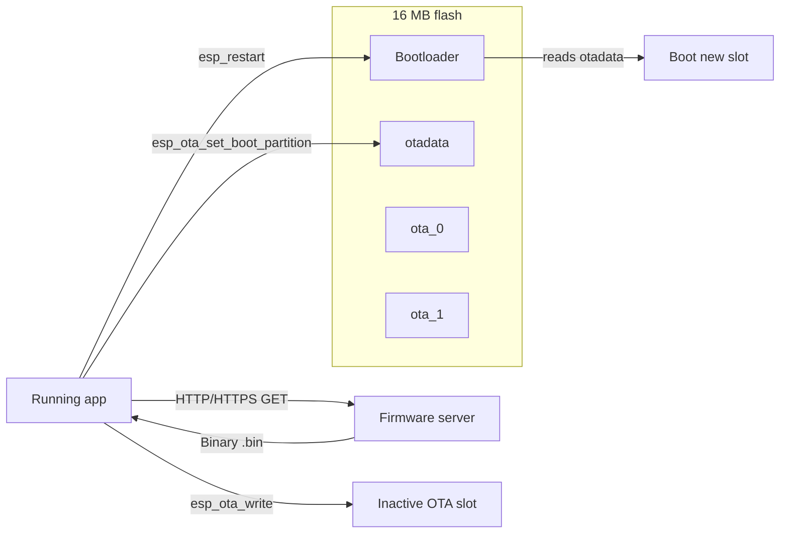

# OTA firmware update — ESP32-P4 from application

How to add **Over-The-Air (OTA)** firmware updates to the NiNO Home ESP32-P4 board. The update is triggered and downloaded **from application code** (not USB/serial flash), using the Wi‑Fi stack that is already in this project.

Pair with [WIFI_PROVISION.md](WIFI_PROVISION.md), [FIRMWARE_ARCHITECTURE.md](FIRMWARE_ARCHITECTURE.md), and [OPEN_PLAN.md](OPEN_PLAN.md).

---

## Table of contents

- [1. Current state](#1-current-state)
- [2. How ESP-IDF OTA works](#2-how-esp-idf-ota-works)
- [3. Prerequisites](#3-prerequisites)
- [4. Step 1 — Partition table (A/B slots)](#4-step-1--partition-table-ab-slots)
- [5. Step 2 — Kconfig and build settings](#5-step-2--kconfig-and-build-settings)
- [6. Step 3 — OTA module in firmware](#6-step-3--ota-module-in-firmware)
- [7. Step 4 — Trigger OTA from your app](#7-step-4--trigger-ota-from-your-app)
- [8. Step 5 — Host firmware on a server](#8-step-5--host-firmware-on-a-server)
- [9. Step 6 — Build, flash, and test](#9-step-6--build-flash-and-test)
- [10. UX during update](#10-ux-during-update)
- [11. Security checklist](#11-security-checklist)
- [12. Troubleshooting](#12-troubleshooting)
- [13. ESP32-C6 co-processor note](#13-esp32-c6-co-processor-note)
- [14. Implementation checklist](#14-implementation-checklist)

---

## 1. Current state

| Item | Status in this repo |
|------|---------------------|
| Wi‑Fi STA/AP + reconnect | Implemented (`main/main.c`, `main/wifi_prov_ble.c`) |
| HTTP client | Implemented (`esp_http_client` in voice/server code) |
| `/status` reports `firmware` version | Implemented (`PROJECT_VER` in `main/main.c`) |
| RGB LED “OTA” state | UI placeholder only (`NINO_RGB_SHOW_OTA` in `main/rgb_led.h`) |
| OTA partitions (`ota_0`, `ota_1`, `otadata`) | **Not present** |
| `app_update` component | **Not linked** |
| OTA download / apply logic | **Not implemented** |

Current partition table (`partitions.csv`):

```csv
nvs,      data, nvs,     0x9000,  0x6000,
phy_init, data, phy,     0xf000,  0x1000,
factory,  app,  factory, 0x10000, 0xA00000,
```

This is a **single 10 MB factory app** (large embedded WAV files). Standard A/B OTA needs **two app partitions** plus an `otadata` partition.

---

## 2. How ESP-IDF OTA works



1. Device runs firmware from **slot A** (`ota_0`) or **slot B** (`ota_1`).
2. Application downloads a new `.bin` over **HTTP or HTTPS**.
3. Image is written to the **inactive** slot with `esp_ota_begin()` / `esp_ota_write()` / `esp_ota_end()`.
4. Boot partition is switched with `esp_ota_set_boot_partition()`.
5. Device reboots; bootloader loads the new image.
6. On success, the old slot becomes the staging area for the next update.

---

## 3. Prerequisites

- **ESP-IDF 5.5+** (already required by this project)
- Target **`esp32p4`**
- Device on **STA Wi‑Fi** with internet or LAN access to your firmware server
- First OTA-capable build still flashed **once over USB** (partition table change requires full reflash)
- Know your **built app size** after enabling OTA layout:

```powershell
idf.py build
idf.py size
```

If the app is larger than one OTA slot, shrink embedded assets or move WAV files to a SPIFFS/FAT partition before enabling OTA.

---

## 4. Step 1 — Partition table (A/B slots)

Replace `partitions.csv` with an OTA layout. Example for **16 MB flash** with **4 MB per app slot** (adjust sizes to fit your binary):

```csv
# Name,   Type, SubType, Offset,  Size, Flags
# 16MB flash — OTA A/B layout for NiNO Home
nvs,      data, nvs,     0x9000,  0x6000,
otadata,  data, ota,     0xf000,  0x2000,
phy_init, data, phy,     0x11000, 0x1000,
ota_0,    app,  ota_0,   0x20000, 0x400000,
ota_1,    app,  ota_1,   0x420000,0x400000,
storage,  data, spiffs,  0x820000, 0x7E0000,
```

| Partition | Size | Purpose |
|-----------|------|---------|
| `nvs` | 24 KB | Wi‑Fi creds, device ID, OTA URL (optional) |
| `otadata` | 8 KB | Tracks active OTA slot |
| `phy_init` | 4 KB | RF calibration |
| `ota_0` / `ota_1` | 4 MB each | A/B application images |
| `storage` | ~7.9 MB | Optional SPIFFS for WAV assets moved out of the app |

**Important:** After this change you must run a **full USB flash** (`idf.py erase-flash flash`). OTA cannot resize partitions on a device that still has the old factory layout.

### If the app is too large

The current project embeds many WAV files in `main/CMakeLists.txt` (`EMBED_FILES`). Options:

1. Move chimes to **SPIFFS** (`storage` partition) and load at runtime.
2. Remove rarely used clips from the firmware image.
3. Use asymmetric slots only if you accept non-standard layout (not recommended for production).

---

## 5. Step 2 — Kconfig and build settings

### 5.1 CMake — add `app_update`

In `main/CMakeLists.txt`, add `app_update` to `main_requires`:

```cmake
set(main_requires esp_psram esp_wifi esp_event esp_netif nvs_flash esp_http_server esp_http_client mdns
    console esp32_p4_function_ev_board esp_websocket_client driver usb
    esp_hosted app_update)
```

Add the OTA source file when you create it:

```cmake
set(main_srcs
    ...
    ota_update.c)
```

### 5.2 sdkconfig (menuconfig)

Run:

```powershell
idf.py menuconfig
```

Recommended settings:

| Menu | Option | Value |
|------|--------|-------|
| Partition Table | Partition Table | Custom partition CSV |
| Partition Table | Custom CSV | `partitions.csv` |
| Bootloader config | Enable app rollback | On (optional, for failed-boot recovery) |
| Component config → ESP HTTPS OTA | Allow HTTP for OTA | Off in production; On for LAN testing only |
| Component config → ESP-TLS | Certificate bundle | Enable default bundle (for HTTPS OTA) |

Project defaults already set custom partitions in `sdkconfig.defaults`:

```
CONFIG_PARTITION_TABLE_CUSTOM=y
CONFIG_PARTITION_TABLE_CUSTOM_FILENAME="partitions.csv"
CONFIG_ESPTOOLPY_FLASHSIZE_16MB=y
```

### 5.3 Version string

Set a meaningful version in the root `CMakeLists.txt` or via `idf.py menuconfig` → **Application manager** → **Project version**. This appears in:

- `esp_app_get_description()->version`
- Your existing `/status` JSON (`firmware` field)

---

## 6. Step 3 — OTA module in firmware

Create `main/ota_update.h` and `main/ota_update.c`.

### 6.1 Header (`ota_update.h`)

```c
#pragma once

#include "esp_err.h"

#ifdef __cplusplus
extern "C" {
#endif

/** Start OTA from a firmware URL (http:// or https://). Runs in a FreeRTOS task. */
esp_err_t ota_update_start(const char *url);

/** True while download/flash is in progress. */
bool ota_update_in_progress(void);

#ifdef __cplusplus
}
#endif
```

### 6.2 Implementation outline (`ota_update.c`)

Two supported paths:

| Method | Use when |
|--------|----------|
| `esp_https_ota()` | HTTPS URL with standard ESP-TLS cert bundle |
| `esp_http_client` + `esp_ota_ops` | Custom headers, progress callbacks, or HTTP on LAN |

**HTTPS OTA (recommended for production):**

```c
#include "esp_https_ota.h"
#include "esp_crt_bundle.h"
#include "nino_rgb_led.h"   /* your RGB helper */

static bool s_ota_active;

bool ota_update_in_progress(void) {
    return s_ota_active;
}

static void ota_task(void *arg) {
    char *url = (char *)arg;
    s_ota_active = true;
    nino_rgb_led_show(NINO_RGB_SHOW_OTA);

    esp_http_client_config_t http_cfg = {
        .url = url,
        .crt_bundle_attach = esp_crt_bundle_attach,
        .timeout_ms = 30000,
    };
    esp_https_ota_config_t ota_cfg = {
        .http_config = &http_cfg,
    };

    esp_err_t err = esp_https_ota(&ota_cfg);
    if (err == ESP_OK) {
        esp_restart();  /* Boot into new firmware */
    } else {
        ESP_LOGE("OTA", "HTTPS OTA failed: %s", esp_err_to_name(err));
        nino_rgb_led_show(NINO_RGB_SHOW_ERROR);
    }

    free(url);
    s_ota_active = false;
    vTaskDelete(NULL);
}

esp_err_t ota_update_start(const char *url) {
    if (!url || !url[0] || s_ota_active) {
        return ESP_ERR_INVALID_STATE;
    }
    char *url_copy = strdup(url);
    if (!url_copy) {
        return ESP_ERR_NO_MEM;
    }
    if (xTaskCreate(ota_task, "ota_task", 8192, url_copy, 5, NULL) != pdPASS) {
        free(url_copy);
        return ESP_ERR_NO_MEM;
    }
    return ESP_OK;
}
```

**Manual OTA (more control, good for debugging):**

```c
#include "esp_ota_ops.h"
#include "esp_http_client.h"

/* 1. esp_ota_get_next_update_partition(NULL)
   2. esp_ota_begin(update_part, OTA_SIZE_UNKNOWN, &handle)
   3. esp_http_client_open + read loop → esp_ota_write(handle, buf, len)
   4. esp_ota_end(handle)
   5. esp_ota_set_boot_partition(update_part)
   6. esp_restart()
*/
```

### 6.3 Boot validation (optional)

After reboot, confirm the new image:

```c
#include "esp_ota_ops.h"

const esp_partition_t *running = esp_ota_get_running_partition();
esp_app_desc_t app_desc;
esp_ota_get_partition_description(running, &app_desc);
ESP_LOGI("BOOT", "Running version %s from %s", app_desc.version, running->label);

/* Mark image valid so rollback does not revert a good OTA */
esp_ota_mark_app_valid_cancel_rollback();
```

Call `esp_ota_mark_app_valid_cancel_rollback()` early in `app_main()` once Wi‑Fi and core services are stable.

---

## 7. Step 4 — Trigger OTA from your app

Pick one or more triggers. All call `ota_update_start(url)`.

### Option A — HTTP endpoint on the device (LAN testing)

Add to `start_http_server()` in `main/main.c`:

```
POST /api/ota/start
Content-Type: application/json

{"url":"http://192.168.0.10:8000/firmware/nino-home.bin"}
```

Handler parses JSON, validates URL, starts OTA task, returns `{"ok":true}`. **Do not expose unauthenticated OTA on production devices.**

### Option B — WebSocket command from PC/cloud server

Extend `voice_ws_client.c` to handle a server message:

```json
{"type":"ota","url":"https://cdn.example.com/nino/v1.2.3.bin"}
```

This matches the outbound-first architecture in [OPEN_PLAN.md](OPEN_PLAN.md).

### Option C — Periodic version poll

1. Device `GET https://api.example.com/devices/{device_id}/firmware`
2. Server returns `{"version":"1.2.3","url":"https://..."}`
3. Compare with `esp_app_get_description()->version`
4. If newer → `ota_update_start(url)`

### Option D — Serial console (development)

```
ota start http://192.168.0.10:8000/firmware/nino-home.bin
```

Register in `console_init()` alongside existing `wifi` and `rgb` commands.

### NVS-stored OTA URL (optional)

Store last-known firmware URL in NVS namespace `wifi_cfg` or a new `ota_cfg` namespace so the device can retry after a failed download.

---

## 8. Step 5 — Host firmware on a server

The device downloads a **raw ESP-IDF app binary**, not an ELF file.

### 8.1 Build the OTA artifact

After `idf.py build`:

| File | Path | Use |
|------|------|-----|
| OTA binary | `build/USB_Camera.bin` | Upload to server |
| Merged flash image | `build/flash_project_args` | USB flash only |

### 8.2 Simple Python static file server (dev)

From the project `server/` folder or any machine on the LAN:

```powershell
# Serve build output (adjust path)
cd build
python -m http.server 8080
```

OTA URL example:

```
http://192.168.0.10:8080/USB_Camera.bin
```

### 8.3 FastAPI endpoint (integrate with existing server)

Add to `server/app.py`:

```python
from fastapi import APIRouter
from fastapi.responses import FileResponse

router = APIRouter()

@router.get("/firmware/latest")
def firmware_latest():
    return {
        "version": "1.2.0",
        "url": "http://192.168.0.10:8000/firmware/USB_Camera.bin",
    }

@router.get("/firmware/USB_Camera.bin")
def firmware_binary():
    return FileResponse("path/to/USB_Camera.bin", media_type="application/octet-stream")
```

### 8.4 Production hosting

- Host `.bin` on HTTPS (S3, CloudFront, GitHub Releases, etc.)
- Serve **version metadata** separately so devices can check before downloading
- Sign images or use TLS + device token authentication

---

## 9. Step 6 — Build, flash, and test

### 9.1 First-time OTA layout flash (USB)

```powershell
idf.py set-target esp32p4
idf.py fullclean
idf.py build
idf.py -p COMx erase-flash flash monitor
```

Use your actual COM port. **Erase is required** when switching from `factory` to OTA partitions.

### 9.2 Verify running partition

In serial monitor after boot:

```
I (xxx) BOOT: Running version 1.1.0 from ota_0
```

Or query device status:

```
GET http://<device-ip>/status
```

### 9.3 OTA test procedure

1. Bump version in project config (e.g. `1.1.0` → `1.2.0`).
2. `idf.py build` — copy `build/USB_Camera.bin` to your HTTP server.
3. Ensure device is on Wi‑Fi STA with route to the server.
4. Trigger OTA (HTTP POST, WebSocket, or serial `ota start ...`).
5. Watch logs:
   - `esp_https_ota` / `esp_ota_write` progress
   - Device reboots
   - New version in `/status` or boot log
6. Confirm RGB was purple during update (`NINO_RGB_SHOW_OTA`).

### 9.4 Rollback test (if enabled)

Flash a **bad** image (wrong chip, corrupt header). Bootloader should roll back to the previous slot after failed boot attempts.

---

## 10. UX during update

Use existing NiNO feedback hooks:

| Phase | Action |
|-------|--------|
| OTA started | `nino_rgb_led_show(NINO_RGB_SHOW_OTA)` — solid purple |
| Download in progress | Keep OTA LED; optionally pause camera/USB/audio tasks |
| Success | `esp_restart()` — play `WIFI.wav` or boot chime on next boot |
| Failure | `NINO_RGB_SHOW_ERROR`; log `esp_err_to_name(err)` |

**Pause heavy tasks** during flash write to reduce watchdog timeouts:

- Stop MJPEG stream / UVC capture
- Stop audio playback queue
- Avoid starting new WebSocket exchanges

---

## 11. Security checklist

| Item | Dev/LAN | Production |
|------|---------|------------|
| Transport | HTTP OK on trusted LAN | **HTTPS only** |
| URL validation | Basic prefix check | Allow-list hostnames |
| Authentication | None | Bearer token header or signed URL |
| Device endpoint | Open POST `/api/ota/start` | Disable or require auth |
| Image signing | Optional | Recommended (ESP secure boot + signed binaries) |
| Rollback | Optional | Enable `CONFIG_BOOTLOADER_APP_ROLLBACK_ENABLE` |

For HTTPS OTA with a custom CA (not public), embed the PEM in firmware or use `esp_tls_cfg_t.cacert_pem_buf`.

---

## 12. Troubleshooting

| Symptom | Likely cause | Fix |
|---------|--------------|-----|
| `ESP_ERR_OTA_PARTITION_CONFLICT` | Still using `factory` partition table | Reflash with OTA `partitions.csv` |
| `ESP_ERR_OTA_VALIDATE_FAILED` | Wrong chip target or corrupt `.bin` | Rebuild with `idf.py set-target esp32p4` |
| `ESP_ERR_INVALID_SIZE` | App larger than OTA slot | Shrink binary or increase slot size |
| Download timeout | Weak Wi‑Fi / server unreachable | Check STA IP, firewall, URL |
| Reboot loop after OTA | Bad image or insufficient stack | Enable rollback; increase OTA task stack |
| HTTPS fails | Cert not trusted | Enable cert bundle or embed CA |
| OTA works but old version shows | Did not bump `PROJECT_VER` | Set version in menuconfig / CMake |

Check partition layout:

```powershell
idf.py partition-table
```

Check active slot at runtime:

```c
esp_ota_get_running_partition()->label  /* "ota_0" or "ota_1" */
```

---

## 13. ESP32-C6 co-processor note

This board uses **ESP-Hosted**: Wi‑Fi and BLE run on an onboard **ESP32-C6** slave. OTA as described above updates the **ESP32-P4 host firmware only**.

Updating C6 slave firmware is a **separate** ESP-Hosted flow (slave binary via SDIO/SPI). Plan C6 updates independently if you need new Wi‑Fi/BLE co-processor features.

---

## 14. Implementation checklist

Track progress here when implementing OTA in this repo:

- [ ] Measure app size (`idf.py size`) and decide OTA slot + SPIFFS sizes
- [ ] Update `partitions.csv` to OTA A/B layout
- [ ] Move large WAV assets to SPIFFS if app exceeds slot size
- [ ] Add `app_update` to `main/CMakeLists.txt`
- [ ] Create `main/ota_update.c` / `ota_update.h`
- [ ] Wire trigger (HTTP / WebSocket / poll / serial)
- [ ] Show `NINO_RGB_SHOW_OTA` during update
- [ ] Pause camera/audio during flash write
- [ ] Expose `esp_app_get_description()->version` in `/status`
- [ ] Add `esp_ota_mark_app_valid_cancel_rollback()` after successful boot
- [ ] Host `.bin` on server; add version API
- [ ] USB erase-flash + flash first OTA-capable build
- [ ] End-to-end test: v1 → OTA → v2 confirmed on hardware

---

## Quick reference — files to touch

| File | Change |
|------|--------|
| `partitions.csv` | OTA A/B + optional SPIFFS |
| `main/CMakeLists.txt` | Add `app_update`, `ota_update.c` |
| `main/ota_update.c` | OTA download and flash logic |
| `main/main.c` | HTTP handler and/or boot validation |
| `main/voice_ws_client.c` | Optional cloud-triggered OTA |
| `server/app.py` | Optional firmware hosting API |
| `sdkconfig.defaults` | Rollback / HTTPS OTA options |

---

## Related ESP-IDF documentation

- [OTA API](https://docs.espressif.com/projects/esp-idf/en/latest/esp32p4/api-reference/system/ota.html)
- [ESP HTTPS OTA](https://docs.espressif.com/projects/esp-idf/en/latest/esp32p4/api-reference/system/esp_https_ota.html)
- [Partition Tables](https://docs.espressif.com/projects/esp-idf/en/latest/esp32p4/api-guides/partition-tables.html)
- [Bootloader Rollback](https://docs.espressif.com/projects/esp-idf/en/latest/esp32p4/api-guides/bootloader.html#app-rollback)
