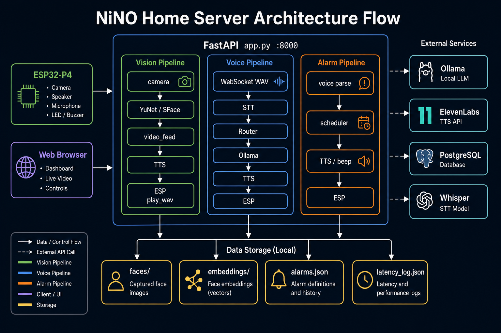
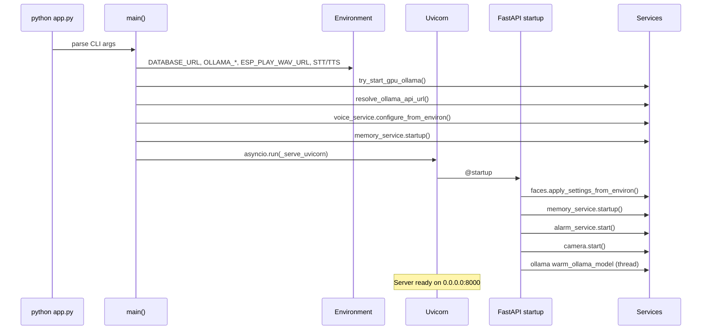
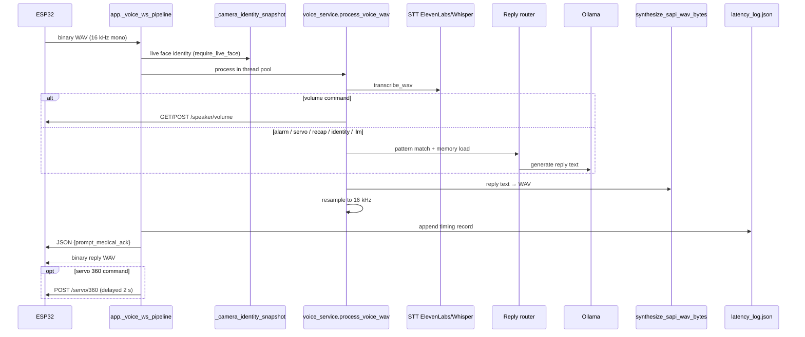
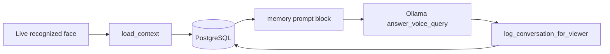
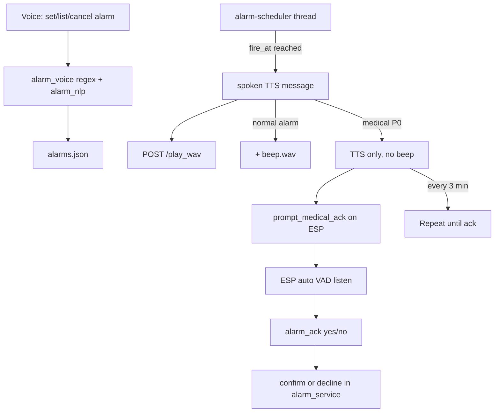
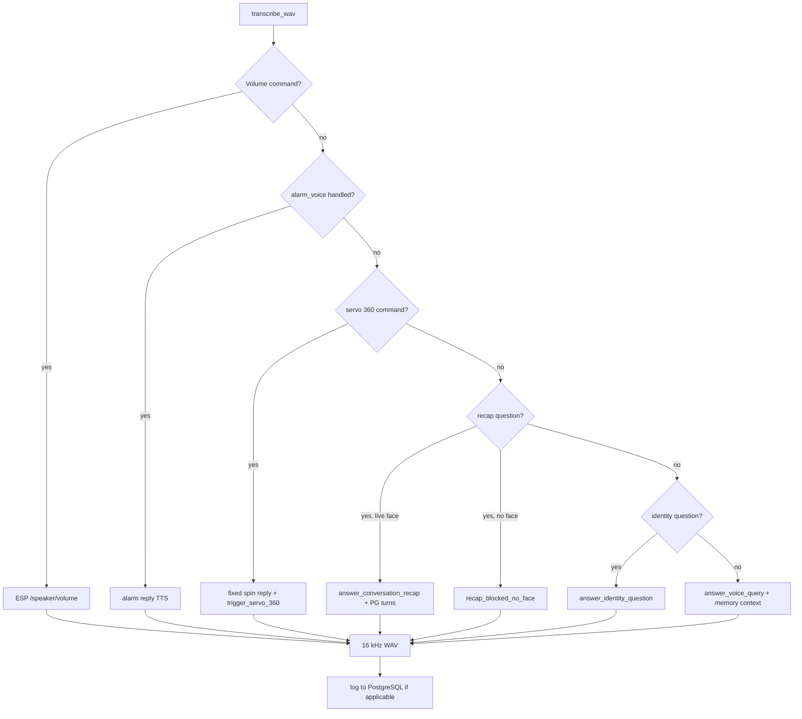
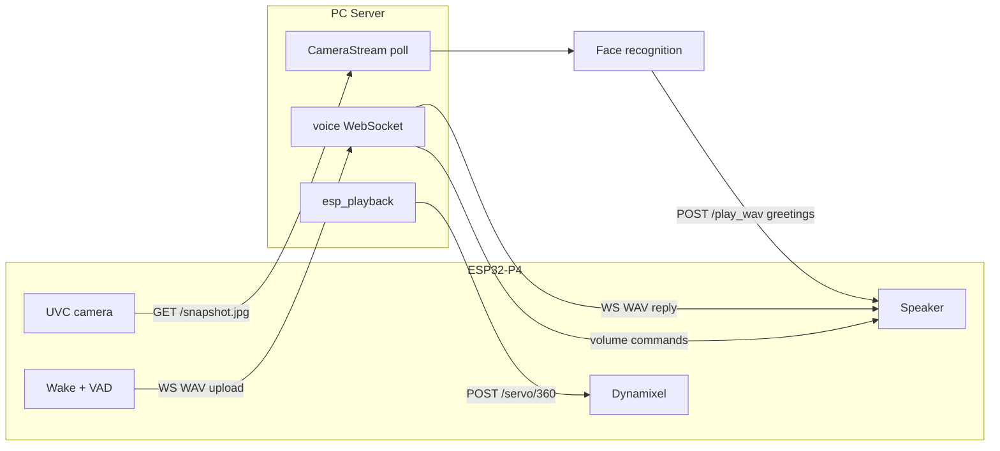

# NINO Home Bot — Server Architecture

Architecture of the Python FastAPI server in `server/`, from process startup through every feature. The ESP32-P4 firmware handles wake word, camera streaming, speaker playback, servos, touch, and eyes; this document focuses on what runs on the PC.

Pair with [FIRMWARE_ARCHITECTURE.md](FIRMWARE_ARCHITECTURE.md) for the full end-to-end picture.

**Visual flow diagram:** [server_architecture_flow.svg](server_architecture_flow.svg) (scalable) · [server_architecture_flow.png](server_architecture_flow.png) (PNG poster)



---

## Table of contents

- [1. Platform & Stack](#1-platform--stack)
- [2. High-Level System Diagram](#2-high-level-system-diagram)
- [3. Startup Sequence](#3-startup-sequence)
- [4. Module Map](#4-module-map)
- [5. Background Threads & Async Model](#5-background-threads--async-model)
- [6. Feature Deep-Dives](#6-feature-deep-dives)
  - [6.1 Camera Ingest](#61-camera-ingest)
  - [6.2 Face Recognition](#62-face-recognition)
  - [6.3 Vision Greetings (TTS)](#63-vision-greetings-tts)
  - [6.4 Voice Assistant Pipeline](#64-voice-assistant-pipeline)
  - [6.5 LLM (Ollama)](#65-llm-ollama)
  - [6.6 Speech-to-Text & Text-to-Speech](#66-speech-to-text--text-to-speech)
  - [6.7 Conversation Memory (PostgreSQL)](#67-conversation-memory-postgresql)
  - [6.8 Alarms & Medical Ack](#68-alarms--medical-ack)
  - [6.9 ESP Playback Bridge](#69-esp-playback-bridge)
- [7. Voice Reply Routing](#7-voice-reply-routing)
- [8. HTTP & WebSocket API](#8-http--websocket-api)
- [9. Data Files & Persistence](#9-data-files--persistence)
- [10. Configuration Precedence](#10-configuration-precedence)
- [11. Integration with ESP32 Firmware](#11-integration-with-esp32-firmware)
- [12. Design Principles](#12-design-principles)

---

## 1. Platform & Stack

| Item | Value |
|------|--------|
| **Runtime** | Python 3.10+ |
| **Web framework** | FastAPI + Uvicorn (async HTTP/WS) |
| **Vision** | OpenCV (YuNet + SFace), NumPy |
| **STT** | ElevenLabs Scribe (cloud) or faster-whisper (local CPU) |
| **LLM** | Ollama HTTP API (`qwen2.5:1.5b` default) |
| **TTS** | ElevenLabs, Windows SAPI, or Linux espeak-ng |
| **Memory** | PostgreSQL via psycopg2 (optional) |
| **Entry point** | `python app.py` → `main()` in `server/app.py` |

**Key dependencies** (`server/requirements.txt`): `fastapi`, `uvicorn`, `opencv-contrib-python`, `faster-whisper`, `requests`, `psycopg2-binary`, `jinja2`.

**Optional config file:** `server/server_config.json` (camera URL, ESP URL, API keys — keep out of git).

---

## 2. High-Level System Diagram

```mermaid
flowchart TB
    subgraph Clients["Clients"]
        ESP[ESP32-P4 firmware]
        Browser[Web UI browser]
    end

    subgraph App["FastAPI app.py :8000"]
        HTTP[HTTP routes]
        WS[WebSocket /voice-query]
        MJPEG[/video_feed MJPEG]
    end

    subgraph Threads["Background workers"]
        CamThread[camera-stream thread]
        TTSWorker[tts_service speech thread]
        AlarmThread[alarm-scheduler thread]
        MemLog[memory-log threads]
        OllamaWarm[ollama-warmup thread]
    end

    subgraph Services["Python modules"]
        Camera[camera.py]
        Faces[face_service.py]
        Voice[voice_service.py]
        LLM[llm_service.py]
        TTS[tts_service.py]
        Alarm[alarm_service.py]
        Memory[memory_service.py]
        ESPBridge[esp_playback.py]
    end

    subgraph External["External / local services"]
        Ollama[Ollama :11435 GPU / :11434 CPU]
        PG[(PostgreSQL nino_memory)]
        Eleven[ElevenLabs API]
        Whisper[faster-whisper model]
    end

    ESP -->|GET /snapshot or /stream| Camera
    ESP -->|WS WAV in/out| WS
    Browser --> HTTP
    Browser --> MJPEG

    HTTP --> Faces
    MJPEG --> Faces
    MJPEG --> TTS
    WS --> Voice
    Voice --> LLM
    Voice --> TTS
    Voice --> Alarm
    Voice --> Memory
    Voice --> ESPBridge

    TTS --> ESPBridge
    Alarm --> ESPBridge
    Alarm --> TTS

    Camera --> CamThread
    TTS --> TTSWorker
    Alarm --> AlarmThread
    Memory --> PG
    LLM --> Ollama
    Voice --> Eleven
    Voice --> Whisper
    ESPBridge -->|POST /play_wav /servo/360 /volume| ESP
```

---

## 3. Startup Sequence

Configuration is applied in two phases: CLI/env in `main()`, then FastAPI `@startup` hooks when Uvicorn serves the app.



### `main()` init order (reference)

```text
1.  Parse CLI (--host, --port, --camera-source, --esp-play-wav-url, …)
2.  Normalize and set DATABASE_URL
3.  Set CAMERA_SOURCE, ESP_PLAY_WAV_URL, ALARM_WAV_PATH
4.  try_start_gpu_ollama() — launch user-local GPU Ollama if installed
5.  resolve_ollama_api_url() — prefer :11435 GPU over :11434 CPU
6.  Set OLLAMA_URL, OLLAMA_MODEL, WHISPER_MODEL, STT/TTS provider keys
7.  voice_service.configure_from_environ()
8.  memory_service.startup() — schema check / PostgreSQL connect
9.  asyncio.run(uvicorn serve)
    └── FastAPI startup:
        ├── face settings from env
        ├── memory startup (again, idempotent)
        ├── alarm scheduler thread
        ├── camera background thread
        └── Ollama model warm-up thread
```

### Shutdown

`@app.on_event("shutdown")` and `main()` `finally` block stop alarm scheduler, TTS worker, and camera thread cleanly.

---

## 4. Module Map

| File | Responsibility |
|------|----------------|
| **`app.py`** | FastAPI app, routes, MJPEG generator, WebSocket voice pipeline, latency log, CLI entry |
| **`camera.py`** | Background frame capture from local webcam or ESP HTTP snapshot/stream |
| **`face_service.py`** | YuNet detection + SFace 128-D embeddings, registration, annotate, identity |
| **`voice_service.py`** | STT → route → LLM/alarm/servo/volume → TTS → 16 kHz WAV for ESP |
| **`llm_service.py`** | Ollama HTTP client, identity/recap/general prompts, GPU URL resolution |
| **`tts_service.py`** | Vision greeting queue, TTS synthesis, ESP POST worker thread |
| **`memory_service.py`** | PostgreSQL users/conversations/memories/summaries, context injection |
| **`alarm_service.py`** | Persistent alarm scheduler, fire at time → TTS + ESP `/play_wav` |
| **`alarm_voice.py`** | Regex (+ Ollama NLP fallback) alarm parse/set/list/cancel from voice |
| **`alarm_medical.py`** | Medical (P0) classification, ack states, repeat interval |
| **`alarm_ack.py`** | Yes/no voice ack for medical alarms |
| **`alarm_nlp.py`** | Ollama JSON fallback when regex time parse fails |
| **`alarm_time.py`** | Local clock helpers for scheduling |
| **`esp_playback.py`** | `POST` WAV to ESP `/play_wav` with size cap and medical ack header |
| **`wav_resample.py`** | Linear resample to mono 16-bit PCM WAV (voice: 16 kHz; vision: 22.05 kHz) |
| **`templates/index.html`** | Web UI — face registration, live feed, alarms |
| **`scripts/init_memory_db.sh`** | Create PostgreSQL DB + apply `memory_schema.sql` |
| **`scripts/start_ollama_gpu.sh`** | Start user-local CUDA Ollama on port 11435 |

---

## 5. Background Threads & Async Model

FastAPI handles HTTP/WebSocket on the **async event loop**. CPU-heavy work runs in **`run_in_threadpool`** or dedicated **daemon threads**.

| Worker | Type | Module | Role |
|--------|------|--------|------|
| `camera-stream` | Thread | `camera.py` | Continuous frame pull (OpenCV or HTTP snapshot poll) |
| `tts-speech` (internal) | Thread | `tts_service.py` | LLM greeting text → TTS → POST `/play_wav` |
| `alarm-scheduler` | Thread | `alarm_service.py` | Tick every 1 s; fire due alarms |
| `ollama-warmup` | Thread | `app.py` startup | Pre-load LLM model |
| `memory-log-conversation` | Thread | `memory_service.py` | Async INSERT after voice turn |
| `memory-summary-catchup` | Thread | `memory_service.py` | Optional nightly summaries |
| Voice STT/LLM/TTS | Thread pool | `app.py` | `run_in_threadpool(process_voice_wav)` per WS message |
| MJPEG generator | Sync generator | `app.py` | Runs in request thread; reads latest camera frame |

Whisper model is loaded **lazily** on first voice query (`_ensure_whisper()`).

---

## 6. Feature Deep-Dives

### 6.1 Camera Ingest

**Module:** `camera.py` — class `CameraStream`

**Sources:**

| Source | Transport | Notes |
|--------|-----------|-------|
| `auto` | OpenCV local | Tries camera indices 0–7 |
| `0`, `1`, … | DirectShow (Windows) | 640×480 |
| `http://ESP_IP/stream` | HTTP snapshot poll | Rewrites to `/snapshot.jpg` to avoid competing with MJPEG clients |
| `http://…/snapshot.jpg` | HTTP poll every ~40 ms | Recommended for ESP |

**API:** `read()` returns a thread-safe copy of the latest frame. `status()` reports connection, frame age, transport type.

```mermaid
flowchart LR
    ESPcam[ESP /snapshot.jpg] --> Poll[HTTP poll loop]
    Local[Webcam index] --> OpenCV[VideoCapture.read]
    Poll --> Frame[Latest frame buffer]
    OpenCV --> Frame
    Frame --> VideoFeed[/video_feed]
    Frame --> VoiceIdentity[Voice viewer lookup]
    Frame --> Register[/api/register samples]
```

---

### 6.2 Face Recognition

**Module:** `face_service.py` — class `FaceService`

**Pipeline:**

1. **Detect:** YuNet ONNX (`face_detection_yunet_2023mar.onnx`) — auto-download to `server/data/models/`
2. **Embed:** SFace ONNX → 128-D vector per aligned 112×112 crop
3. **Match:** Cosine similarity vs stored embeddings in `server/data/face_embeddings.json`
4. **Stabilize:** Multi-frame confirm + session primary hold (~90 s)

**Registration:** `POST /api/register` captures N samples from live camera → saves JPGs under `server/data/faces/<person_id>/` → `train()` re-encodes all embeddings.

**Runtime outputs:** `annotate()` draws boxes + names for MJPEG; `recognize()` returns structured results; `primary_viewer()` picks largest confident face for voice.

| Setting | Default | Purpose |
|---------|---------|---------|
| `FACE_MATCH_THRESHOLD` | 0.42 | Cosine acceptance (higher = stricter) |
| `FACE_SESSION_PRIMARY_HOLD_SECONDS` | 90 | Remember primary viewer across brief gaps |
| `FACE_CONFIRM_FRAMES` | 3 | Frames before stabilized name for voice |

---

### 6.3 Vision Greetings (TTS)

**Module:** `tts_service.py` — class `TTSService`

Driven by `/video_feed` loop calling `tts.update_face_state()` every frame.

```mermaid
flowchart TB
    Feed[/video_feed loop] --> Annotate[faces.annotate]
    Annotate --> Update[tts.update_face_state]
    Update -->|first sighting| Greet[LLM greeting_for_face]
    Update -->|re-enter after interval| Welcome[Welcome-back greeting]
    Greet --> Queue[TTS worker queue]
    Welcome --> Queue
    Queue --> Synth[TTS synthesize]
    Synth --> Resample[16 kHz WAV]
    Resample --> ESP[POST ESP /play_wav]
```

- **First sighting:** Always greets once per session per person
- **Welcome back:** After `FACE_GREETING_INTERVAL_SECONDS` (default 600 s) when person re-enters frame
- **Suppression:** Paused during active voice WebSocket session (`notify_voice_interaction`)
- **Head motion:** ESP plays WAV with full servo motion mode (firmware side)

Vision TTS uses **16 kHz** resample for ESP; internal SAPI default is 22.05 kHz before resample.

---

### 6.4 Voice Assistant Pipeline

**Entry:** WebSocket `/voice-query` or `/ws/voice` (same handler)

**Flow per audio message:**



**WebSocket protocol (server → ESP):**

1. Text JSON frame: `{"prompt_medical_ack": true|false}`
2. Binary frame: 16 kHz mono WAV reply

Firmware may also parse `eye_expression` from JSON metadata (contract exists on device; server can extend JSON in future).

**Error recovery:** On pipeline exception, server synthesizes a spoken error WAV (Ollama unavailable message or brief error) so ESP always receives valid audio.

---

### 6.5 LLM (Ollama)

**Module:** `llm_service.py`

| Function | Use |
|----------|-----|
| `resolve_ollama_api_url()` | Auto-pick GPU `:11435` over CPU `:11434` |
| `try_start_gpu_ollama()` | Shell out to `scripts/start_ollama_gpu.sh` |
| `warm_ollama_model()` | Pre-load model at startup |
| `answer_voice_query()` | General Q&A with optional memory context |
| `answer_identity_question()` | "Who am I?" with live recognition state |
| `answer_conversation_recap()` | "What did we talk about?" from recent turns |
| `greeting_for_face()` | Vision welcome messages |

Default model: **`qwen2.5:1.5b`**. Timeout: 60 s for voice queries.

---

### 6.6 Speech-to-Text & Text-to-Speech

**STT** (`voice_service.transcribe_wav`):

| Provider | When | Latency |
|----------|------|---------|
| ElevenLabs Scribe | Default if `ELEVENLABS_API_KEY` set | ~1–2 s |
| faster-whisper | Fallback or `--stt-provider whisper` | 6–30 s CPU |

ElevenLabs failure automatically falls back to Whisper.

**TTS** (`tts_service.synthesize_sapi_wav_bytes`):

| Provider | Platform | When |
|----------|----------|------|
| `elevenlabs` | Any | Default if API key set |
| `sapi` | Windows | Local PowerShell SAPI |
| `local` | Linux | espeak-ng `en+f3` |

Voice replies resample to **16 kHz** (`VOICE_ASSIST_PLAYBACK_HZ`). Alarm and vision paths also target 16 kHz to stay under ESP 384 KiB WAV limit.

---

### 6.7 Conversation Memory (PostgreSQL)

**Module:** `memory_service.py` — class `MemoryService`

**Schema** (`scripts/memory_schema.sql`):

| Table | Purpose |
|-------|---------|
| `users` | One row per recognized person (`face_id`, display name) |
| `conversations` | Q&A log per turn |
| `memories` | Long-term facts (Phase B — `MEMORY_EXTRACTION=1`) |
| `summaries` | Daily rollups (Phase C — `MEMORY_SUMMARY_CRON=1`) |



**Live-face gate:** Memory context and recap require `camera_identity_state == "recognized"`. Without a live face, recap returns `recap_blocked_no_face`.

**Recap filtering:** Removes prior recap meta-questions and STT fragments before sending up to 5 meaningful turns to the LLM.

---

### 6.8 Alarms & Medical Ack

**Modules:** `alarm_service.py`, `alarm_voice.py`, `alarm_medical.py`, `alarm_ack.py`



| Alarm type | TTS | Beep | Ack |
|------------|-----|------|-----|
| Normal | Yes | Yes (`beep.wav`) | No |
| Medical (P0) | Yes | No | Yes — ESP re-listens for yes/no |

Web UI: `GET /api/alarms`, `POST /api/alarms/{id}/ack`, `DELETE /api/alarms`.

See [ALARM.md](ALARM.md) for voice command examples.

---

### 6.9 ESP Playback Bridge

**Module:** `esp_playback.py`

Central HTTP client for pushing audio and commands to the board:

| Function | ESP endpoint |
|----------|--------------|
| `post_wav_to_esp(wav)` | `POST /play_wav` |
| `trigger_esp_servo_360()` | `POST /servo/360` |
| `get_esp_speaker_volume()` | `GET /speaker/volume` |
| `set_esp_speaker_volume(pct)` | `POST /speaker/volume` |

**Size limit:** `ESP_MAX_PLAY_WAV_BYTES` default 380 KiB (firmware cap 384 KiB).

**Medical ack header:** `X-Nino-Prompt-Ack: 1` tells firmware to auto-listen after playback.

Configured via `ESP_PLAY_WAV_URL` (e.g. `http://192.168.x.x/play_wav`); servo/volume URLs derived from same host.

---

## 7. Voice Reply Routing

After STT, `process_voice_wav()` picks exactly one path:



| `reply_path` | Trigger examples |
|--------------|------------------|
| `volume` | "Set volume to fifty percent" |
| `alarm` | "Remind me at 8 AM", "List my alarms" |
| `servo_360` | "Make a 360", "Spin 360" |
| `recap` | "What did we talk about?" (live face required) |
| `recap_blocked_no_face` | Recap without recognized face |
| `identity_llm` | "Who am I?", "What's my name?" |
| `llm` | General questions |

Personalization: ~18% of general replies include viewer name (`VOICE_PERSONALIZE_PROB=0.18`).

---

## 8. HTTP & WebSocket API

### Web UI & vision

| Method | Path | Description |
|--------|------|-------------|
| GET | `/` | Web UI (faces, alarms, camera source) |
| GET | `/video_feed` | Annotated MJPEG with face boxes |
| GET | `/snapshot.jpg` | Single annotated JPEG |
| GET | `/api/status` | Camera, faces, TTS, LLM, alarms, memory |
| GET | `/api/latency-log?limit=50` | Voice timing events |
| POST | `/api/register` | Register face samples from live camera |
| POST | `/api/retrain` | Re-encode all stored face crops |
| POST | `/api/camera` | Switch camera source at runtime |

### Alarms

| Method | Path | Description |
|--------|------|-------------|
| GET | `/api/alarms` | List pending alarms |
| POST | `/api/alarms/{id}/ack` | Medical yes/no ack (web UI) |
| DELETE | `/api/alarms` | Cancel all |
| DELETE | `/api/alarms/{id}` | Cancel one |

### Voice (ESP)

| Protocol | Path | Description |
|----------|------|-------------|
| WS | `/voice-query` | Primary ESP URI — WAV in, JSON + WAV out |
| WS | `/ws/voice` | Alias (same pipeline) |

---

## 9. Data Files & Persistence

| Path | Format | Contents |
|------|--------|----------|
| `server/data/faces/<id>/*.jpg` | JPEG | Registered face samples |
| `server/data/face_embeddings.json` | JSON | SFace 128-D embeddings per person |
| `server/data/models/*.onnx` | ONNX | YuNet + SFace (auto-download) |
| `server/data/alarms.json` | JSON | Scheduled alarms |
| `server/data/latency_log.json` | JSON array | Per-query voice timings (thread-safe append) |
| `server/data/labels.json` | JSON | Display name labels |
| PostgreSQL `nino_memory` | SQL | Users, conversations, memories, summaries |

Latency log fields include: `stt_seconds`, `reply_path`, `memory_store`, `server_total_seconds`, `heard`, `reply_text`.

---

## 10. Configuration Precedence

```text
1. CLI flags          python app.py --esp-play-wav-url …
2. Environment vars   export DATABASE_URL=…
3. server_config.json optional local overrides
4. Code defaults      Ollama qwen2.5:1.5b, face threshold 0.42, etc.
```

### Essential environment variables

| Variable | Purpose |
|----------|---------|
| `ESP_PLAY_WAV_URL` | `http://<ESP_IP>/play_wav` — greetings, alarms, vision TTS |
| `DATABASE_URL` | PostgreSQL for conversation memory |
| `OLLAMA_URL` | `auto` or explicit generate API URL |
| `OLLAMA_MODEL` | e.g. `qwen2.5:1.5b` |
| `ELEVENLABS_API_KEY` | Cloud STT/TTS |
| `STT_PROVIDER` | `elevenlabs` or `whisper` |
| `TTS_PROVIDER` | `elevenlabs`, `sapi`, or `local` |
| `CAMERA_SOURCE` | `auto`, index, or `http://ESP/stream` |

Full list: see [README.md](../README.md#environment-variables).

---

## 11. Integration with ESP32 Firmware

End-to-end data flow between server and board:



**Typical launch:**

```bash
cd server
python app.py --host 0.0.0.0 --port 8000 \
  --camera-source http://<ESP_IP>/stream \
  --esp-play-wav-url http://<ESP_IP>/play_wav \
  --database-url "$DATABASE_URL"
```

**ESP serial setup:**

```text
voice connect <PC_LAN_IP> 8000
```

---

## 12. Design Principles

1. **Snapshot over stream for ESP camera** — Polling `/snapshot.jpg` avoids starving the board's single MJPEG client and improves face recognition reliability.
2. **Thread pool for voice** — STT, LLM, and TTS block; WebSocket stays responsive via `run_in_threadpool`.
3. **Live-face gate for memory** — Personal recap and PostgreSQL context require recognized face in frame, reducing wrong-user attribution.
4. **Always return WAV to ESP** — Pipeline errors synthesize spoken fallback so the robot never hangs on empty WebSocket frames.
5. **16 kHz voice path** — Matches ESP VAD/wake pipeline; keeps replies under ESP WAV size cap.
6. **Dual Ollama endpoints** — Prefer GPU instance on `:11435`; log warning when falling back to CPU `:11434`.
7. **Atomic latency log writes** — Temp file + `os.replace` prevents corrupt JSON on crash.
8. **Graceful optional subsystems** — Memory, ElevenLabs, and ESP URL each degrade independently with clear `GET /api/status` flags.

---

## Related docs

| Document | Contents |
|----------|----------|
| [FIRMWARE_ARCHITECTURE.md](FIRMWARE_ARCHITECTURE.md) | ESP32 boot, tasks, onboard features |
| [../README.md](../README.md) | Quick start, full feature overview |
| [ALARM.md](ALARM.md) | Alarm voice commands and medical flow |
| [SERVO.md](SERVO.md) | Dynamixel 360 via voice/HTTP |
| [WIFI_PROVISION.md](WIFI_PROVISION.md) | Board network setup |
| [TEST_QUESTIONS.md](TEST_QUESTIONS.md) | Demo script for voice and memory |
