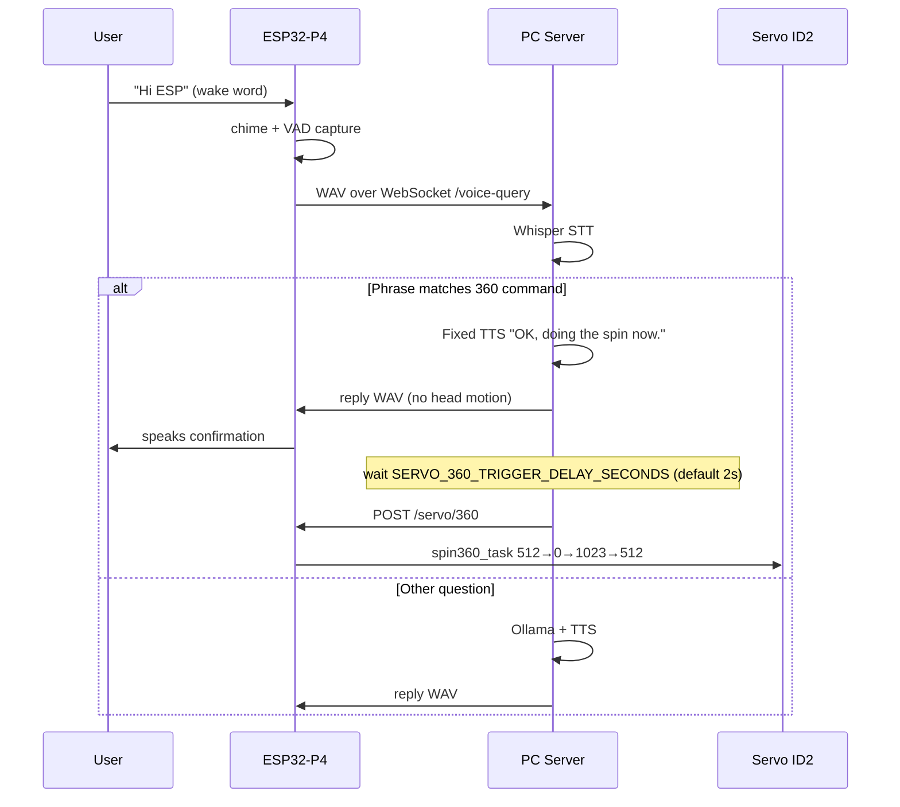

# NiNO Dynamixel Servo — Wiring & 360 Spin

This document describes how the two Dynamixel AX servos are wired in firmware, how the **ID2 full rotation (360)** works, and how voice commands trigger it.

## Hardware

| Item | Detail |
|------|--------|
| Adapter | ROBOTIS U2D2 on the **J18 USB hub** (shared with UVC camera) |
| Protocol | Dynamixel Protocol 1.0, 1 Mbps |
| Servo IDs | **1** = tilt (pitch), **2** = pan (yaw) |
| Position range | 0–1023 (AX joint scale) |
| Neutral | **512** (center) |
| Mode | Joint (position) — CW limit 0, CCW limit 1023 |

Power the servos and ensure the U2D2 enumerates before motion commands will run. Serial logs show `U2D2 ready — homing servos to 512` when the bus is up.

## Firmware modules

| File | Role |
|------|------|
| `main/servo_dxl.c` | USB host, Dynamixel read/write, `nino_servo_dxl_spin_360()` |
| `main/servo_dxl.h` | Public servo API |
| `main/servo_motion.c` | Cyclic head motion during face/touch TTS (L/R/U/D) |
| `main/main.c` | HTTP `POST /servo/360`, CLI command `360` |
| `main/audio_queue.c` | Speaker queue; **voice replies use no head motion** so ID2 spin is not fought |

### Key API

```c
void nino_servo_dxl_go_neutral(void);              // both servos → 512
void nino_servo_dxl_set_pan_tilt(int pan, int tilt); // ID2 pan, ID1 tilt
void nino_servo_dxl_set_servo_goal(uint8_t id, int goal);
esp_err_t nino_servo_dxl_get_present_position(uint8_t id, int *pos);
esp_err_t nino_servo_dxl_spin_360(void);           // background task, ID2 only
```

## ID2 — 360 spin sequence

`nino_servo_dxl_spin_360()` runs in task `servo_360`:

1. Read **ID2** present position.
2. If not within ±15 of **512**, move to **512** and wait.
3. Rotate: **512 → 0 → 1023 → 512** (only ID2 moves; ID1 stays put).
4. Each segment waits until position is within tolerance (up to 60 s per segment).

Only one spin task may run at a time (`ESP_ERR_INVALID_STATE` if already running or bus not ready).

## Trigger paths

### 1. Serial CLI

```
360
```

Calls `nino_servo_dxl_spin_360()` immediately.

### 2. HTTP (from PC server)

```
POST http://<ESP_IP>/servo/360
```

Handler in `main.c`:

- Stops cyclic head motion (`nino_servo_motion_stop()`).
- Starts `nino_servo_dxl_spin_360()`.
- JSON: `{"ok":true,"started":true}` or error (`servos_not_ready`, `already_running`).

### 3. Voice — “Hi ESP” → “make a 360”

**Does not use Ollama.** Fixed TTS only.



#### Recognized voice phrases (examples)

- “make a 360”, “do a 360”
- “spin 360”, “spin a 360”
- “make a three sixty”
- “full 360”, “360 spin”, “rotate 360”
- Servo/head + spin/360 combinations

Detection: `server/voice_service.py` → `is_servo_360_command()`.

#### Spoken replies (fixed, no LLM)

| Situation | TTS |
|-----------|-----|
| Command accepted | “OK, doing the spin now.” |
| ESP URL not configured on server | “I cannot reach the robot…” |
| Servos not ready | “The servos are not ready…” |
| Spin already running | “A spin is already running.” |

Implementation: `reply_for_servo_360_command()` in `voice_service.py`.

## Server configuration

The server must know the ESP HTTP base URL. It is derived from **`ESP_PLAY_WAV_URL`**:

```powershell
python app.py --host 0.0.0.0 --port 8000 `
  --camera-source http://192.168.0.84/stream `
  --esp-play-wav-url http://192.168.0.84/play_wav
```

Voice trigger URL becomes: `http://192.168.0.84/servo/360`

On the ESP serial console:

```
voice connect <PC_LAN_IP> 8000
voice wake on
```

| Env var | Default | Meaning |
|---------|---------|---------|
| `ESP_PLAY_WAV_URL` | from config/CLI | Used to derive `/servo/360` host |
| `SERVO_360_TRIGGER_DELAY_SECONDS` | `2.0` | Delay after TTS before POST spin |

## Troubleshooting

| Symptom | Check |
|---------|--------|
| Voice says “cannot reach the robot” | `--esp-play-wav-url` set? ESP IP correct? |
| No spin after confirmation | Server log: `ESP servo 360 failed…`; flash firmware with `/servo/360`; U2D2 ready? |
| `servos_not_ready` | Servo power, U2D2 on J18 hub, wait for joint mode in log |
| Phrase not detected | Server log: `Voice query` vs `Voice servo 360 command`; speak clearly after wake chime |
| Spin stops mid-way | Timeout per segment (60 s); check mechanical bind or low speed (default moving speed 35) |
| CLI `360` works, voice does not | `voice connect` IP/port; server running; restart server after code changes |

## Related files (quick index)

```
main/servo_dxl.c          — spin360_task, Dynamixel bus
main/servo_dxl.h          — API
main/main.c               — POST /servo/360, CLI 360
main/audio_queue.c        — voice WAV without head motion
server/voice_service.py   — phrase detect, fixed TTS, trigger_esp_servo_360()
server/app.py             — delayed POST after WebSocket reply
```
