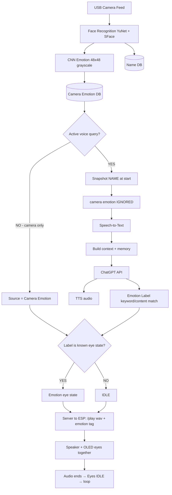
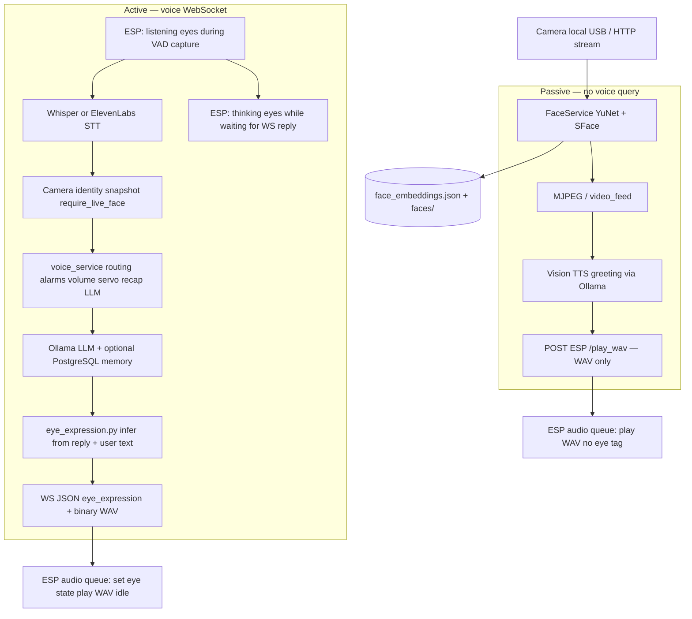

# Emotion & Eye Expression — Design vs Present Server

This document compares the **original NiNO emotion flow** ([`nino_emotion_flow.png`](nino_emotion_flow.png)) with the **present Python server** described in [`serverP.md`](serverP.md) and implemented under `server/` + `main/`.

Use it to see what was planned, what was built, and what still diverges.

---

## At a glance

| Topic | `nino_emotion_flow.png` (design) | Present server (`serverP.md` / code) |
|-------|----------------------------------|--------------------------------------|
| **Camera emotion detection** | CNN on 48×48 grayscale face crop → stored in **Camera Emotion** DB | **Not implemented** — no CNN, no camera-emotion store |
| **Passive mode (no voice)** | Camera emotion drives OLED eyes continuously | Eyes stay **idle**; vision only triggers **spoken greetings** (no eye tag) |
| **Active mode (voice query)** | Camera emotion **ignored**; emotion from reply text | Same priority — eyes come from **reply text only**, never from camera |
| **LLM backend** | ChatGPT API | **Ollama** (local, GPU-preferred `:11435`) |
| **Emotion / eye labeling** | Keyword / content match on AI reply | `eye_expression.py` — weighted phrase scoring + regex + fallbacks on **reply + user text** |
| **Delivery to ESP** | Single command: `/play .wav + emotion tag` | **Two channels:** voice = WebSocket JSON metadata + binary WAV; greetings/alarms = HTTP `POST /play_wav` (WAV only, no eye tag) |
| **Idle reset after audio** | Eyes return to **IDLE** when clip ends | **Matches** — `audio_queue.c` reverts to idle after TTS finishes |
| **Unknown label** | Falls back to **IDLE** | **Matches** — unknown/missing tag → idle (`normalize_eye_expression` → `None`) |
| **Face recognition** | YuNet + SFace → **Name** DB | **Matches** — YuNet + SFace → `data/face_embeddings.json` + sample images |
| **Context / memory** | “Build context + conversation memory” (unspecified backend) | PostgreSQL via `memory_service.py` (optional); recap, store, recall routing |
| **Extra voice paths** | Not shown | Volume, alarms, servo 360, medical ack, identity, recap — most return **no** eye tag |

---

## Flow comparison

### Design flow (`nino_emotion_flow.png`)

### Present server flow (emotion-relevant parts)

---

## Detailed differences

### 1. Camera-based emotion detection — **missing in server**

| Design | Present |
|--------|---------|
| Separate **Emotion Detection** step: CNN on 48×48 grayscale crop | No emotion model in `face_service.py` or elsewhere |
| Writes to **Camera Emotion** database | No camera-emotion persistence |
| Passive path uses camera emotion as eye **source** | Passive path has **no eye-expression source** at all |

**Impact:** The “mirror the user’s face emotion on the eyes when nobody is talking” behaviour from the diagram is **not implemented**. When idle, eyes remain in `idle` unless a voice interaction or manual ESP command changes them.

---

### 2. Passive vs active mode — **partially aligned**

| Design | Present |
|--------|---------|
| **Passive:** camera emotion → eyes (no voice) | **Passive:** face detect → optional **greeting TTS** only; **no eye tag** sent |
| **Active:** snapshot name, **ignore camera emotion**, label from reply | **Active:** snapshot identity from live face; eyes from **LLM reply text** only (camera emotion N/A because it is never computed) |
| Binary split: voice query yes/no | Same split in practice, but passive behaviour differs (TTS vs eyes) |

**Aligned:** During voice queries, emotion/eyes are derived from conversation text, not from the camera feed.

**Not aligned:** Passive mode in the diagram drives eyes from camera; the server drives **speech** from face recognition (`tts_service.update_face_state`) with no corresponding eye animation.

---

### 3. LLM and labeling — **same idea, different stack**

| Design | Present |
|--------|---------|
| **ChatGPT API** for reply + context | **Ollama** HTTP API (`llm_service.py`), model default `qwen2.5:1.5b` |
| **Emotion labeling:** keyword / content match on reply | **`eye_expression.py`:** six expression tags with phrase groups, weighted scoring, user-text multiplier, tie-break rules, and `_fallback_from_reply()` heuristics |
| Label checked against “known eye states” | `normalize_eye_expression()` — only `happy`, `tired`, `curious`, `sad`, `surprised`, `recalling` pass; `idle`, `thinking`, `listening` → omitted (device stays idle for that reply) |

**Extra in server:** User utterance text is scored alongside the assistant reply (`user_text` at 2× weight). Recap paths force `recalling`. Non-LLM paths (`volume`, `alarm`, `servo_360`) return **no** eye tag.

**Valid server expression tags (6):** `happy`, `tired`, `curious`, `sad`, `surprised`, `recalling`

**Full ESP eye states (9):** `idle`, `happy`, `tired`, `thinking`, `curious`, `sad`, `surprised`, `listening`, `recalling`

The three functional states **`thinking`**, **`listening`**, and **`idle`** are **not** chosen by server emotion labeling — they are driven **on-device**:

- `listening` — during VAD microphone capture (`voice_assist.c`)
- `thinking` — after WAV sent, while waiting for WebSocket reply (`voice_ws_client.c`)
- `idle` — default; restored after audio ends or on error

The diagram does not show this pre/post-reply eye lifecycle.

---

### 4. Server → ESP transport — **split protocol**

| Design | Present |
|--------|---------|
| One combined payload: **`/play .wav + emotion tag`** | **Voice replies:** WebSocket — JSON `{"eye_expression": "…", "prompt_medical_ack": …}` then **binary WAV** |
| | **Vision greetings & alarms:** HTTP `POST ESP_PLAY_WAV_URL` (`/play_wav`) — **audio only**, no expression header |
| Audio + eyes synchronized on ESP | **Voice:** expression applied when reply arrives, held through playback, idle on end (`audio_queue.c`) |
| | **Greetings/alarms:** playback with `NINO_EYE_STATE_COUNT` (no expression) |

**Aligned:** Eyes and speaker play together for voice replies; eyes reset to idle when TTS finishes.

**Not aligned:** The diagram’s single “wav + tag” command is only loosely analogous to the WebSocket path. Proactive vision speech uses a **different** path with **no** emotion tag.

---

### 5. Face recognition & identity — **largely aligned**

| Design | Present |
|--------|---------|
| YuNet + SFace → **Name** DB | YuNet + SFace → `data/faces/`, `face_embeddings.json` |
| Snapshot name at voice query start | `_camera_identity_snapshot(require_live_face=True)` in `app.py` |
| | Fallback chain: live frame → TTS viewer cache → session recall (900 s TTL) |
| | Memory logging requires **live recognized face** |

**Not in diagram:** Registration API (`POST /api/register`), cosine threshold tuning, multi-frame confirmation, face-greeting interval (600 s default), 90 s suppression after voice interaction.

---

### 6. Context & memory — **expanded beyond diagram**

| Design | Present |
|--------|---------|
| “Build context + conversation memory” (no detail) | Optional **PostgreSQL** (`memory_service.py`, `DBP.md`) |
| | Voice routing: recap → memory LLM turn → identity → general chat |
| | Background conversation logging + Phase B fact extraction |
| | Filters in `memory_filters.py` to block junk memories |

The diagram’s memory box exists in spirit but the live system is substantially richer.

---

### 7. Features in present server **not shown** in diagram

These exist in [`serverP.md`](serverP.md) and affect runtime but are outside the emotion flowchart:

- **Alarm scheduler** — voice-set alarms, medical ack loop, TTS to ESP
- **Volume commands** — no eye tag
- **Servo 360** — “do a 360” trigger after reply
- **Web UI** — MJPEG `/video_feed`, registration, status API
- **STT/TTS providers** — Whisper, ElevenLabs, SAPI, espeak
- **Latency logging** — `data/latency_log.json` per voice query
- **Error recovery** — spoken fallback if Ollama fails; eyes idle on WS error

---

### 8. Idle fallback & loop — **aligned**

| Design | Present |
|--------|---------|
| Unknown label → **IDLE** | Missing/invalid `eye_expression` → device plays on idle |
| After audio ends → **IDLE** | `audio_queue.c`: “TTS finished: back to idle (server contract)” |
| Loop to next query | WebSocket session loops per utterance; camera thread runs continuously |

---

## Side-by-side: eye state selection

| Situation | Diagram behaviour | Present behaviour |
|-----------|-------------------|-------------------|
| No voice, user in frame | Camera CNN emotion → eye state or idle | **Idle eyes**; optional greeting **audio** only |
| User speaking (capture) | Not specified | ESP **`listening`** |
| Waiting for LLM/TTS | Not specified | ESP **`thinking`** |
| Voice reply with matched label | Emotion eye state + WAV | WS tag → emotion state + WAV |
| Voice reply, no match | **IDLE** + WAV | **IDLE** + WAV (tag omitted) |
| Volume / alarm / servo reply | Not shown | **IDLE** (no tag; `LLM_RESPONSE_PATHS` excludes these) |
| Vision greeting | Not distinguished from passive eyes | `/play_wav` only, **idle** eyes |
| Alarm fire | Not shown | `/play_wav` only, **idle** eyes |
| Playback complete | **IDLE** | **IDLE** |

---

## Summary

### What matches the diagram

1. **YuNet + SFace** face recognition with stored identities.
2. **Active voice:** camera-derived “emotion” is not used; **reply content** drives the eye tag.
3. **Keyword/content-style labeling** on assistant text (implemented in depth in `eye_expression.py`).
4. **Known-state gate** — invalid labels → idle.
5. **Synchronized audio + eyes** on ESP for voice replies, then **reset to idle**.

### Major gaps (diagram → server)

1. **No CNN camera emotion detection** and no Camera Emotion database.
2. **No passive eye mirroring** — camera-only mode does not animate eyes from user affect.
3. **ChatGPT → Ollama** backend swap.
4. **Transport split** — WebSocket metadata + WAV for voice vs HTTP `/play_wav` for greetings/alarms (diagram shows one combined path).

### Additions beyond the diagram

1. On-device **`listening`** and **`thinking`** states during capture and server wait.
2. **Six** server-chosen expression tags vs nine total hardware states.
3. **PostgreSQL memory**, recap routing, alarms, volume, servo, web UI, and multi-provider STT/TTS.
4. User-text weighting and path-specific rules in `eye_expression.py`.

---

## Source references

| Artifact | Location |
|----------|----------|
| Original flowchart | [`docs/nino_emotion_flow.png`](nino_emotion_flow.png) |
| Present server doc | [`docs/serverP.md`](serverP.md) |
| Eye labeling | [`server/eye_expression.py`](../server/eye_expression.py) |
| Voice pipeline | [`server/voice_service.py`](../server/voice_service.py), [`server/app.py`](../server/app.py) |
| ESP eye engine | [`main/nino_eye.c`](../main/nino_eye.c), [`docs/Eye states.md`](Eye%20states.md) |
| ESP voice + eyes | [`main/voice_assist.c`](../main/voice_assist.c), [`main/voice_ws_client.c`](../main/voice_ws_client.c), [`main/audio_queue.c`](../main/audio_queue.c) |
