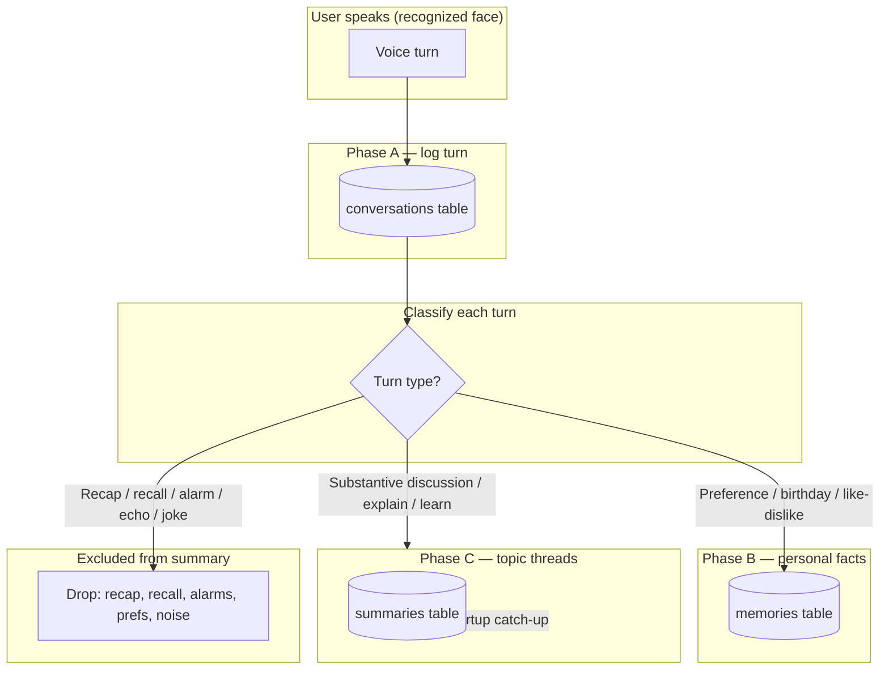
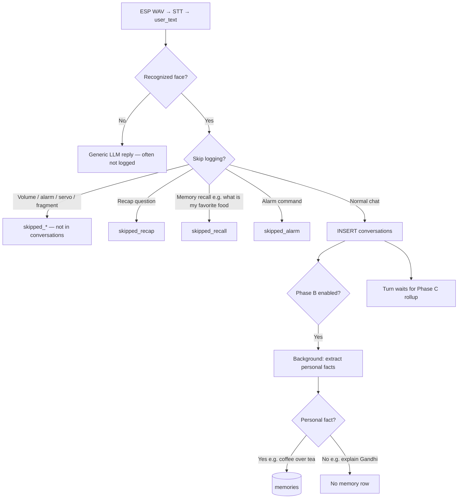
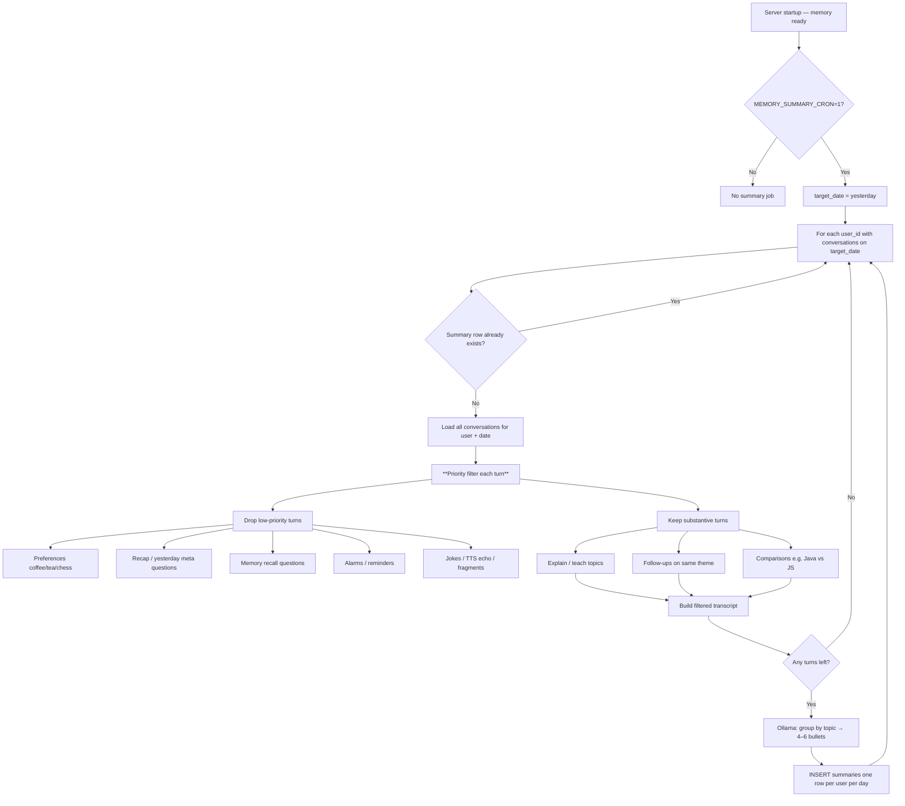
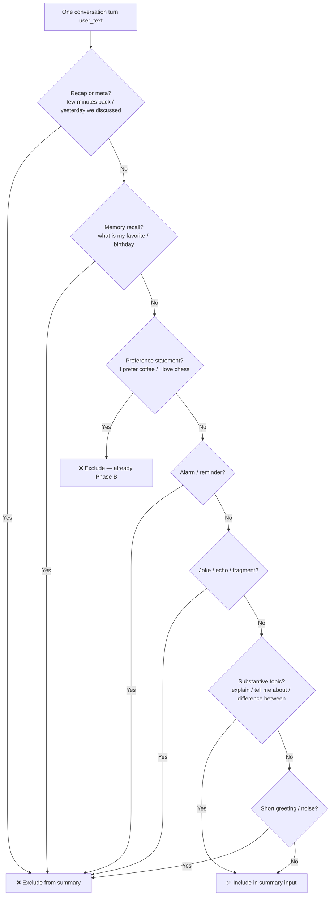
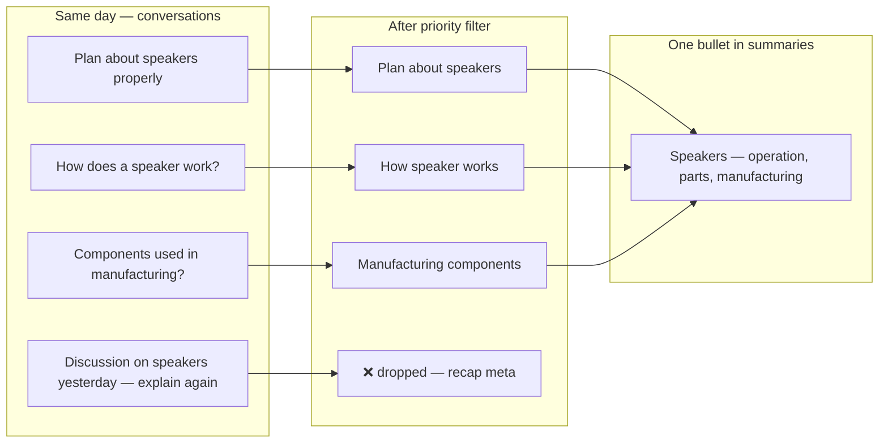
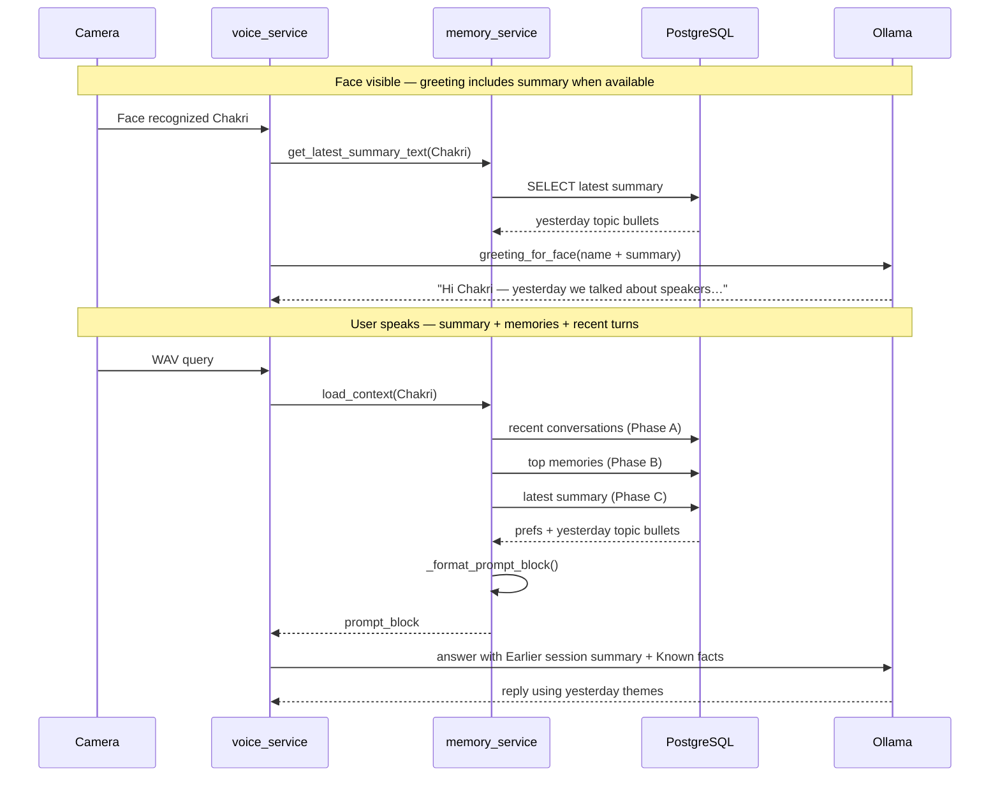
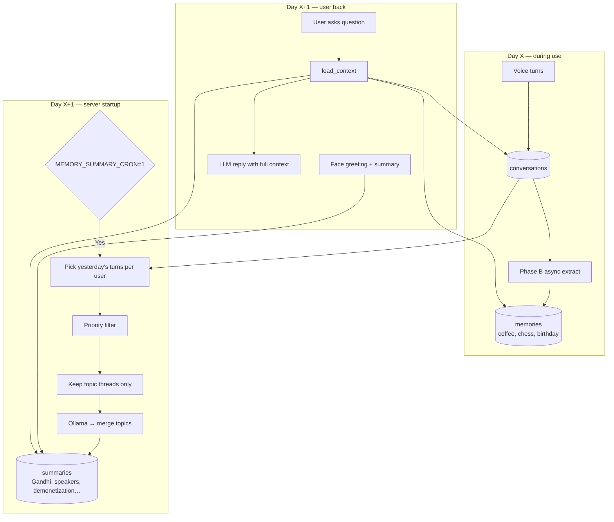

# Phase C — Priority Summary Flow (Plan)

How daily summaries **should** work: topic threads go into `summaries`; personal facts go to Phase B `memories`; noise and meta-queries are excluded.

This reflects the **target design** discussed for NiNO. Some steps (priority pre-filter before summarization) are **not fully implemented yet** — see [Current vs planned](#current-vs-planned) at the end.

---

## 1) Big picture — three memory lanes



| Lane | Table | What belongs here |
|------|-------|-------------------|
| **Phase A** | `conversations` | Every logged turn (raw history) |
| **Phase B** | `memories` | Personal facts: prefs, dates, stable details |
| **Phase C** | `summaries` | **Topic themes** from the day (compressed) |
| **Excluded** | — | Meta-recap, recall questions, alarms, duplicates of Phase B |

---

## 2) Day X — conversation logging flow

Each voice turn is stored in `conversations` unless already skipped at log time.



**Examples from a busy day**

| User said | Logged to `conversations`? | Phase B `memories`? | Phase C summary later? |
|-----------|----------------------------|---------------------|-------------------------|
| Explain microcontroller simply | Yes | No | **Yes** — topic |
| I prefer coffee over tea | Yes | **Yes** | **No** — personal |
| Tell me five CEOs of India | Yes | No | **Yes** — topic |
| Few minutes back we discussed speakers | Often **No** (recap skip) | No | **No** — meta |
| What is demonetization? | Yes | No | **Yes** — topic (merge with follow-ups) |
| Set alarm for 7 AM | **No** (alarm path) | No | **No** |

---

## 3) End of day X → summary generation (Phase C write path)

Triggered when `MEMORY_SUMMARY_CRON=1` and server starts on day X+1 (startup catch-up for yesterday).



---

## 4) Priority filter — decision tree (per turn)

This is the core “trick”: **not every `conversations` row should influence the summary.**



---

## 5) Topic merging — many turns → few bullets

Multiple turns about the **same theme** collapse into **one** summary line.



**Example day rollup (ideal output)**

```text
- Microcontrollers (simple explanation)
- CEOs of India
- Java vs JavaScript
- Mahatma Gandhi
- Demonetization
- Trigonometry
- Speakers (how they work, components, manufacturing)
```

**Not in summary:** coffee/tea, chess vs outdoor games, recap phrasing.

---

## 6) Day X+1 — read path (when user returns)



**Planned enhancement (not wired yet):** pass `summary_text` into `greeting_for_face()` so the first spoken line can say *“Welcome back — yesterday we talked about speakers and demonetization.”*

---

## 7) Full lifecycle — one diagram



---

## 8) Responsibility matrix

| Content | `conversations` | `memories` (B) | `summaries` (C) |
|---------|-----------------|----------------|-----------------|
| Explain microcontroller | ✓ raw turn | — | ✓ topic bullet |
| I prefer coffee over tea | ✓ raw turn | ✓ fact | ✗ |
| CEOs of India + follow-up | ✓ raw turns | — | ✓ one merged bullet |
| Demonetization × 2 turns | ✓ raw turns | — | ✓ one merged bullet |
| Speakers × 3 explain turns | ✓ raw turns | — | ✓ one merged bullet |
| Recap: few minutes back speakers | ✗ or ✓ but filter out | — | ✗ |
| What is my favorite food | ✗ skipped_recall | — | ✗ |
| Set alarm 7 AM | ✗ skipped_alarm | — | ✗ |

---

## 9) Implementation checklist (to match this flow)

| Step | Status | Module |
|------|--------|--------|
| Log turns to `conversations` | ✅ Done | `memory_service`, `voice_service` |
| Skip recap / recall / alarms at log time | ✅ Done | `memory_filters.conversation_log_skip_reason` |
| Extract prefs to `memories` | ✅ Done | Phase B in `memory_service` |
| Startup catch-up for yesterday | ✅ Done | `_run_summary_catchup_safe` |
| **Priority filter before summarize** | ⬜ Planned | `_summarize_user_day` + `memory_filters` |
| **Topic-merge prompt** (group speakers, Gandhi, etc.) | ⬜ Planned | summarization prompt in `memory_service` |
| Inject summary into voice LLM | ✅ Done | `load_context` → `_format_prompt_block` |
| Inject summary into face greeting | ✅ Done | `greeting_for_face` + `tts_service` |

---

## Current vs planned

| Aspect | Today | This plan |
|--------|-------|-----------|
| Input to summarizer | **All** conversation rows for the day | **Filtered** topic rows only |
| Personal prefs in summary | May appear if LLM includes them | **Excluded** — live in `memories` |
| Recap / meta questions | May appear if logged | **Excluded** |
| Multiple turns same topic | LLM may or may not merge | **Explicit merge** into one bullet |
| Greeting uses summary | No | Yes (planned) |

See also: [`phase_c_detailed.md`](phase_c_detailed.md) for full Phase C reference.
