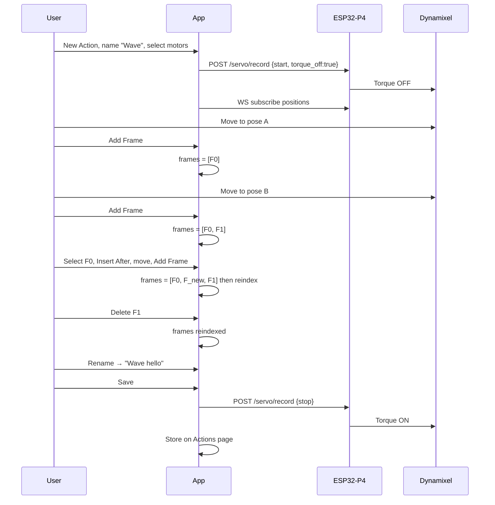
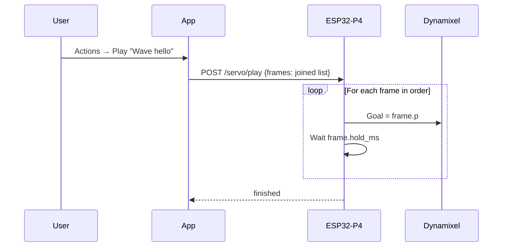

# Record & Play — Motor Actions

Design for teaching Dynamixel motions from the **mobile app**, building them as editable **frames**, saving them on the **Actions** page, and playing them back on the bot.

**Status:** implemented (firmware APIs + Actions web UI).  
**Related:** [SERVO.md](SERVO.md), [MOBILE-APP COM.md](MOBILE-APP%20COM.md)

### How to use now

1. Flash firmware with record/play endpoints.
2. Run the PC server; open **http://localhost:8000/actions**.
3. Select the robot → **Start edit (torque off)** → move head → **Add Frame**.
4. Insert / delete / replace frames; set hold ms; **Rename** / **Save**.
5. **Play** sends joined frames to `POST /servo/play` on the bot.

---

## Goal

1. Bot is connected to motors (Dynamixel AX on U2D2).
2. In the app, **select a motor** (or both).
3. **Move** the motor; each moment you keep becomes a **frame** (pose + timing).
4. Frames are **joined in order** into one **action**.
5. You can **add** frames in between, **delete** frames, and edit hold time per frame.
6. You can **name** and **rename** the action.
7. Action is listed on the **Actions** page → **Play** replays the frame sequence on the bot.

---

## Core idea: Action = ordered list of frames

```text
Action "Look left then nod"
  ├── Frame 0  t=0ms     pan=512  tilt=512   (start)
  ├── Frame 1  t=500ms   pan=400  tilt=512   (look left)
  ├── Frame 2  t=1200ms  pan=400  tilt=480   (nod)
  └── Frame 3  t=2000ms  pan=512  tilt=512   (home)
```

- A **frame** = one snapshot of motor position(s) at a point in the motion.
- An **action** = frames joined end-to-end in index order.
- Playback walks frame 0 → 1 → 2 → … and moves the motors to each pose.

You do **not** treat the recording as one opaque blob. You always edit a **frame list**.

---

## Hardware we already have

| ID | Joint | Role | Position scale | Neutral |
|----|-------|------|----------------|---------|
| **1** | Tilt | Head up / down | 0–1023 | 512 |
| **2** | Pan | Head left / right | 0–1023 | 512 |

Firmware already can:

- Write goal position (`nino_servo_dxl_set_servo_goal`)
- **Read present position** (`nino_servo_dxl_get_present_position`) — not exposed to the app yet

Missing for record & play:

- HTTP / WebSocket APIs for position, torque, goal, play
- App frame editor + Actions page
- Playback of a frame list on the bot

---

## How frames are created

Two ways to add frames. Both land in the **same editable frame list**.

### Way 1 — Capture frame (recommended primary)

Best for clean, intentional motions.

```text
1. Select motor(s)
2. Enter Record / Edit mode (torque OFF on selected motors)
3. Move head to a pose
4. Tap  + Add Frame   → current angles become a new frame
5. Move again → Add Frame again
6. Repeat
7. Frames are joined in the order you added them
```

To insert in the middle:

```text
Select Frame 1  →  tap  Insert After  →  move head  →  Add Frame
Result: Frame 0, Frame 1, [new Frame 2], old Frame 2 becomes Frame 3, …
```

### Way 2 — Continuous take (optional)

For fluid paths:

```text
1. Tap Record
2. Move freely — app samples live angles every N ms as frames
3. Tap Stop
4. Resulting frames appear in the same editor (you can still add/delete)
```

Default sample while continuous: **10–20 Hz**. After stop, app may thin near-duplicate frames (optional).

**Recommendation:** ship **Way 1 (Add Frame)** first; add continuous take as a second button later.

---

## Frame editing (must-have)

On the action editor screen, every action is a scrollable **frame strip**:

```text
[ F0 ] [ F1 ] [ F2 ] [ F3 ] …
  ▲ selected
```

| Operation | What it does |
|-----------|----------------|
| **Add Frame** | Append current live pose at the **end** of the list |
| **Insert After** | Insert current live pose **after** the selected frame |
| **Insert Before** | Insert current live pose **before** the selected frame |
| **Delete Frame** | Remove selected frame; list re-indexes |
| **Replace Frame** | Overwrite selected frame with current live pose (keep its timing slot) |
| **Reorder** | Drag frames left/right (optional v1.1; insert/delete covers most needs) |
| **Hold / duration** | Per-frame: how long to take (or wait) before the next frame |

### Timing model

Each frame stores:

- `index` — order in the action (0…N−1)
- `hold_ms` — time spent moving to / holding this pose before advancing  
  **or** absolute `t_ms` from start (derived from holds)

Simplest for editing: store **`hold_ms` per frame**, compute `t_ms` when playing / exporting:

```text
Frame 0: hold_ms = 0     (snap / start pose)
Frame 1: hold_ms = 500   (reach look-left in 500 ms)
Frame 2: hold_ms = 700
Frame 3: hold_ms = 800
```

When you **delete** a middle frame, neighboring frames stay; total duration shrinks.  
When you **insert** a frame, you set its `hold_ms` (default e.g. 500 ms).

### Join rule

Playback always uses:

```text
joined sequence = frames.sort_by(index)
```

No gaps, no branches in v1 — one linear strip.

---

## Name & rename

| When | Behavior |
|------|----------|
| **First save** | Dialog: enter action name (required, non-empty). Example: `Look left then nod` |
| **Rename** | From Actions list or editor → rename → updates `name` only (`id` stays stable) |
| **Duplicate** | Optional: copy frames under a new name / new `id` |

Validation:

- Name trimmed, max ~40 characters
- Empty name blocked
- Duplicate names allowed (distinguish by `id` + created time) **or** warn — proposal: **allow duplicates**, show created time in list

---

## UX flow

### A. Build / edit an action (frames)

```text
App → New Action  (or open existing)
  │
  ├─ Name: "Wave"          ← can rename anytime
  ├─ Select motor(s): ID1 / ID2 / Both
  ├─ Enter edit/record mode
  │     Bot: torque OFF, other servo owners paused
  │     Live angles stream to app
  │
  ├─ Move → Add Frame → Move → Add Frame → …
  │     Frame strip grows: F0 F1 F2 …
  │
  ├─ Select F1 → Delete          (remove a bad pose)
  ├─ Select F1 → Insert After    (add a pose between F1 and F2)
  ├─ Edit hold_ms on any frame
  │
  └─ Save
        Action stored on Actions page (frames joined in order)
```

### B. Play

```text
App → Actions → select action → Play
  │
  Bot receives the frame list (joined in order)
  Moves motors frame by frame using hold_ms / t_ms
  Ends in idle (leave last pose; optional Home)
```

### C. Actions page

| Field / control | Meaning |
|-----------------|---------|
| Name | Shown label (rename here) |
| Frames | Count (e.g. 12 frames) |
| Motors | ID1 / ID2 / both |
| Duration | Sum of `hold_ms` |
| Created / updated | Timestamps |
| **Play** | Run on bot |
| **Edit** | Open frame editor (add / delete / insert / replace) |
| **Rename** | Change name only |
| **Delete** | Remove whole action |

---

## Data format

```json
{
  "id": "act_20260804_001",
  "name": "Look left then nod",
  "created_at": "2026-08-04T13:30:00Z",
  "updated_at": "2026-08-04T14:10:00Z",
  "motors": [1, 2],
  "frames": [
    {
      "index": 0,
      "hold_ms": 0,
      "p": { "1": 512, "2": 512 }
    },
    {
      "index": 1,
      "hold_ms": 500,
      "p": { "1": 512, "2": 400 }
    },
    {
      "index": 2,
      "hold_ms": 700,
      "p": { "1": 480, "2": 400 }
    },
    {
      "index": 3,
      "hold_ms": 800,
      "p": { "1": 512, "2": 512 }
    }
  ]
}
```

Rules:

- Positions are **AX raw 0–1023**. App may show degrees for display only.
- `frames` is always ordered by `index` (0…N−1, no holes after save).
- After add/delete/insert, app **reindexes** before save.
- Minimum frames to Play: **1** (pose) or **2** (motion) — proposal: allow Play with ≥1 frame.
- Rename changes `name` + `updated_at` only.

**Storage (phase 1):** app local (Actions page). Bot does not store named actions yet — it only receives frames at Play time.

---

## Teach mode (how you move the motor)

### Mode 1 — Hand teach (recommended first)

1. Select motor(s).
2. Bot **torque OFF**.
3. Push the head by hand.
4. Live present position shown in app.
5. **Add Frame** snapshots that pose into the list.
6. On leave editor: torque ON (hold last pose).

### Mode 2 — App jog (optional later)

- Sliders send `POST /servo/goal`.
- Same **Add Frame** captures present position.

---

## Firmware API plan (new)

Bot HTTP port 80. Frame **editing** stays in the app; bot only needs sense / hold / play.

### 1. Read positions

```http
GET /servo/position
```

```json
{
  "ok": true,
  "ready": true,
  "mode": "idle",
  "servos": [
    { "id": 1, "position": 512, "torque": true },
    { "id": 2, "position": 498, "torque": true }
  ]
}
```

### 2. Enter / leave record-edit mode

```http
POST /servo/record
{ "action": "start", "ids": [1, 2], "torque_off": true }
```

```http
POST /servo/record
{ "action": "stop" }
```

### 3. Live stream (for live angle readout while building frames)

```text
WS  ws://<ESP_IP>/ws/servo
```

```json
{ "cmd": "subscribe", "hz": 20 }
```

Bot pushes present positions; **app decides when to create a frame** (Add Frame tap, or continuous sampler).

### 4. Goal (jog / preview one frame)

```http
POST /servo/goal
{ "id": 2, "position": 400, "speed": 22 }
```

Optional: **Preview frame** in editor = send that frame’s `p` via `/servo/goal` so you see the pose before Play.

### 5. Play joined frames

```http
POST /servo/play
{
  "name": "Look left then nod",
  "speed": 22,
  "frames": [
    { "hold_ms": 0,   "p": { "1": 512, "2": 512 } },
    { "hold_ms": 500, "p": { "1": 512, "2": 400 } },
    { "hold_ms": 700, "p": { "1": 480, "2": 400 } },
    { "hold_ms": 800, "p": { "1": 512, "2": 512 } }
  ]
}
```

Bot walks frames in array order (already joined). For each frame: set goals → wait `hold_ms` (and/or until near target, with max timeout).

```http
POST /servo/play/stop
```

### 6. Status

```json
"servo": {
  "ready": true,
  "mode": "idle|record|play",
  "ids_online": [1, 2]
}
```

---

## Ownership rules

While `mode == record` or `mode == play`:

| Feature | Behavior |
|---------|----------|
| Face tracking | Forced pause |
| Audio L/R/U/D head motion | Forced off |
| `POST /servo/360` | Reject `busy_record` / `busy_play` |
| New play while recording | Reject |

---

## Sequence diagrams

### Capture frames + edit + save



### Play joined frames



---

## App UI sketch

### Action editor (frame-centric)

- Title: action **name** (tap pencil → **Rename**)
- Motor chips: Tilt / Pan
- Live angle readout
- Buttons: **Add Frame** · **Insert Before** · **Insert After** · **Replace** · **Delete Frame**
- Horizontal **frame strip** (thumbnails or index chips `F0 F1 F2…`)
- Selected frame detail: positions + `hold_ms` editor
- **Preview this frame** (optional) · **Play action** · **Save**

### Actions page

- List: name, frame count, duration
- Swipe / menu: **Play** · **Edit** · **Rename** · **Delete**

---

## Implementation phases

| Phase | Work | Outcome |
|-------|------|---------|
| **P0** | Firmware: position, torque, goal, record start/stop | Hand-move + read angles |
| **P1** | Firmware: WS position stream | Live readout |
| **P2** | App: Add/Insert/Delete/Replace frames, name/rename, Actions list | Editable frame actions |
| **P3** | Firmware: `POST /servo/play` with `frames[]` | Joined playback |
| **P4** | Continuous take + thinning, preview frame, polish | Fluid record path |

---

## Open questions

1. **Capture style first?** Proposal: **Add Frame** taps first; continuous take in P4.
2. **Default `hold_ms` for new frames?** Proposal: **500 ms**.
3. **After Play, leave last pose or home to 512?** Proposal: leave last pose + optional Home.
4. **Actions storage?** Proposal: app-local v1.
5. **Playback wait:** clock `hold_ms` only, or also wait until near target? Proposal: both — wait near target **or** `hold_ms`, whichever first, with a max timeout.

---

## What we will not change in v1

- BLE stays Wi‑Fi provisioning only.
- Voice / `POST /servo/360` keep working outside record/play.
- Only IDs 1 and 2 unless we extend the picker later.

---

## Success check

1. Create action, name it **“Wave”**.
2. Add three frames by moving the head and tapping **Add Frame**.
3. Insert a frame between F0 and F1; delete F2; strip reindexes.
4. Rename to **“Wave hello”** — Actions page shows the new name, same frames.
5. **Play** — bot runs frames in joined order.
6. Edit again, delete one frame, Play again — shorter motion.
7. Face track / TTS head motion still work after leaving the editor.
