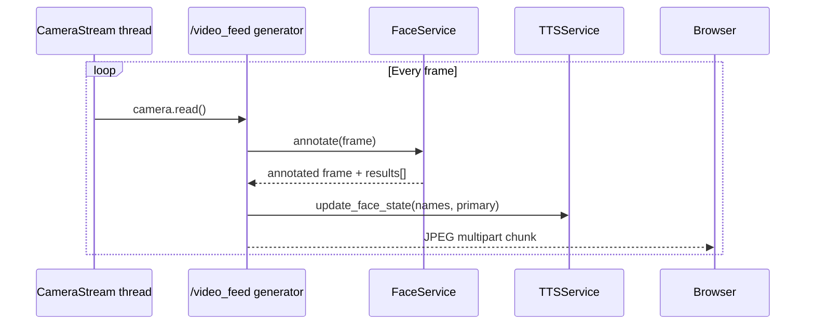
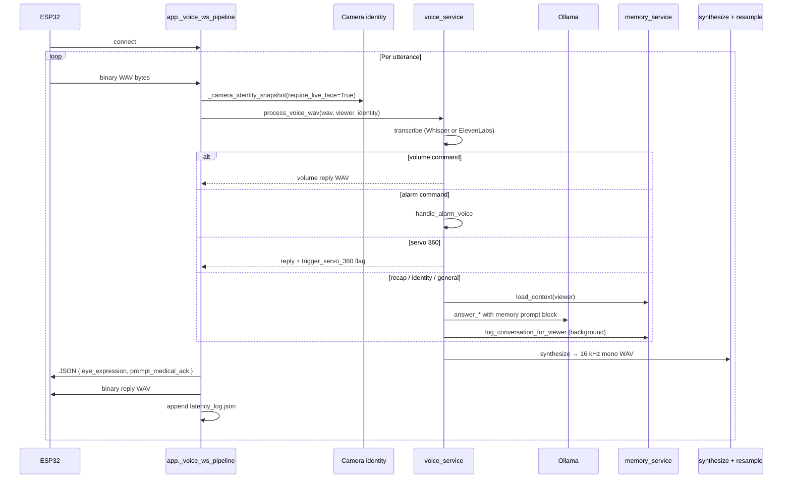
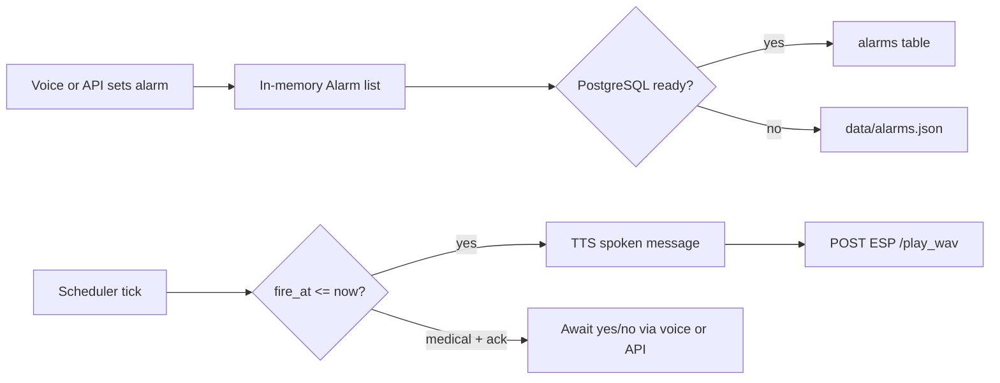

# NiNO Server — Present Working Flow

This document describes how the **Python FastAPI server** (`server/`) works today: startup, modules, HTTP/WebSocket endpoints, and the main runtime pipelines (vision, voice, alarms, TTS).

---

## Overview

The server is the **brain** of the NiNO demo:

- Pulls camera frames (local USB, HTTP stream, or ESP32 snapshot URL)
- Recognizes faces (OpenCV YuNet + SFace embeddings)
- Serves a web UI with live MJPEG video
- Handles **voice queries** from the ESP32 over WebSocket (STT → LLM → TTS)
- Greets recognized people proactively via vision-driven TTS
- Schedules and fires alarms (spoken on ESP32 speaker)
- Optionally uses **PostgreSQL** for conversation memory (see `DBP.md`)

**Entry point:** `server/app.py` — run with:

```bash
cd server
python app.py --host 0.0.0.0 --port 8000
```

Default port: **8000**.

---

## Architecture

```mermaid
flowchart TB
    subgraph Clients
        ESP[ESP32-P4 device]
        Browser[Web browser]
    end

    subgraph FastAPI["app.py (FastAPI + Uvicorn)"]
        HTTP[HTTP routes]
        WS["/ws/voice WebSocket"]
    end

    subgraph CoreServices
        CAM[camera.py]
        FACE[face_service.py]
        VOICE[voice_service.py]
        LLM[llm_service.py]
        TTS[tts_service.py]
        ALARM[alarm_service.py]
        MEM[memory_service.py]
        EYE[eye_expression.py]
    end

    subgraph External
        OLLAMA[Ollama LLM]
        PG[(PostgreSQL)]
        ESPPLAY[ESP /play_wav]
    end

    Browser --> HTTP
    ESP --> WS
    HTTP --> CAM
    HTTP --> FACE
    WS --> VOICE
    VOICE --> LLM
    VOICE --> MEM
    VOICE --> ALARM
    VOICE --> TTS
    VOICE --> EYE
    LLM --> OLLAMA
    MEM --> PG
    ALARM --> PG
    TTS --> ESPPLAY
    ALARM --> ESPPLAY
    CAM --> FACE
    FACE --> TTS
```



### Module map

| Module | Role |
|--------|------|
| `app.py` | FastAPI app, routes, MJPEG stream, voice WebSocket orchestration |
| `camera.py` | Background thread: local OpenCV capture or HTTP snapshot polling |
| `face_service.py` | YuNet detection + SFace 128-D embeddings, registration, annotation |
| `voice_service.py` | STT → routing (alarms, identity, recap, LLM) → TTS WAV |
| `llm_service.py` | Ollama HTTP API: greetings, voice answers, memory extraction |
| `tts_service.py` | Vision greeting queue; synthesizes WAV → ESP or local SAPI/espeak |
| `alarm_service.py` | Background scheduler; fires due alarms to ESP |
| `alarm_voice.py` | Voice commands: set/list/cancel alarms |
| `alarm_medical.py` | Medical alarm classification, ack states |
| `memory_service.py` | PostgreSQL memory layer (users, conversations, facts) |
| `eye_expression.py` | Maps reply tone → ESP eye expression tag |
| `esp_playback.py` | POST WAV to `ESP_PLAY_WAV_URL` |
| `wav_resample.py` | Resample to 16 kHz mono for ESP playback |

---

## Startup sequence

### 1. CLI / `main()` (`app.py`)

Before Uvicorn starts:

1. Load `server/.env` (if `python-dotenv` installed)
2. Resolve `DATABASE_URL`, memory flags (`MEMORY_EXTRACTION`, etc.)
3. Set camera source (`CAMERA_SOURCE` / `--camera-source`)
4. Configure `ESP_PLAY_WAV_URL`, alarm WAV path
5. **Ollama:** `try_start_gpu_ollama()` then `resolve_ollama_api_url()` (prefers GPU on `:11435`)
6. Set env: `OLLAMA_URL`, `OLLAMA_MODEL`, `WHISPER_MODEL`, STT/TTS providers, face thresholds
7. `tts.configure_llm()`, `voice_service.configure_from_environ()`, `memory_service.startup()`

### 2. FastAPI `@app.on_event("startup")`

1. Reload face settings from environment
2. `get_memory_service().startup()` — connect PostgreSQL, apply schema
3. `get_alarm_service().start()` — load alarms, start scheduler thread
4. `camera.start()` — begin frame capture thread
5. Background thread: `warm_ollama_model()` — preload LLM weights
6. Log face recognition readiness (trained people, thresholds)

### 3. Uvicorn

Serves on `--host` / `--port` (default `0.0.0.0:8000`).

### Shutdown

On exit: stop alarm scheduler → stop TTS → stop camera.

---

## Configuration

Precedence: **CLI flags** → **environment variables** → **`server/server_config.json`** → defaults.

| Setting | Env / flag | Default |
|---------|------------|---------|
| Camera | `CAMERA_SOURCE`, `--camera-source` | `auto` (indexes 0–7) or ESP stream URL |
| ESP speaker | `ESP_PLAY_WAV_URL` | from `server_config.json` |
| LLM | `OLLAMA_URL`, `OLLAMA_MODEL` | auto GPU `:11435`, `qwen2.5:1.5b` |
| STT | `STT_PROVIDER` | `elevenlabs` if API key set, else `whisper` |
| TTS | `TTS_PROVIDER` | `elevenlabs` / `sapi` / `local` (espeak) |
| Face match | `FACE_MATCH_THRESHOLD` | `0.42` (cosine similarity) |
| Face greeting interval | `FACE_GREETING_INTERVAL_SECONDS` | `600` (10 min) |
| Database | `DATABASE_URL` | unset = memory disabled |
| Alarm WAV | `ALARM_WAV_PATH` | `../main/beep.wav` |

See `server/.env.example` for a full template.

---

## HTTP API

| Method | Path | Purpose |
|--------|------|---------|
| GET | `/` | Web UI (`templates/index.html`) |
| GET | `/video_feed` | MJPEG stream with face overlays |
| GET | `/snapshot.jpg` | Single annotated JPEG |
| GET | `/api/status` | Camera, faces, TTS, LLM, alarms, memory, latest detections |
| POST | `/api/camera` | Change camera source `{ "source": "..." }` |
| POST | `/api/register` | Capture face samples + train `{ name, samples, interval_ms }` |
| POST | `/api/retrain` | Re-encode all samples → embeddings |
| GET | `/api/latency-log` | Recent voice latency records |
| GET | `/api/memory/stats` | PostgreSQL table row counts |
| GET | `/api/alarms` | Pending / awaiting-ack alarms |
| DELETE | `/api/alarms` | Cancel all alarms |
| DELETE | `/api/alarms/{id}` | Cancel one alarm |
| POST | `/api/alarms/{id}/ack` | Confirm/decline medical alarm ack |

Static assets: `/static/*`

---

## Vision pipeline (camera + faces + MJPEG)



### Camera (`camera.py`)

- **Thread:** `camera-stream` daemon
- **Sources:**
  - `auto` → try local indexes 0–7
  - Integer → local USB camera (640×480)
  - `http://.../stream` → OpenCV FFmpeg capture
  - `http://.../stream` or `/snapshot.jpg` → **HTTP snapshot polling** (preferred for ESP32; avoids starving the device)
- **Status:** `connected` if a frame arrived within 4 seconds

### Face recognition (`face_service.py`)

- **Detector:** YuNet ONNX (`data/models/face_detection_yunet_2023mar.onnx`)
- **Recognizer:** SFace ONNX → 128-D embedding per face
- **Storage:** `data/faces/{person_id}/*.jpg` + `data/face_embeddings.json`
- **Matching:** cosine similarity vs stored embeddings; margin + multi-frame confirmation for voice identity
- **Registration:** `POST /api/register` saves samples, then `train()` re-encodes all embeddings
- **Output per face:** name, recognized flag, bbox, primary/secondary, stabilized name

### Vision TTS (`tts_service.py`)

When `update_face_state()` sees a **primary** recognized face:

1. **First sighting** → enqueue LLM greeting (`greeting_for_face`)
2. **Re-entry** after leaving frame → welcome-back (throttled by `face_greeting_interval_seconds`)
3. Worker thread: Ollama text → TTS WAV → `POST ESP_PLAY_WAV_URL`

After a voice interaction, `notify_voice_interaction()` suppresses vision greetings for ~90s.

---

## Voice WebSocket pipeline

**Endpoints:** `/ws/voice` and `/voice-query` (ESP compatibility alias)



### Identity resolution for voice

Order used in `app.py`:

1. Live camera frame / `latest_results` from MJPEG loop
2. `tts.current_viewer_name()` / `tts.viewer_name_for_voice()`
3. Session memory `_recall_voice_viewer()` (TTL 900s)

For memory logging, only a **live recognized face** counts (`require_live_face=True`).

### Reply routing (`voice_service.process_voice_wav`)

| Condition | Path | LLM? |
|-----------|------|------|
| Volume up/down/set | `volume` | No |
| Alarm set/list/cancel | `alarm` | No |
| "Do a 360" / servo command | `servo_360` | No |
| "What did we talk about?" | `recap` | Yes (with DB history) |
| "Who am I?" | `identity_llm` | Yes |
| Default question | `llm` | Yes (personalized if viewer known) |

### Response metadata

Before WAV bytes, server sends JSON:

```json
{
  "eye_expression": "happy",
  "prompt_medical_ack": false
}
```

`eye_expression` drives ESP eye animation; `prompt_medical_ack` signals the device to listen for yes/no after a medical alarm prompt.

### Error recovery

If the pipeline throws (e.g. Ollama timeout), server synthesizes a spoken error WAV and still returns audio to the device.

### Latency logging

Each WS event and voice query is appended to `server/data/latency_log.json` (atomic write, thread-safe).

---

## Alarm scheduler

**Module:** `alarm_service.py` — background thread ticks every 1s.



- **Medical alarms:** `requires_ack`, repeat every N minutes until confirmed
- **Voice ack:** handled in `alarm_voice` / `alarm_ack` via yes/no phrases
- **HTTP ack:** `POST /api/alarms/{id}/ack` with `{ "response": "yes" }` or `"no"`
- **Fired one-shot alarms:** marked `fired=true`, removed from active list

---

## Local file data (not PostgreSQL)

These live under `server/data/` and are managed by the server directly:

| File / dir | Purpose |
|------------|---------|
| `faces/{id}/*.jpg` | Registered face sample images |
| `face_embeddings.json` | SFace embedding store |
| `data/models/*.onnx` | YuNet + SFace models (auto-downloaded) |
| `latency_log.json` | Voice pipeline timing audit log |
| `alarms.json` | Alarm fallback when `DATABASE_URL` unset |
| `labels.json`, `person_thresholds.json` | Legacy / auxiliary face metadata |

---

## External dependencies

| Service | Used for |
|---------|----------|
| **Ollama** | All LLM text (voice, greetings, memory extraction) |
| **faster-whisper** | Local STT (when `STT_PROVIDER=whisper`) |
| **ElevenLabs** | Cloud STT/TTS (optional, API key) |
| **PostgreSQL** | Conversation memory + alarm persistence (optional) |
| **ESP32 HTTP** | `ESP_PLAY_WAV_URL` — speaker playback; camera snapshot/stream |

---

## Typical runtime flows

### A. User walks in (vision only)

1. Camera thread delivers frames
2. MJPEG loop detects + recognizes face
3. TTS worker greets via Ollama → ESP speaker
4. No database write (unless they later speak)

### B. User asks a question (voice)

1. ESP records audio, sends WAV over WebSocket
2. Server STT → identifies viewer from camera
3. Loads PostgreSQL context for that person (if configured)
4. Ollama generates reply with memory prompt block
5. Conversation logged in background; Phase B may extract long-term facts
6. TTS WAV + eye expression sent back to ESP

### C. User sets an alarm by voice

1. STT → `handle_alarm_voice` parses time + label
2. Alarm saved (PostgreSQL or JSON) with `user_id` if face recognized
3. Scheduler fires at `fire_at` → spoken TTS to ESP
4. Medical alarms loop until ack

---

## Health check

`GET /api/status` returns a single JSON snapshot of all subsystems — use this to verify camera, face model, Ollama reachability, memory `ready`, and pending alarms.
