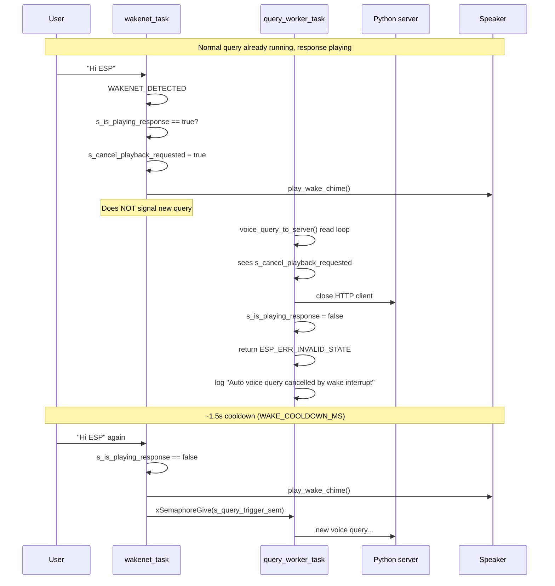

# Hi ESP — Stop Playback During Voice Response

This document describes the **complete barge-in flow** in the ESP32 firmware: when the assistant is playing a voice-query response WAV, saying **"Hi ESP"** stops that playback. All code lives in `main/main.cpp`.

---

## Quick answer

| Situation | What happens |
|-----------|--------------|
| Idle, say "Hi ESP" | Wake chime → record → server → play response |
| **During response playback**, say "Hi ESP" | **Stop playback** → wake chime → wait (no new query) |
| After stop, say "Hi ESP" again | Wake chime → start next query |

**Scope:** This only applies to WAV streamed from `POST /voice-query`. Playback via `POST /upload` is **not** interruptible.

---

## Architecture

Two FreeRTOS tasks cooperate with shared flags:

```
app_main()
  ├── wakenet_task      (core 0) — always listens for "Hi ESP"
  └── query_worker_task (core 0) — runs voice query when signaled
```

```
┌─────────────────────┐         ┌──────────────────────┐
│   wakenet_task      │         │  query_worker_task   │
│                     │         │                      │
│  mic → WakeNet      │  sem    │  run_voice_query_    │
│  "Hi ESP" detected  │ ──────► │  locked()            │
│                     │         │    → record          │
│  if playing:        │         │    → HTTP POST       │
│    set cancel flag  │◄────────│    → stream WAV play │
└─────────────────────┘  flags  └──────────────────────┘
         │                              │
         │  s_is_playing_response       │
         │  s_cancel_playback_requested │
         └──────────────────────────────┘
```

---

## Sequence diagram (stop during playback)



---

## Constants and global state

These symbols are the backbone of the stop-playback mechanism.

**File:** `main/main.cpp` (lines 64–83)

```cpp
#define WAV_HEADER_SIZE 44
#define UPLOAD_RECV_CHUNK 2048
#define MIC_SAMPLE_RATE 16000
#define MIC_CHANNELS 1
#define MIC_BITS 16
#define MAX_QUERY_SECONDS 10
#define CHIME_SAMPLE_RATE 16000
#define WAKE_COOLDOWN_MS 1500

static char s_voice_server_ip[16] = "";
static int s_voice_query_seconds = 4;
static bool s_wake_enabled = false;
static bool s_wake_task_started = false;
static SemaphoreHandle_t s_voice_mutex = NULL;
static SemaphoreHandle_t s_mic_mutex = NULL;
static SemaphoreHandle_t s_query_trigger_sem = NULL;
static TaskHandle_t s_wake_task_handle = NULL;
static TaskHandle_t s_query_task_handle = NULL;
static volatile bool s_is_playing_response = false;
static volatile bool s_cancel_playback_requested = false;
```

| Symbol | Role |
|--------|------|
| `s_is_playing_response` | `true` while PCM from voice-query response is being written to the speaker |
| `s_cancel_playback_requested` | Set by wake word (or CLI); checked before each 2 KB playback chunk |
| `s_query_trigger_sem` | Binary semaphore — wake word gives it to start a new query |
| `s_voice_mutex` | Serializes voice-query runs so only one query at a time |
| `s_mic_mutex` | Shared between wake detection and recording |
| `WAKE_COOLDOWN_MS` | 1.5 s debounce after each wake detection |
| `UPLOAD_RECV_CHUNK` | 2048 bytes — cancel is checked once per HTTP read of this size |

---

## Boot initialization

Tasks and sync primitives are created in `app_main()`.

**File:** `main/main.cpp` (lines 1246–1277)

```cpp
extern "C" void app_main(void)
{
    esp_err_t ret = nvs_flash_init();
    if (ret == ESP_ERR_NVS_NO_FREE_PAGES || ret == ESP_ERR_NVS_NEW_VERSION_FOUND) {
        ESP_ERROR_CHECK(nvs_flash_erase());
        ret = nvs_flash_init();
    }
    ESP_ERROR_CHECK(ret);

    wifi_init_all();
    http_server_start();
    s_voice_mutex = xSemaphoreCreateMutex();
    s_mic_mutex = xSemaphoreCreateMutex();
    s_query_trigger_sem = xSemaphoreCreateBinary();
    if (s_voice_mutex == NULL) {
        ESP_LOGE(TAG, "voice mutex create failed");
    }
    if (s_mic_mutex == NULL) {
        ESP_LOGE(TAG, "mic mutex create failed");
    }
    if (s_query_trigger_sem == NULL) {
        ESP_LOGE(TAG, "query trigger semaphore create failed");
    }
    if (s_query_task_handle == NULL && s_query_trigger_sem != NULL) {
        xTaskCreatePinnedToCore(query_worker_task, "query_worker", 8 * 1024, NULL, 5, &s_query_task_handle, 0);
    }
    if (!s_wake_task_started) {
        xTaskCreatePinnedToCore(wakenet_task, "wakenet_task", 10 * 1024, NULL, 5, &s_wake_task_handle, 0);
        s_wake_task_started = true;
    }
    console_init();
}
```

Enable wake mode from the serial console:

```
voice wake on <PC_IP> [seconds]
```

Example: `voice wake on 192.168.1.100 4`

---

## Step 1 — Wake word detection (`wakenet_task`)

The wake task runs continuously when `s_wake_enabled` is true. It reads mic frames, feeds Espressif AFE/WakeNet, and reacts to `WAKENET_DETECTED`.

### 1a. Detection loop (mic read + feed)

**File:** `main/main.cpp` (lines 605–632)

```cpp
    while (1) {
        if (!s_wake_enabled) {
            vTaskDelay(pdMS_TO_TICKS(100));
            continue;
        }

        if (s_mic_mutex == NULL) {
            vTaskDelay(pdMS_TO_TICKS(20));
            continue;
        }
        if (xSemaphoreTake(s_mic_mutex, pdMS_TO_TICKS(20)) != pdTRUE) {
            continue;
        }
        int rd = esp_codec_dev_read(s_mic, mic_frame, (int)(frame_samples * sizeof(int16_t)));
        xSemaphoreGive(s_mic_mutex);
        if (rd < 0) {
            vTaskDelay(pdMS_TO_TICKS(20));
            continue;
        }

        afe->feed(afe_data, mic_frame);
        afe_fetch_result_t *res = afe->fetch(afe_data);
        if (res == NULL) {
            continue;
        }
        if (res->wakeup_state != WAKENET_DETECTED) {
            continue;
        }
```

### 1b. Cooldown debounce

**File:** `main/main.cpp` (lines 634–638)

```cpp
        TickType_t now = xTaskGetTickCount();
        if ((now - last_trigger) < pdMS_TO_TICKS(WAKE_COOLDOWN_MS)) {
            continue;
        }
        last_trigger = now;
```

### 1c. **STOP PLAYBACK branch** — the core barge-in logic

When playback is active, set the cancel flag and play the wake chime. **Do not** start a new query.

**File:** `main/main.cpp` (lines 640–647)

```cpp
        if (s_is_playing_response) {
            ESP_LOGI(TAG, "Wake word detected during playback -> stopping current response");
            s_cancel_playback_requested = true;
            play_wake_chime();
            // Do NOT trigger query here. Next wake word starts next query.
            vTaskDelay(pdMS_TO_TICKS(WAKE_COOLDOWN_MS));
            continue;
        }
```

### 1d. Normal wake (idle) — start a new query

**File:** `main/main.cpp` (lines 649–654)

```cpp
        ESP_LOGI(TAG, "Wake word detected -> trigger query");
        play_wake_chime();
        if (s_query_trigger_sem != NULL && s_voice_server_ip[0] != '\0') {
            xSemaphoreGive(s_query_trigger_sem);
        }
        vTaskDelay(pdMS_TO_TICKS(WAKE_COOLDOWN_MS));
```

### Wake chime (played on both paths)

**File:** `main/main.cpp` (lines 235–254)

```cpp
static void play_wake_chime(void)
{
    const int s1 = (CHIME_SAMPLE_RATE * 90) / 1000;
    const int gap = (CHIME_SAMPLE_RATE * 30) / 1000;
    const int s2 = (CHIME_SAMPLE_RATE * 120) / 1000;
    const int total = s1 + gap + s2;

    int16_t *tone = (int16_t *)calloc((size_t)total, sizeof(int16_t));
    if (tone == NULL) {
        return;
    }

    append_tone_with_fade(tone, 0, s1, 700.0f, CHIME_SAMPLE_RATE, 10000.0f);
    append_tone_with_fade(tone, s1 + gap, s2, 980.0f, CHIME_SAMPLE_RATE, 11500.0f);

    if (ensure_speaker_open(CHIME_SAMPLE_RATE, 1, 16) == ESP_OK) {
        esp_codec_dev_write(s_spk, tone, (int)(total * (int)sizeof(int16_t)));
    }
    free(tone);
}
```

---

## Step 2 — Query worker receives trigger (`query_worker_task`)

When idle wake word fires, the worker runs the full voice query under a mutex.

**File:** `main/main.cpp` (lines 521–538)

```cpp
static void query_worker_task(void *arg)
{
    (void)arg;
    while (1) {
        if (xSemaphoreTake(s_query_trigger_sem, portMAX_DELAY) != pdTRUE) {
            continue;
        }
        if (!s_wake_enabled || s_voice_server_ip[0] == '\0') {
            continue;
        }
        esp_err_t err = run_voice_query_locked(s_voice_server_ip, s_voice_query_seconds);
        if (err == ESP_ERR_INVALID_STATE) {
            ESP_LOGI(TAG, "Auto voice query cancelled by wake interrupt");
        } else if (err != ESP_OK) {
            ESP_LOGE(TAG, "Auto voice query failed: %d", (int)err);
        }
    }
}
```

---

## Step 3 — Voice query mutex wrapper (`run_voice_query_locked`)

Clears the cancel flag at the start of each new query, then calls the full pipeline.

**File:** `main/main.cpp` (lines 502–519)

```cpp
static esp_err_t run_voice_query_locked(const char *server_ip, int seconds)
{
    if (server_ip == NULL || server_ip[0] == '\0') {
        return ESP_ERR_INVALID_ARG;
    }

    if (s_voice_mutex == NULL) {
        return ESP_ERR_INVALID_STATE;
    }

    if (xSemaphoreTake(s_voice_mutex, pdMS_TO_TICKS(2000)) != pdTRUE) {
        return ESP_ERR_TIMEOUT;
    }
    s_cancel_playback_requested = false;
    esp_err_t err = voice_query_to_server(server_ip, seconds);
    xSemaphoreGive(s_voice_mutex);
    return err;
}
```

---

## Step 4 — Full voice query pipeline (`voice_query_to_server`)

### Phase A — Record mic and POST to server

Recording and HTTP upload happen **before** playback. Cancel during these phases is not implemented.

**File:** `main/main.cpp` (lines 335–416)

```cpp
static esp_err_t voice_query_to_server(const char *server_ip, int seconds)
{
    if (seconds < 1) {
        seconds = 1;
    }
    if (seconds > MAX_QUERY_SECONDS) {
        seconds = MAX_QUERY_SECONDS;
    }

    ESP_RETURN_ON_ERROR(ensure_mic_open(), TAG, "mic open failed");
    ESP_RETURN_ON_FALSE(s_mic_mutex != NULL, ESP_ERR_INVALID_STATE, TAG, "mic mutex missing");

    const uint32_t pcm_bytes = (uint32_t)(MIC_SAMPLE_RATE * MIC_CHANNELS * (MIC_BITS / 8) * seconds);
    const size_t req_len = WAV_HEADER_SIZE + (size_t)pcm_bytes;
    uint8_t *req_wav = (uint8_t *)malloc(req_len);
    ESP_RETURN_ON_FALSE(req_wav != NULL, ESP_ERR_NO_MEM, TAG, "alloc req_wav failed");

    write_wav_header(req_wav, MIC_SAMPLE_RATE, MIC_CHANNELS, MIC_BITS, pcm_bytes);
    ESP_LOGI(TAG, "Recording %d sec from mic...", seconds);
    if (xSemaphoreTake(s_mic_mutex, pdMS_TO_TICKS(8000)) != pdTRUE) {
        free(req_wav);
        return ESP_ERR_TIMEOUT;
    }
    int rd = esp_codec_dev_read(s_mic, req_wav + WAV_HEADER_SIZE, (int)pcm_bytes);
    xSemaphoreGive(s_mic_mutex);
    if (rd < 0) {
        free(req_wav);
        return ESP_FAIL;
    }

    char url[96];
    snprintf(url, sizeof(url), "http://%s:8000/voice-query", server_ip);

    esp_http_client_config_t cfg = {};
    cfg.url = url;
    cfg.method = HTTP_METHOD_POST;
    cfg.timeout_ms = 120000;

    esp_http_client_handle_t client = esp_http_client_init(&cfg);
    if (client == NULL) {
        free(req_wav);
        return ESP_FAIL;
    }

    esp_http_client_set_header(client, "Content-Type", "audio/wav");
    ESP_LOGI(TAG, "Sending voice query to %s", url);
    esp_err_t err = esp_http_client_open(client, (int)req_len);
    if (err != ESP_OK) {
        free(req_wav);
        esp_http_client_cleanup(client);
        return err;
    }

    int written_req = esp_http_client_write(client, (const char *)req_wav, (int)req_len);
    free(req_wav);
    if (written_req < 0) {
        esp_http_client_close(client);
        esp_http_client_cleanup(client);
        return ESP_FAIL;
    }

    int content_len = esp_http_client_fetch_headers(client);
    (void)content_len;
    if (esp_http_client_get_status_code(client) != 200) {
        esp_http_client_close(client);
        esp_http_client_cleanup(client);
        return ESP_FAIL;
    }

    bool is_chunked = esp_http_client_is_chunked_response(client);
    if (!is_chunked && content_len == 0) {
        esp_http_client_close(client);
        esp_http_client_cleanup(client);
        return ESP_FAIL;
    }

    int status = esp_http_client_get_status_code(client);
    if (status != 200) {
        esp_http_client_close(client);
        esp_http_client_cleanup(client);
        return ESP_FAIL;
    }
```

### Phase B — Stream response WAV and play (where stop happens)

This is the **only place** `s_is_playing_response` is set and `s_cancel_playback_requested` is checked.

**File:** `main/main.cpp` (lines 418–500)

```cpp
    uint8_t *rx_buf = (uint8_t *)malloc(UPLOAD_RECV_CHUNK);
    if (rx_buf == NULL) {
        esp_http_client_close(client);
        esp_http_client_cleanup(client);
        return ESP_ERR_NO_MEM;
    }

    uint8_t hdr[WAV_HEADER_SIZE];
    int hdr_len = 0;
    bool playback_ready = false;
    size_t pcm_written = 0;

    while (1) {
        int r = esp_http_client_read(client, (char *)rx_buf, UPLOAD_RECV_CHUNK);
        if (r < 0) {
            free(rx_buf);
            esp_http_client_close(client);
            esp_http_client_cleanup(client);
            return ESP_FAIL;
        }
        if (r == 0) {
            break;
        }

        int offset = 0;
        if (hdr_len < WAV_HEADER_SIZE) {
            const int copy = ((WAV_HEADER_SIZE - hdr_len) < r) ? (WAV_HEADER_SIZE - hdr_len) : r;
            memcpy(hdr + hdr_len, rx_buf, copy);
            hdr_len += copy;
            offset += copy;

            if (hdr_len == WAV_HEADER_SIZE) {
                uint32_t sample_rate = 0;
                uint16_t channels = 0;
                uint16_t bits_per_sample = 0;
                if (parse_wav_header(hdr, &sample_rate, &channels, &bits_per_sample) != ESP_OK) {
                    free(rx_buf);
                    esp_http_client_close(client);
                    esp_http_client_cleanup(client);
                    return ESP_FAIL;
                }
                if (ensure_speaker_open(sample_rate, channels, bits_per_sample) != ESP_OK) {
                    free(rx_buf);
                    esp_http_client_close(client);
                    esp_http_client_cleanup(client);
                    return ESP_FAIL;
                }
                playback_ready = true;
            }
        }

        if (playback_ready && offset < r) {
            s_is_playing_response = true;
            if (s_cancel_playback_requested) {
                s_cancel_playback_requested = false;
                free(rx_buf);
                esp_http_client_close(client);
                esp_http_client_cleanup(client);
                s_is_playing_response = false;
                return ESP_ERR_INVALID_STATE;
            }
            const int payload_len = r - offset;
            int written = esp_codec_dev_write(s_spk, (void *)(rx_buf + offset), payload_len);
            if (written < 0) {
                free(rx_buf);
                esp_http_client_close(client);
                esp_http_client_cleanup(client);
                s_is_playing_response = false;
                return ESP_FAIL;
            }
            pcm_written += (size_t)payload_len;
        }
    }

    free(rx_buf);
    esp_http_client_close(client);
    esp_http_client_cleanup(client);
    s_is_playing_response = false;
    ESP_RETURN_ON_FALSE(playback_ready, ESP_FAIL, TAG, "empty/invalid WAV response");
    ESP_LOGI(TAG, "Voice response playback complete, PCM bytes=%u", (unsigned)pcm_written);
    play_done_chime();
    return ESP_OK;
}
```

### WAV header parser (used before playback starts)

**File:** `main/main.cpp` (lines 95–117)

```cpp
static esp_err_t parse_wav_header(const uint8_t *hdr, uint32_t *sample_rate, uint16_t *channels, uint16_t *bits_per_sample)
{
    if (memcmp(hdr + 0, "RIFF", 4) != 0 || memcmp(hdr + 8, "WAVE", 4) != 0) {
        return ESP_ERR_INVALID_ARG;
    }
    if (memcmp(hdr + 12, "fmt ", 4) != 0 || memcmp(hdr + 36, "data", 4) != 0) {
        return ESP_ERR_NOT_SUPPORTED;
    }

    const uint16_t audio_format = read_le16(hdr + 20);
    if (audio_format != 1) {  // PCM
        return ESP_ERR_NOT_SUPPORTED;
    }

    *channels = read_le16(hdr + 22);
    *sample_rate = read_le32(hdr + 24);
    *bits_per_sample = read_le16(hdr + 34);

    if (*channels == 0 || *sample_rate == 0 || *bits_per_sample == 0) {
        return ESP_ERR_INVALID_ARG;
    }
    return ESP_OK;
}
```

### Done chime (only on successful full playback — skipped on cancel)

**File:** `main/main.cpp` (lines 256–276)

```cpp
static void play_done_chime(void)
{
    // Different from wake chime: short descending confirmation tone.
    const int s1 = (CHIME_SAMPLE_RATE * 110) / 1000;
    const int gap = (CHIME_SAMPLE_RATE * 25) / 1000;
    const int s2 = (CHIME_SAMPLE_RATE * 90) / 1000;
    const int total = s1 + gap + s2;

    int16_t *tone = (int16_t *)calloc((size_t)total, sizeof(int16_t));
    if (tone == NULL) {
        return;
    }

    append_tone_with_fade(tone, 0, s1, 1040.0f, CHIME_SAMPLE_RATE, 9000.0f);
    append_tone_with_fade(tone, s1 + gap, s2, 760.0f, CHIME_SAMPLE_RATE, 9000.0f);

    if (ensure_speaker_open(CHIME_SAMPLE_RATE, 1, 16) == ESP_OK) {
        esp_codec_dev_write(s_spk, tone, (int)(total * (int)sizeof(int16_t)));
    }
    free(tone);
}
```

---

## Step 5 — CLI manual cancel (same mechanism)

The `voice query` console command uses the **same cancel flag** if a response is already playing.

**File:** `main/main.cpp` (lines 1056–1080)

```cpp
    if (strcmp(argv[1], "query") == 0) {
        if (argc < 3) {
            printf("Usage: voice query <server_ip> [seconds]\n");
            return 0;
        }

        const char *server_ip = argv[2];
        int seconds = 4;
        if (argc >= 4) {
            seconds = atoi(argv[3]);
        }

        if (s_is_playing_response) {
            s_cancel_playback_requested = true;
            vTaskDelay(pdMS_TO_TICKS(150));
        }
        esp_err_t err = run_voice_query_locked(server_ip, seconds);
        if (err == ESP_OK) {
            printf("voice query: OK\n");
        } else if (err == ESP_ERR_INVALID_STATE) {
            printf("voice query: cancelled\n");
        } else {
            printf("voice query: failed (%d)\n", (int)err);
        }
        return 0;
    }
```

Wake mode enable command for reference:

**File:** `main/main.cpp` (lines 1089–1103)

```cpp
        if (strcmp(argv[2], "on") == 0) {
            if (argc >= 4) {
                strncpy(s_voice_server_ip, argv[3], sizeof(s_voice_server_ip) - 1);
                s_voice_server_ip[sizeof(s_voice_server_ip) - 1] = '\0';
            }
            if (argc >= 5) {
                s_voice_query_seconds = atoi(argv[4]);
            }
            if (s_voice_server_ip[0] == '\0') {
                printf("Set server IP: voice wake on <server_ip> [seconds]\n");
                return 0;
            }
            s_wake_enabled = true;
            printf("Wake enabled. server=%s seconds=%d\n", s_voice_server_ip, s_voice_query_seconds);
            return 0;
        }
```

---

## End-to-end state machine

```
                    ┌──────────────┐
                    │    IDLE      │
                    │ (not playing)│
                    └──────┬───────┘
                           │ "Hi ESP"
                           ▼
                    ┌──────────────┐
                    │  RECORDING   │  ← cancel NOT supported here
                    └──────┬───────┘
                           │
                           ▼
                    ┌──────────────┐
                    │ SERVER WAIT  │  ← cancel NOT supported here
                    └──────┬───────┘
                           │ WAV stream starts
                           ▼
                    ┌──────────────┐
         ┌─────────│  PLAYBACK    │─────────┐
         │         │ s_is_playing │         │
         │         │ _response=T  │         │
         │         └──────┬───────┘         │
         │ "Hi ESP"       │                 │ playback finishes
         │                │                 │
         ▼                │                 ▼
  s_cancel_playback       │          play_done_chime()
  _requested = true       │                 │
         │                │                 │
         ▼                │                 │
  close HTTP, return      │                 │
  ESP_ERR_INVALID_STATE   │                 │
         │                │                 │
         ▼                ▼                 ▼
                    ┌──────────────┐
                    │    IDLE      │
                    └──────────────┘
                           │
              second "Hi ESP" → new query
```

---

## Log messages to watch on serial

| Log | Meaning |
|-----|---------|
| `WakeNet ready. Say: Hi ESP` | Wake task started |
| `Wake word detected -> trigger query` | Idle wake — starting query |
| `Wake word detected during playback -> stopping current response` | Barge-in triggered |
| `Auto voice query cancelled by wake interrupt` | Playback loop exited cleanly |
| `Voice response playback complete, PCM bytes=...` | Normal finish (no interrupt) |

---

## Design notes and limitations

### Cooperative cancel (not hardware stop)

There is no `esp_codec_dev_stop()` or DMA flush. Cancellation means:

1. Wake task sets `s_cancel_playback_requested = true`
2. Playback loop stops reading HTTP and writing PCM on the **next** 2 KB chunk boundary
3. Audio already buffered in the codec may still play briefly (~tens of ms)

### Two-step wake after interrupt

By design, the first "Hi ESP" during playback **only stops** — it does not immediately start recording. The user must say "Hi ESP" **again** to start the next query. This avoids accidentally cutting off and immediately re-querying.

### Chimes are not cancellable

`play_wake_chime()` blocks on `esp_codec_dev_write()` for ~240 ms. After a stop, you will still hear the wake chime.

### `/upload` path excluded

`upload_handler()` plays WAV from `assistant.py` but never sets `s_is_playing_response` or checks `s_cancel_playback_requested`. "Hi ESP" does **not** stop that playback.

### No AEC during playback

`afe_cfg->aec_init = false` — speaker audio can feed back into the mic and affect wake-word detection while the assistant is speaking.

---

## How to test

1. Flash firmware, connect WiFi, start Python server (`api_server.py` on port 8000).
2. On ESP serial console:
   ```
   voice wake on <your_pc_ip> 4
   ```
3. Say **"Hi ESP"** → ask a question that produces a long TTS reply.
4. While the assistant is speaking, say **"Hi ESP"** again.
   - Expected: response stops, wake chime plays, log shows `stopping current response` and `cancelled by wake interrupt`.
5. Say **"Hi ESP"** a third time → new query should start.

---

## Related files

| File | Role |
|------|------|
| `main/main.cpp` | All stop-playback logic (this document) |
| `server/api_server.py` | `POST /voice-query` — returns response WAV |
| `server/README.md` | Wake-word usage summary |
| `plan.md` | Architecture and barge-in design intent |
| `COMPLETE_VOICE_WORKFLOW.md` | End-to-end voice pipeline including wake word |
